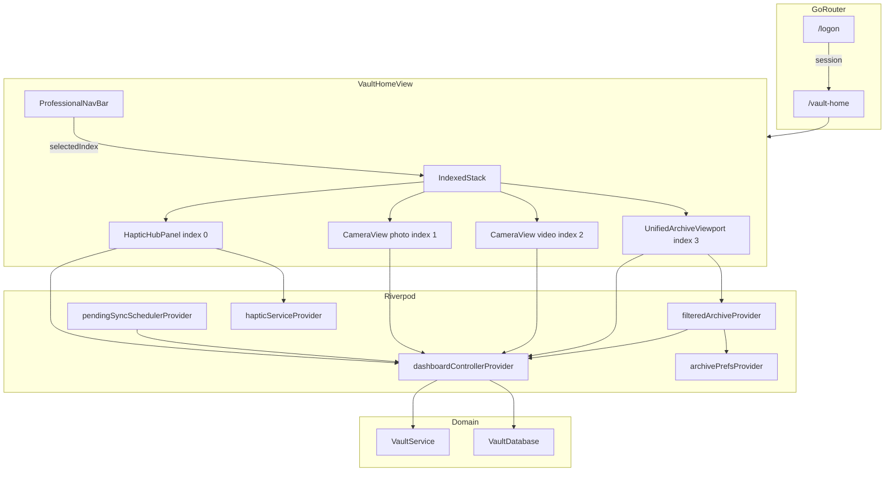

# FactLockCam Home Screen Audit — 18 May 2026

**Purpose:** Comprehensive audit of the authenticated **home screen** and its **archive shell** (`VaultHomeView`), with implementation blueprints, rule compliance, performance risks, test status, and prioritized remediation.

**Scope definition:** In current code, “home screen” means two related layers:

1. **Home tab (index 0)** — `HapticHubPanel`: branded logo banner, pending-sync banner, video backdrop, and three action tiles (Archive / Picture / Video).
2. **Archive shell** — `VaultHomeView`: post-login authenticated container using `IndexedStack` + `ProfessionalNavBar` that hosts Home, embedded Picture/Video cameras, and the Unified Archive Omni-Surface.

This audit covers both because user-visible “home” behavior (navigation, sync, capture return path) is owned by the shell, not the hub panel alone.

**Wiki grounding:** [[FactLockCam_Master_Blueprint]], [[MASTER_CONTEXT16MAY2026]], [[Heavy_Metal_Design_System]], [[FactLockCam_Product_Baseline_2026-05]], `.cursor/rules/vault-omni-surface.mdc`, `.cursor/rules/factlockcam-capture-pipeline.mdc`.

---

## 1. Executive summary

| Area | Status | Notes |
|------|--------|-------|
| Shell architecture | ✅ Functional | `IndexedStack` preserves tab state; post-capture returns to Home |
| Home tab UX | ✅ Functional | Three hub tiles + haptic/backdrop feedback |
| Design system | ⚠️ Mostly aligned | Palette, mono labels, titanium surfaces; subtitle typography mixed |
| State management | ✅ Compliant | Riverpod `AsyncNotifier` + prefs segregation; no forbidden bloc/provider |
| Performance | 🔴 Risk | Both `CameraView` instances init and stay alive while on Home tab |
| Session / account | 🔴 Gap | No sign-out or settings entry in shell UI (`AuthController.signOut` orphaned) |
| Documentation | ⚠️ Drift | Wiki/blueprints still reference removed `/archive` and `/camera` routes |
| Tests | 🔴 Failing | `vault_dashboard_view_test.dart` — 2/4 tests fail (May 2026 run) |

The home experience is **product-usable** for capture → seal → browse, but carries **material battery/perf debt** from eager dual-camera initialization, **account-management dead ends** (More tab stub, no sign-out), and **stale docs/tests** from the May 2026 tab-shell migration.

---

## 2. Architecture blueprint

### 2.1 Route entry

```
/logon  ──(auth session)──►  /vault-home  (VaultHomeView)
/vault-dashboard  ──redirect──►  /vault-home
```

- **Router:** `factlockcam_app/lib/app/router/app_router.dart`
- **Auth gate:** `authStateProvider` redirects unauthenticated users to `/logon`; authenticated users on logon redirect to `/vault-home`.
- **Removed routes (no longer in router):** `/archive`, `/camera?mode=…` — archive and cameras are tab-embedded.

### 2.2 Shell composition

```
VaultHomeView (ConsumerStatefulWidget)
├── Scaffold (titaniumDeep)
│   ├── IndexedStack [index = _selectedIndex]
│   │   ├── [0] HapticHubPanel          ← HOME TAB (this audit’s primary surface)
│   │   ├── [1] CameraView (photo)
│   │   ├── [2] CameraView (video)
│   │   └── [3] UnifiedArchiveViewport
│   └── ProfessionalNavBar (bottom)
```

**Key files:**

| File | Role |
|------|------|
| `lib/ui/mobile/vault_home_view.dart` | Shell: tab index state, capture callbacks |
| `lib/ui/mobile/vault/haptic_hub_panel.dart` | Home tab UI |
| `lib/ui/mobile/vault/professional_nav_bar.dart` | Bottom nav (5 visual slots, 4 functional tabs) |
| `lib/ui/mobile/vault/archive_omni/unified_archive_viewport.dart` | Archive tab (omni-surface) |
| `lib/ui/mobile/camera/camera_view.dart` | Embedded capture (photo + video instances) |
| `lib/core/ui/widgets/heavy_metal_backdrop.dart` | Shared video backdrop mixin + logo banner |

### 2.3 Tab index contract

| Index | Nav label | Widget | Hub tile trigger |
|-------|-----------|--------|------------------|
| 0 | Home | `HapticHubPanel` | — |
| 1 | Picture | `CameraView(photo)` | Hub “Picture” → `_onCaptureRequested(1)` |
| 2 | Video | `CameraView(video)` | Hub “Video” → `_onCaptureRequested(2)` |
| 3 | Archive | `UnifiedArchiveViewport` | Hub “Archive” → `_onCaptureRequested(3)` |
| — | More | *(not indexed)* | SnackBar: “Settings panel coming soon.” |

### 2.4 Post-capture navigation contract

```dart
// vault_home_view.dart
void _onCaptureComplete() {
  setState(() => _selectedIndex = 0);  // return to Home tab
}
```

`CameraView` invokes `onCaptureComplete` after successful seal (`_sealCapturedFile`) and when the AppBar back button is pressed (tab-embedded mode). This fixes the prior “stranded on camera after seal” bug documented in `wiki/log.md`.

---

## 3. Home tab (`HapticHubPanel`) — detailed blueprint

### 3.1 Visual stack (top → bottom)

```
Column
├── HeavyMetalLogoBanner
│   └── Image.asset('assets/images/factlockcam_logoheader.jpg')
├── Pending sync MaterialBanner (conditional)
└── Expanded → Stack
    ├── BackgroundVideoLayer (HeavyMetalBackdropMixin)
    ├── TitaniumOverlay (bottom vignette, IgnorePointer)
    └── SafeArea → action column
        ├── Spacer
        └── “CHOOSE AN ACTION” + three _HubTile widgets
```

### 3.2 Interaction model

Each hub tile tap runs `_handleHubTap`:

1. `HapticService.lock()` → `HapticFeedback.heavyImpact()`
2. `playBackdropFromStart()` — seek video to 0, play once, auto-reset at end
3. Callback: `onCaptureRequested(tabIndex)` → parent switches `_selectedIndex`

**Semantics:** `_HubTile` exposes `Semantics(button: true, label: 'LABEL. subtitle')` — good accessibility baseline.

### 3.3 Pending sync surfacing

On first frame after mount, `HapticHubPanel` calls:

```dart
ref.read(dashboardControllerProvider.notifier).syncPendingInBackground();
```

When `dashboardControllerProvider` has items with `pendingSync == true`, a `MaterialBanner` shows:

- Amber mono copy: “N item(s) pending sync…”
- **RETRY NOW** → same `syncPendingInBackground()` path

**Duplication note:** Identical banner logic exists in `UnifiedArchiveViewport._PendingSyncBanner`. Both tabs can trigger sync on mount — mitigated by `PendingSyncCoordinator` mutex in `dashboard_controller.dart`.

### 3.4 Background sync scheduler (app-wide)

`FactLockCamApp` watches `pendingSyncSchedulerProvider`:

- Interval: **3 minutes**
- Calls `DashboardController.syncPendingInBackground()`
- Complements hub/archive lifecycle hooks

---

## 4. State management audit

### 4.1 Shell tab index — local `StatefulWidget` ✅ acceptable

`_selectedIndex` lives in `_VaultHomeViewState` as ephemeral UI chrome. This is appropriate: it is not business data and does not need persistence.

**Alternative (future):** A small Riverpod `Notifier<int>` if deep links or programmatic tab switching are needed (e.g. “open Archive after seal”).

### 4.2 Archive data — `DashboardController` ✅

```dart
final dashboardControllerProvider =
    AsyncNotifierProvider<DashboardController, List<ArchiveItem>>(...);
```

- Loads via `VaultService.listArchiveItems()`
- `syncPendingInBackground()` uses `PendingSyncCoordinator` to serialize concurrent retries
- Metadata updates optimistic-mutate list in memory
- **Rule compliance:** No direct Supabase calls from UI; vault service boundary preserved

### 4.3 Archive UI prefs — segregated ✅ (omni-surface rule)

`archive_prefs_provider.dart`:

- `ArchivePrefsNotifier` holds `ArchiveViewMode` + `ArchiveFilterType`
- `filteredArchiveProvider` computed from dashboard + prefs
- **Does not** mutate `DashboardController` for sort/filter — matches `vault-omni-surface.mdc`

### 4.4 DI bridging ✅

Services resolve through GetIt; UI reads via Riverpod providers (`vaultServiceProvider`, `hapticServiceProvider`, etc.) per `01_flutter_state_architecture.mdc`.

---

## 5. Design system compliance

Reference: [[Heavy_Metal_Design_System]], `04_forensic_ui_standards.mdc`.

| Element | Expected | Home implementation | Verdict |
|---------|----------|---------------------|---------|
| Primary surface | Titanium Deep `#121212` | `AppColors.titaniumDeep` on scaffolds | ✅ |
| Action accent | Kinetic Green in-progress | Retry button, tile splash | ✅ |
| Locked accent | Verified Neon | Tile borders, icon rings, nav selected state | ✅ |
| HUD / labels | Space Mono via `AppTextStyles` | “CHOOSE AN ACTION”, tile titles, nav labels | ✅ |
| Hub subtitles | Mono for telemetry | Uses `theme.textTheme.bodySmall` (Inter) | ⚠️ |
| Camera overlays | Thin lines, RepaintBoundary | Embedded tabs — compliant in `CameraView` | ✅ (tab 1/2) |
| Logo zone | Distinct titanium plinth | `HeavyMetalLogoBanner` | ✅ |

**Hub tile styling:** Gradient titanium surface, 1 px Verified Neon border, hardware icon disc — consistent with secure-hardware metaphor.

**Logo:** Raster `factlockcam_logoheader.jpg` replaces the text placeholder in `HeavyMetalLogoBanner._HeavyMetalLogoPlaceholder` (which still contains “FACTLOCKCAM” string for fallback-only use).

---

## 6. Performance and resource audit

### 6.1 IndexedStack + dual CameraView — 🔴 HIGH

**Finding:** `IndexedStack` builds and **keeps alive** all four children. Each `CameraView` runs `_initializeCamera()` in `initState`, acquiring a `CameraController` immediately when the user lands on `/vault-home` — **even while viewing the Home tab**.

Implications:

- Two camera controllers may contend for hardware (photo + video instances)
- Battery and thermal cost while browsing hub or archive
- Video instance requests `enableAudio: true` at init
- Controllers dispose only when `VaultHomeView` is removed from tree (sign-out / app exit) — not on tab switch

**Recommendation:** Lazy-init cameras on first tab selection; dispose or pause when leaving camera tabs. Consider `AutomaticKeepAliveClientMixin` only for archive scroll state, not cameras.

### 6.2 Video backdrop on Home tab — ⚠️ MEDIUM

`HeavyMetalBackdropMixin` initializes `VideoPlayerController.asset` on hub mount. Clip stays paused on frame 0 until tile tap — acceptable. Separate controller also exists on `LogonView` (not simultaneous).

Test seam: `HeavyMetalBackdropMixin.enabled = false` in `test/flutter_test_config.dart`.

### 6.3 Nested Scaffolds — ⚠️ LOW

`VaultHomeView` and each tab child (`HapticHubPanel`, `CameraView`, `UnifiedArchiveViewport`) declare their own `Scaffold`. Flutter handles this, but:

- SnackBars from `ProfessionalNavBar` “More” use outer context — OK
- Potential confusion for future FAB / `MaterialBanner` placement

### 6.4 Archive chronology scroll — ✅ (tab 3)

`ChronologyCard` uses `RepaintBoundary`, scroll-bound transforms (no `AnimationController`), isolate-backed thumbnail decode via `thumbnailCacheProvider` — aligned with `vault-chronology-engine.mdc`.

---

## 7. User flows (home-centric)

### 7.1 Cold start → Home

```
App launch → /logon → OTP success → redirect /vault-home
  → IndexedStack index 0 (HapticHubPanel)
  → post-frame syncPendingInBackground()
  → [side effect] both CameraViews also init cameras
```

### 7.2 Hub → Capture → Home

```
Home tile “Picture” or “Video”
  → haptic + backdrop play
  → tab index 1 or 2
  → capture + seal (VaultService.proofLockFile path)
  → onCaptureComplete → tab index 0
```

### 7.3 Hub → Archive

```
Home tile “Archive” → tab index 3 (UnifiedArchiveViewport)
  OR bottom nav “Archive”
  → grid/chronology per archivePrefsProvider
  → tap card → AssetInspectorScreen (MaterialPageRoute push)
```

### 7.4 Pending sync

```
Seal with remote failure → SQLite pending_sync row
  → banner on Home + Archive tabs
  → Retry now / 3-min scheduler / coordinator-serialized retries
```

---

## 8. Security and session audit

### 8.1 Sign-out — 🔴 MISSING UI

`AuthController.signOut()` correctly:

1. Burns local wallet via `VaultService.burnLocalWallet()`
2. Calls `AuthRepository.signOut()`

**No UI in the archive shell invokes `signOut()`.** Wiki log (May 2026) notes burn/sign-out were removed from `ChronologyViewport` header with no replacement on `HeavyMetalLogoBanner.actions`.

**Impact:** Users cannot end session or wipe local wallet from the authenticated shell. The “More” tab is a stub SnackBar only.

### 8.2 Trust copy on Home

Hub subtitles (“Browse photos and videos on this device”) are accurate — local-first, no overclaim. Aligns with `03_crypto_and_legal_bounds.mdc`.

---

## 9. Navigation bar audit (`ProfessionalNavBar`)

**Strengths:**

- Forensic palette, mono uppercase labels, 2 px Verified Neon top border on selected tab
- Safe-area bottom inset handled
- Five-column layout matches design intent

**Issues:**

| Issue | Severity |
|-------|----------|
| “More” tab not in `IndexedStack`; no selected state possible | Medium UX |
| Doc comment says “Five tabs: Home, Picture, Video, Archive, More” but only 4 indexed children | Low doc |
| Settings/sign-out/burn wallet unimplemented | High product |

---

## 10. Omni-surface rule compliance (Archive tab)

Per `vault-omni-surface.mdc`:

| Rule | Status |
|------|--------|
| Remove `/archive` GoRouter path | ✅ Removed from `app_router.dart` |
| “Archive” hub tile → index 3 | ✅ `_onCaptureRequested(3)` |
| `UnifiedArchivePreferences` + `filteredArchiveProvider` | ✅ `archive_prefs_provider.dart` |
| `AnimatedSwitcher` grid/chronology | ✅ |
| Grid: date-grouped slivers | ✅ `OmniGridView` with month headers |
| `RepaintBoundary` on grid cells | ✅ |
| Filter chips: kineticGreen active | ✅ `OmniControlBar` |
| Cupertino segmented view toggle | ✅ |

---

## 11. Test audit

**File:** `factlockcam_app/test/vault_dashboard_view_test.dart`

| Test | Result (18 May 2026) | Issue |
|------|----------------------|-------|
| Route path constant | Not re-run individually | Likely ✅ |
| Hub shows Archive/Picture/Video | ❌ FAIL | Expects `find.text('FACTLOCKCAM')` but hub renders `Image.asset` logo — no text node |
| Stack-based layout | ✅ PASS | |
| Pending sync banner | ❌ FAIL | `pumpAndSettle` timeout — likely camera init / platform channel noise from embedded `CameraView` |

**Gaps:**

- No test for hub tile → tab index switching
- No test for `onCaptureComplete` return-to-Home
- No test for `ProfessionalNavBar` selection sync
- No golden/visual test for `_HubTile` styling
- Camera platform dependencies make full-shell widget tests fragile

**Recommendation:** Override or lazy-stub `CameraView` in shell tests; assert logo via `find.byType(Image)` or semantic label; use `pump` with bounded duration instead of `pumpAndSettle` when cameras are mounted.

---

## 12. Documentation drift

Sources still describing **pre-tab-shell** routing:

| Document | Stale claim |
|----------|-------------|
| `FactLockCam_Blueprints14May2026.md` | Lists `/archive`, `/camera?mode=` as active routes |
| `wiki/concepts/FactLockCam_Product_Baseline_2026-05.md` | “Browse sealed media in `/archive`” |
| `wiki/analyses/MASTER_CONTEXT13MAY2026.md` | `/archive`, `/camera` routes |
| `wiki/glossary.md` “Four-panel vault UX” | Says “Archive pushed via go_router from empty-state tile” — now tab index 3 |

**Current truth:** Archive is tab index 3 inside `VaultHomeView`; no standalone `/archive` route.

---

## 13. Risk register

| ID | Risk | Likelihood | Impact | Mitigation |
|----|------|------------|--------|------------|
| H-01 | Dual camera init on hub load | Certain | Battery, heat, init failures | Lazy camera mount per selected tab |
| H-02 | No sign-out / wallet burn UI | Certain | Session lock-in, privacy | Wire `HeavyMetalLogoBanner.actions` or More tab sheet |
| H-03 | Stale tests block CI confidence | High | Regressions slip through | Fix assertions; mock cameras in shell tests |
| H-04 | Duplicate pending-sync banners | Medium | Redundant network retry calls | Single shared banner widget/provider (coordinator already serializes) |
| H-05 | Wiki/onboarding docs wrong routes | Medium | Engineer confusion | Update blueprints + baseline (see §12) |
| H-06 | More tab dead-end | Medium | Perceived unfinished product | Implement settings sheet or hide until ready |
| H-07 | Nested Scaffold complexity | Low | Future layout bugs | Document pattern or flatten to single scaffold |

---

## 14. Prioritized recommendations

### P0 — Ship blockers / user trust

1. **Restore account controls** — Add sign-out (with local burn confirmation) to `HeavyMetalLogoBanner.actions` on Home and/or Archive, or implement a real More-tab settings sheet calling `AuthController.signOut()`.
2. **Lazy camera initialization** — Do not construct both `CameraView` instances until their tab is first selected; tear down or pause when leaving.

### P1 — Quality and maintainability

3. **Repair `vault_dashboard_view_test.dart`** — Remove `FACTLOCKCAM` text assertion; stub/lazy-load cameras; fix `pumpAndSettle` hangs.
4. **Sync documentation** — Update `FactLockCam_Blueprints14May2026.md`, product baseline, and glossary to tab-embedded model only.
5. **Extract shared pending-sync banner** — DRY between `HapticHubPanel` and `UnifiedArchiveViewport`.

### P2 — Polish

6. **Hub subtitle typography** — Use `AppTextStyles.monoSm` for tile subtitles to match forensic HUD standard.
7. **More tab** — Either remove from nav until settings exist, or implement minimal sheet (account, legal, version).
8. **Optional: tab switch haptic** — Light impact on `ProfessionalNavBar` selection for parity with hub tiles.

---

## 15. Component dependency diagram



---

## 16. File reference index

| Path | Purpose |
|------|---------|
| `factlockcam_app/lib/ui/mobile/vault_home_view.dart` | Authenticated shell |
| `factlockcam_app/lib/ui/mobile/vault/haptic_hub_panel.dart` | Home tab |
| `factlockcam_app/lib/ui/mobile/vault/professional_nav_bar.dart` | Bottom navigation |
| `factlockcam_app/lib/ui/mobile/vault/archive_omni/unified_archive_viewport.dart` | Archive tab |
| `factlockcam_app/lib/ui/mobile/vault/archive_omni/providers/archive_prefs_provider.dart` | Filter/view prefs |
| `factlockcam_app/lib/ui/controllers/dashboard_controller.dart` | Archive list + sync |
| `factlockcam_app/lib/ui/controllers/pending_sync_scheduler.dart` | 3-minute retry timer |
| `factlockcam_app/lib/core/ui/widgets/heavy_metal_backdrop.dart` | Backdrop mixin + logo banner |
| `factlockcam_app/lib/core/services/haptic_service.dart` | Hub tap haptics |
| `factlockcam_app/lib/app/router/app_router.dart` | Auth redirects |
| `factlockcam_app/test/vault_dashboard_view_test.dart` | Shell widget tests (failing) |

---

## 17. Provenance

| Claim | Source |
|-------|--------|
| Shell structure, tab indices, callbacks | `vault_home_view.dart`, `haptic_hub_panel.dart`, `professional_nav_bar.dart` (code read 2026-05-18) |
| Router surface | `app_router.dart` (code read 2026-05-18) |
| Omni-surface compliance | `unified_archive_viewport.dart`, `archive_prefs_provider.dart`, `omni_control_bar.dart`, `omni_grid_view.dart` |
| Sync architecture | `dashboard_controller.dart`, `pending_sync_scheduler.dart`, `factlockcam_app.dart` |
| Design tokens | `app_colors.dart`, `app_typography.dart`, [[Heavy_Metal_Design_System]] |
| Test results | `flutter test test/vault_dashboard_view_test.dart` — 2 passed, 2 failed (2026-05-18) |
| Historical migration context | `wiki/log.md` (May 2026 tab-shell rewrite) |
| Sign-out gap | Grep: `signOut` only in controllers, no UI callers |

---

## Related notes

- [[FactLockCam_Master_Blueprint]]
- [[FactLockCam_Blueprints_14May2026]]
- [[MASTER_CONTEXT16MAY2026]]
- [[FactLockCam_Product_Baseline_2026-05]]
- [[ProofLock_Refactor_Scope]]
- `FactLockCam_Blueprints14May2026.md` (repo root — needs routing refresh per §12)
