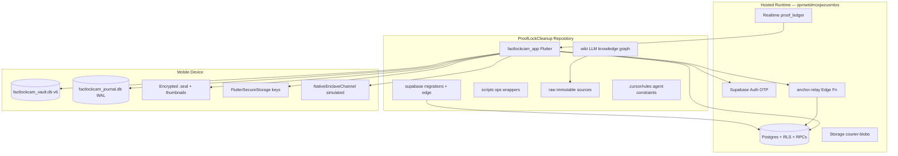
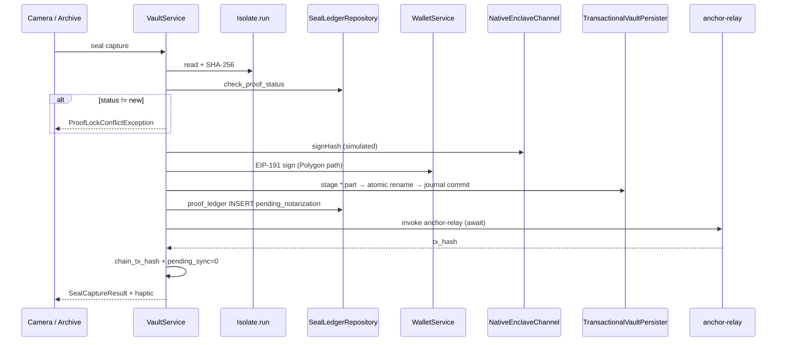
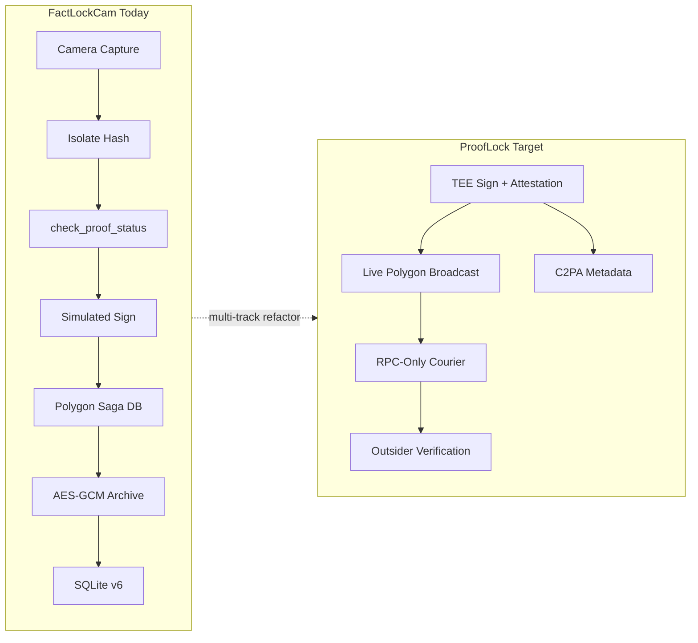

# FACTLOCK Master Blueprint — 21 May 2026

**Audit type:** Read-only system audit (no application code, schema, or runtime changes)  
**Authority chain:** LLM Wiki (`wiki/index.md` → linked pages) cross-checked against repository tree as of **2026-05-21**  
**Canonical wiki status entry:** [[FactLockCam_Product_Baseline_2026-05]]  
**Companion wiki pages:** [[FactLockCam_Master_Blueprint]], [[FactLockCam_Blueprints_14May2026]], [[Identity_Lifecycle_And_Data_Lineage]], [[Polygon_Saga_Live]]

---

## Executive Summary

**ProofLockCleanup** is a dual-purpose workspace:

1. **FactLockCam** — a Flutter multi-platform application (`factlockcam_app/`) for authenticated capture, **local-first** AES-GCM sealing, and Supabase-backed proof replication with an optional **Polygon async saga**.
2. **LLM Wiki** — a Karpathy-style knowledge graph (`wiki/`, governed by `AGENTS.md`) that compiles durable architecture truth from immutable `raw/` sources and ongoing reconciliation.

As of the **sixth QA pass (2026-05-21)**, the primary product workflow is **verified end-to-end** on hosted Supabase: **Magic Number logon** → **hub-first archive shell** → **capture or browse archive** → sealed assets with remote proof when online. Recent work adds **identity lifecycle** (EVM wallet lineage, historical archive placeholders, JIT courier upload, cascade account burn) on top of Sprint 2–4 integrity (transactional journal, isolate lock coordinator) and Sprint 5 App Store prep (legal bundle, multi-shot capture hardening).

**Trust framing (non-negotiable):** FactLockCam delivers **tamper-evident** media archiveing and **authenticity heuristics**—risk reduction—not mathematical certainty of truth, absolute anti-deepfake claims, or guaranteed FRE 902 admissibility.

---

## Table of Contents

1. [System Topology](#1-system-topology)
2. [Product Baseline & QA Timeline](#2-product-baseline--qa-timeline)
3. [Trust Model & Legal Bounds](#3-trust-model--legal-bounds)
4. [Client Architecture](#4-client-architecture)
5. [Navigation & Hub Shell](#5-navigation--hub-shell)
6. [Authentication & Identity Lifecycle](#6-authentication--identity-lifecycle)
7. [Capture Pipeline](#7-capture-pipeline)
8. [Archive Domain: Seal, Persist, Sync](#8-vault-domain-seal-persist-sync)
9. [Local Persistence & Integrity](#9-local-persistence--integrity)
10. [Polygon Saga (Try 2 — Live)](#10-polygon-saga-try-2--live)
11. [Archive UX & Domain Interaction Contract](#11-archive-ux--domain-interaction-contract)
12. [Courier & Web Verification Surface](#12-courier--web-verification-surface)
13. [Supabase Data Plane](#13-supabase-data-plane)
14. [Edge Functions & Remote Ops](#14-edge-functions--remote-ops)
15. [Design System & Forensic UI](#15-design-system--forensic-ui)
16. [Dependency Injection & State Architecture](#16-dependency-injection--state-architecture)
17. [Platform Matrix & Conditional Compilation](#17-platform-matrix--conditional-compilation)
18. [Developer Operations](#18-developer-operations)
19. [Governance: Cursor Rules & Wiki](#19-governance-cursor-rules--wiki)
20. [Capability Matrix (Finished vs Open)](#20-capability-matrix-finished-vs-open)
21. [Risk Register](#21-risk-register)
22. [ProofLock Manifest Gap Analysis](#22-prooflock-manifest-gap-analysis)
23. [Audit Observations (21 May 2026)](#23-audit-observations-21-may-2026)
24. [Suggested Read Order for Engineers & Agents](#24-suggested-read-order-for-engineers--agents)
25. [Provenance & Wiki Cross-References](#25-provenance--wiki-cross-references)

---

## 1. System Topology



| Area | Path | Role |
|------|------|------|
| Flutter application | `factlockcam_app/` | UI, domain services, local persistence, Supabase clients |
| Supabase | `supabase/` | Postgres schema, 14 migrations, RLS, RPCs, `config.toml`, Edge Functions |
| Scripts | `scripts/` | Dart-define sync, Supabase pipeline, wiki validation, QA env |
| Wiki | `wiki/` | Canonical architecture memory — read `wiki/index.md` first |
| Raw sources | `raw/` | Immutable ingestion inputs for wiki compilation |
| Agent rules | `.cursor/rules/` | Cursor-specific engineering constraints (21 rule files) |

---

## 2. Product Baseline & QA Timeline

Source: [[FactLockCam_Product_Baseline_2026-05]]

| Pass | Date | Theme | Wiki |
|------|------|-------|------|
| **Sixth** | 2026-05-21 | Identity lifecycle: `wallet_history`, `proof_ledger.evm_address`, SQLite v6 lineage, JIT courier, restore placeholders | [[Identity_Lifecycle_And_Data_Lineage]] |
| **Fifth** | 2026-05-21 | App Store prep: bundled ToS/Privacy, multi-shot seal queue, vault I/O sidecar-lock fix, proof bundle zip | [[App_Store_Prep_Capture_Seal_2026-05]] |
| **Fourth** | 2026-05-21 | Sprint 4 isolate lock coordinator + **SECURING FILE…** overlays; `PrivacyInfo.xcprivacy` | [[Isolate_Lock_Coordinator]] |
| **Third** | 2026-05-21 | Sprint 2 transactional journal + SQLite single-flight; physical iPhone capture + Polygon insert | [[Archive_Transactional_Journal]] |
| **Second** | 2026-05-20 | Proof progress UX, certificate tx hash, Polygon saga overlay, app icon, 33/33 tests (wiki baseline) | [[Polygon_Saga_Live]] |
| **PR0** | 2026-05-20 | Lazy camera mount — prerequisite for physical iOS QA | [[Polygon_Try1_Postmortem]] |

### Verified Happy Path (compressed)

1. **Authenticate** via Supabase email OTP (6-digit Magic Number) when Dart defines supply `SUPABASE_URL` + `SUPABASE_ANON_KEY`.
2. Land on **`/vault-home`** — four-tile hub → lazy-mounted panels (Picture, Video, Archive, Account & Settings).
3. **Capture** photo or video; pipeline runs isolate hash → preflight → sign → encrypt → journal persist → remote ledger → (Polygon) await relay.
4. **Browse** unified archive omni-surface (grid/chronology); thumbnails from disk; full decrypt only on explicit user action.
5. **Send Proof** shares zip bundle + courier URL; **Certificate** includes ledger transaction hash.

---

## 3. Trust Model & Legal Bounds

Governed by `.cursor/rules/03_crypto_and_legal_bounds.mdc` and `factlockcam_app/lib/core/legal/disclaimers.dart`.

| Claim class | Policy |
|-------------|--------|
| Product language | "Tamper-evident", "authenticity heuristics", "risk reduction" |
| Forbidden UI | "Mathematical certainty of truth", "absolute anti-deepfake" |
| PDF / certificates | Must state document supports workflow/disclosure but **does not guarantee** FRE 902 admissibility |
| Local crypto | **AES-GCM** via `CipherEngine` / `VaultEncryptionHandler` — XOR schemes from manifest are **rejected** |
| Device signing | `NativeEnclaveChannel` returns **simulated** payloads until Secure Enclave / Keystore wired |
| Chain anchoring | Saga live with **simulated** `polygon-sim:<hash>` until mainnet RPC + contract secrets configured |

---

## 4. Client Architecture

Source: [[FactLockCam_Blueprints_14May2026]]

### Stack

| Layer | Technology | Constraint |
|-------|------------|------------|
| UI state | `flutter_riverpod` | **Forbidden:** `bloc`, `provider` package |
| Service wiring | `get_it` | Composition root: `lib/core/di/injection.dart` |
| Bridge pattern | Riverpod `Provider`s | e.g. `vaultServiceProvider` → `getIt<VaultService>()` |
| Navigation | `go_router` | Auth redirects; deep link `/courier?pkg=` on web |
| Heavy work | `Isolate.run()` | SHA-256, AES-GCM, EIP-191 signing — **not** multi-MB vault file I/O |
| Chain | `web3dart` | **Never** import into `lib/ui/` |

### Entry Sequence (`main.dart`)

```
WidgetsFlutterBinding.ensureInitialized()
  → initializeBackend()          // Supabase when configured
  → runBootRecoveryBeforeUi()    // Sprint 2 journal rollback
  → configureDependencies()    // GetIt + eager SQLite/journal open
  → runApp(ProviderScope → FactLockCamApp)
```

### Configuration (`AppConfig`)

Compile-time `--dart-define` values (synced from `.env.local` via scripts):

| Define | Purpose | Notes |
|--------|---------|-------|
| `SUPABASE_URL` | Hosted project REST/Kong origin | Normalized against duplicated `https://` |
| `SUPABASE_ANON_KEY` | Publishable anon key | |
| `USE_POLYGON_NOTARIZER` | Async Polygon saga vs simulated chain | Sync script defaults **true** |
| `WEB_VAULT_BASE_URL` | Courier link origin for mobile shares | Must not override non-empty compile define |
| `REQUIRE_HARDWARE_ATTESTATION` | Future TEE gate | **Defined, not wired** |
| `LOCAL_ANON_KEY` | Web debug local stack | `http://127.0.0.1:54325` when `kIsWeb && kDebugMode` |

**Cold-build rule:** Dart defines refresh only on cold rebuild; hot restart retains stale values.

Fallback: gitignored `generated_dart_defines.dart` from sync; stub template committed.

---

## 5. Navigation & Hub Shell

Source: [[FactLockCam_Master_Blueprint]], `.cursor/rules/factlockcam-hub-refactor.mdc`

### Routes (`app_router.dart`)

| Route | Behavior |
|-------|----------|
| `/` | Redirect → `/logon` |
| `/logon` | Email OTP |
| `/vault-home` | Hub-first shell (`VaultHomeView`) |
| `/vault-dashboard` | Legacy redirect → `/vault-home` |
| `/courier` | Web recipient unlock (`CourierUnlockView`, query `pkg`) |

Unauthenticated users → `/logon` (except `/courier`). Authenticated on `/logon` → hub.

### Hub-First IndexedStack (`vault_home_view.dart`)

| Index | Panel | Mount strategy |
|-------|-------|----------------|
| 0 | `HapticHubPanel` — four-tile launcher | Always mounted |
| 1 | Photo `CameraView` | Lazy — `SizedBox.shrink()` when inactive |
| 2 | Video `CameraView` | Lazy — separate `ValueKey` |
| 3 | `UnifiedArchiveViewport` | Lazy |
| 4 | `AccountSettingsPanel` | Lazy |

**Hub tiles (user-facing labels):** Archive · Picture · Video · Account & Settings  
Internal class names retain `Archive*` prefix per refactor convention.

**Navigation:** Hub tile tap → panel; explicit back control → hub index 0. Post-capture → hub index 0.  
**Deprecated:** `professional_nav_bar.dart` bottom tabs — hub layout fully centralized.

---

## 6. Authentication & Identity Lifecycle

Sources: [[Identity_Lifecycle_And_Data_Lineage]], `.cursor/rules/prooflock-identity-lifecycle.mdc`

### Auth Identity vs Signing Keys

| Concept | Storage | Lifecycle |
|---------|---------|-----------|
| Supabase auth | `auth.users` | OTP session; `perform_full_burn()` deletes |
| Profile | `public.profiles` | Auto-created on signup; `wallet_id` opaque UUID |
| Active EVM key | `profiles.evm_address` | `PolygonWalletService` in Secure Storage; syncs to profile |
| Seal-time origin | `proof_ledger.evm_address` | Captured per asset at insert |
| Historical keys | `public.wallet_history` | Append-only on `evm_address` rotation via trigger |

### Local SQLite v6 (`archive_items`)

New columns (identity pass):

- `wallet_address` — EVM address active when asset sealed
- `is_locally_available` — encrypted bytes still in sandbox

### Multi-Wallet UI Matrix

When `archive_items.wallet_address != profiles.evm_address`:

| Local file | UI state |
|------------|----------|
| Missing | `RestoreArchiveBanner` — import backup via iOS document picker |
| Present | Historical tile (media-type icon, no standard thumbnail pipeline) |

Components: `ArchiveRepository`, `ArchiveGridItem`, `currentProfileProvider`, `OmniGridView`.

### Account Burn (App Store 5.1.1)

- RPC `perform_full_burn()`: purge courier storage objects → `DELETE FROM auth.users` (cascade)
- UI: double-confirmation in Account panel before RPC
- Sign-out: burns **local** wallet before Supabase sign-out

### Platform Channels

`PlatformChannelCoordinator` (`com.factlockcam.app/platform`):

- iOS `beginBackgroundTask` / `endBackgroundTask` for JIT uploads
- iOS document picker for restore (`kUTTypeData`, iOS 13+ compatible)
- **Gap:** Android restore picker returns `null` today

---

## 7. Capture Pipeline

Sources: [[App_Store_Prep_Capture_Seal_2026-05]], `.cursor/rules/factlockcam-capture-pipeline.mdc`

### Camera Subsystem

| Concern | Implementation |
|---------|----------------|
| Modes | `AcquisitionMode.photo` / `.video` |
| Preview overlays | `RepaintBoundary` — reticle, telemetry, chrome frame |
| Shutter | `ShutterIrisPainter` mechanical iris in `RepaintBoundary` |
| Photo format | `ImageFormatGroup.jpeg` |
| Video | Audio enabled; long-press start; toggle stop |
| Telemetry HUD | GPS + UTC monospaced (`GoogleFonts` / Space Mono) |
| Multi-shot | Eager `readAsBytes()` before background seal; `_enqueueCaptureSeal` serializes queue |
| Post-shot UX | Camera stays live; background seal badge |

### Seal Entry Points

```
CameraView → VaultService.sealAndStoreCapture()
           → _hashBytesInIsolate (buffered bytes path)
           → proofLockFile / _proofLockBytes*
           → _persistSealedBytes (TransactionalVaultPersister on mobile)
```

### Integrity Rules

- Seal incomplete until **local SQLite + remote ledger** committed (or explicitly `pending_sync`)
- Remote failure → `pending_sync` + exponential backoff — never silent loss of local seal
- Temp capture files deleted after successful persist
- Post-persist verify: decrypt + SHA-256 round-trip on canonical `.seal` path

---

## 8. Archive Domain: Seal, Persist, Sync

Source: [[FactLockCam_Blueprints_14May2026]], `vault_service_io.dart`

### `proofLockFile` Ordered Runtime



| Step | Detail |
|------|--------|
| 1 | MIME inference — magic bytes beat extension (HEIC in `.jpg` temps) |
| 2 | Isolate SHA-256 fingerprint |
| 3 | `check_proof_status(p_file_hash)` — only `new` proceedable |
| 4 | Device sign + EVM sign (Polygon) or simulated chain path |
| 5 | AES-GCM encrypt + thumbnail (HEIC → JPEG via `instantiateImageCodec`) |
| 6 | Transactional persist (mobile) or legacy path (web) |
| 7 | `proof_ledger` insert; failure → `pending_sync` + backoff fields |
| 8 | Await relay when Polygon enabled; persist `chain_tx_hash` locally |
| 9 | Temp file cleanup; `ProofSyncNotifier` invalidates dashboard |

### Reconciliation

- `PendingSyncScheduler` — ~3 minute interval
- Hub/archive lifecycle — `syncPendingInBackground`
- UI banner — **Retry now** when any `pending_sync`
- `retryPendingRemoteSync` — walks replica + proof path with backoff

### Courier Extraction (owner-side)

`extractForCourier` → decrypt → `CourierCrypto.decryptAndVerifyFingerprint` → re-hash must match fingerprint or throw.

---

## 9. Local Persistence & Integrity

Source: [[Archive_Transactional_Journal]], [[Isolate_Lock_Coordinator]]

### Dual-Database Saga (Mobile Only)

| Database | Engine | Role |
|----------|--------|------|
| `factlockcam_journal.db` | sqlite3 + WAL | `journal_log` prepare/commit/rollback; `asset_manifest` |
| `factlockcam_vault.db` | sqflite v6 | `archive_items` UI metadata |

### TransactionalVaultPersister Flow

1. **Prepare** journal row
2. Write ciphertext/thumbnail to staging `*.part`
3. **Sidecar lock** `*.part.lock` — never `FileMode.write` on staging payload (truncation bug fixed fifth QA)
4. Atomic rename to archive finals on caller isolate
5. **Commit** journal + `upsertArchiveItem`
6. On failure: purge staging/final/sidecar; mark rolled back

**Archive I/O rule:** Multi-MB ciphertext read/write on **caller isolate**; crypto in `Isolate.run` only.

### Boot Recovery

`BootRecoveryService` in `main.dart` **before** DI/UI:

- Rolls back `prepared` journal rows
- Deletes orphan staging/final files from interrupted seals

### Concurrency Hardening

- `VaultDatabase.ensureOpen()` single-flight opener
- DI eagerly opens vault + journal on native targets
- `upsertArchiveItem` retries on SQLite busy/locked

### Sprint 4 UI Locks

| Component | Role |
|-----------|------|
| `IsolateLockCoordinator` | lock/unlock stream during persister transactions |
| `assetLockStateProvider` | Riverpod bridge |
| `AssetSecuringOverlay` | **SECURING FILE…** on chronology + omni grid tiles |
| `AssetFileLockedException` | Read fail-fast while locked |

---

## 10. Polygon Saga (Try 2 — Live)

Source: [[Polygon_Saga_Live]], `.cursor/rules/polygon-saga-architecture.mdc`

**Status:** PR0–PR5 complete; physical iPhone QA verified on hosted project `jqvnwtslmoxjwzusmtxs`.

### Feature Flag

`USE_POLYGON_NOTARIZER=true` (default after dart-define sync) selects:

| Interface | Implementation |
|-----------|----------------|
| `WalletService` | `PolygonWalletService` — EVM key in Secure Storage; `profiles.evm_address` sync |
| `VaultBlockchainHandler` | `PolygonBlockchainHandler` — invokes `anchor-relay` |
| `NotarizationMonitorService` | Realtime `UPDATE` + initial remote seed |
| `ChainNotarizer` DI slot | `PolygonChainNotarizer` registered but saga bypasses legacy stub |

When `false`: `SimulatedChainNotarizer` → RPC `simulate_chain_notarize`.

### UI Copy

- In-progress: **Generating Proof…** (not "Waiting for Blockchain Tx")
- Sources: `_SealingOverlay`, `proofNotarizationStateProvider`, `ProofState.processingLabel`

### Simulated On-Chain Hash

`anchor-relay` returns deterministic `polygon-sim:<asset_hash>` until live Polygon RPC + contract + gas-station secrets wired. Hash is **real ledger data** — appears on certificates.

### Deploy Checklist

1. `supabase db push` (saga + identity migrations)
2. `supabase functions deploy anchor-relay`
3. Device rebuild with `--dart-define-from-file=dart_defines.json` (signed debug for physical install)

### PR Sequencing Rule (do not mix concerns)

Per polygon-saga-architecture rule: domain interfaces → anchor-relay → web3dart wallet → VaultService integration → monitor + UI bridge.

---

## 11. Archive UX & Domain Interaction Contract

Sources: [[FactLockCam_Master_Blueprint]], `.cursor/rules/vault-asset-inspector.mdc`, `.cursor/rules/vault-chronology-engine.mdc`

### Omni Surface

`UnifiedArchiveViewport` — grid/chronology with filters; embedded at hub index 3 (not standalone `/archive` route in primary flow).

### Domain Interaction Contract

```
mediaType / mime_type
  → AssetActionRegistry (MediaActionType set)
  → UniversalAssetToolbar (Cupertino action sheet)
  → AssetAction Riverpod AsyncNotifier (service dispatch)
```

**Rule:** UI never calls Supabase directly.

### Asset Inspector

- **Hero** keyed strictly by `assetFingerprint`
- Initial render: `thumbnailCacheProvider` — no full decrypt until "View Full Picture"
- Metadata mutation: optimistic Riverpod `AsyncNotifier`; **never** modify `proof_ledger`
- Actions: Send, View Full, Certs, Exit — `HeavyMetalBackdropMixin` styling

### Owner-Side Viewing

| Type | Path | Decrypt policy |
|------|------|----------------|
| Photo | `ArchivePhotoView` / inspector | Cached extraction future — no re-decrypt on rebuild |
| Video | `ArchiveVideoView` | `extractForCourier` → temp file → `video_player` |

### Send Proof & Certificates

- `ProofBundleExportService` → zip to temp → `SharePlus`
- `CertificateExportService.buildCertificateDraft` — async; **Ledger Transaction Hash** from local SQLite or remote fetch
- Legal disclaimers embedded

### Delete Semantics

**DELETE FROM DEVICE:** local SQLite + encrypted/thumbnail/staging/journal manifest; force-unlock if needed.  
**Does not** erase remote `proof_ledger` rows — product policy TBD.

---

## 12. Courier & Web Verification Surface

Sources: [[ProofLock_Refactor_Scope]], migrations `20260514220000_web_courier_schema.sql` onward

### Schema (present)

- `public.courier_packages` — RLS scoped to `owner_id = auth.uid()`
- Storage bucket `courier-blobs`
- RPCs: `get_or_create_courier_package`, `attempt_courier_unlock` (SECURITY DEFINER patterns)
- `perform_full_burn()` purges storage objects before auth delete

### Mobile Origination

- `CourierRepository` + `VaultService.createCourierPackage`
- `ProofCourierService` — JIT upload in iOS background task scope
- Links bind **`WEB_VAULT_BASE_URL`** compile-time define
- UI: loading state + graceful `PostgrestException` handling

### Web Recipient

- Route `/courier?pkg=<uuid>`
- `CourierUnlockView` — must use `CourierCrypto.decryptAndVerifyFingerprint` (no duplicated decrypt logic)

### Gaps vs ProofLock Manifest

- Manifest wants **RPC-only** courier with no broad SELECT — partial; owner SELECT policies exist on `courier_packages`
- Outsider verification UX incomplete
- No user-facing `.plock` export in UI (service-layer extract exists)

---

## 13. Supabase Data Plane

### Migration Inventory (14 files, chronological)

| Migration | Purpose |
|-----------|---------|
| `20260428013509_snapseal_foundation.sql` | Profiles, seal_ledger, RLS, new-user trigger |
| `20260503120000_prooflock_simulated_chain.sql` | Simulated chain + proof_ledger canonical shape |
| `20260509160000_repair_remote_prooflock_schema.sql` | **Destructive** hosted drift repair |
| `20260509200000_backfill_profiles_from_auth_users.sql` | Missing profile rows + wallet_id |
| `20260510120000_tighten_ledger_select_rls.sql` | Wallet-scoped ledger SELECT |
| `20260514220000_web_courier_schema.sql` | Courier packages + unlock RPC foundation |
| `20260515000000_web_courier_indices.sql` | Courier performance indexes |
| `20260515032134_get_or_create_courier_package.sql` | Package origination RPC |
| `20260516000000_ensure_courier_blobs_storage_bucket.sql` | Storage bucket |
| `20260517000000_repair_courier_storage_object_rls.sql` | Storage object RLS repair |
| `20260518120000_perform_full_burn.sql` | Initial burn RPC (extended in identity migration) |
| `20260520120000_polygon_saga_proof_ledger.sql` | `notarization_status`, finalize RPCs |
| `20260521000000_proof_ledger_replica_identity.sql` | Realtime replica identity |
| `20260521120000_identity_lifecycle.sql` | `wallet_history`, `evm_address`, burn cascade |

### Core Tables

| Table | Role |
|-------|------|
| `profiles` | User profile, opaque `wallet_id`, active `evm_address` |
| `proof_ledger` | Primary remote proof surface — hash, signatures, `chain_tx_hash`, `notarization_status`, `evm_address` |
| `seal_ledger` | Legacy/active-wallet replica; retry path still touches |
| `simulated_chain_ledger` | Simulated notarization audit trail |
| `wallet_history` | Rotated EVM addresses |
| `courier_packages` | Courier metadata + storage pointers |

### RLS Posture

All tables require RLS; policies use `auth.uid()`. Sensitive reads gated through RPCs where possible. Continue grant review (`anon` vs `authenticated`) before production.

### Hosted Drift Warning

Bare `supabase` CLI does not load repo `.env.local`. Use `scripts/factlockcam_supabase_pipeline.sh` for linked push with consistent env.

---

## 14. Edge Functions & Remote Ops

### `anchor-relay` (`supabase/functions/anchor-relay/index.ts`)

- Validates JWT + EIP-191 signature
- Calls `finalize_polygon_notarization`
- Returns `{ tx_hash }` to client
- **Required deploy** on hosted projects for Polygon saga

### CI (`.github/workflows/supabase.yml`)

- PR: local `db reset` + `db lint --fail-on warning`
- Manual dispatch: optional linked project push with secrets

---

## 15. Design System & Forensic UI

Source: [[Heavy_Metal_Design_System]], `.cursor/rules/04_forensic_ui_standards.mdc`

| Token | Value | Usage |
|-------|-------|-------|
| Titanium Deep | `#121212` | Primary surfaces |
| Titanium Panel | `#1C1C1C` | Panels |
| Stark White | `#FFFFFF` | HUD text |
| Kinetic Green | `#00D26A` | Active/recording/in-progress |
| Verified Neon | `#39FF14` | Locked/verified complete |

**Typography:** Monospaced technical font for hashes, telemetry, ledger IDs (`AppTextStyles` / Space Mono).

**Performance rules:**

- No thick borders/shadows over camera feed
- `CustomPaint` for frames, reticles, shutter
- `RepaintBoundary` on all camera overlays
- Scroll-driven chronology animations bound to `ScrollController` offset (no `AnimationController` for fanning)

**Haptics:** `HapticService.heavyImpact()` at seal completion; light impact on chronology center crossing.

---

## 16. Dependency Injection & State Architecture

Source: `injection.dart`, `.cursor/rules/01_flutter_state_architecture.mdc`

### Registered Singletons (native mobile, representative)

```
FlutterSecureStorage
SupabaseClientHandle
VaultDatabase + IsolateLockCoordinator
LocalVaultStorage (with lock coordinator on IO)
JournalDatabaseFactory → JournalRepository → TransactionalVaultPersister
VaultPathResolver
NativeEnclaveChannel
VaultEncryptionHandler
AuthRepository, SealLedgerRepository, CourierRepository
PlatformChannelCoordinator, ProofCourierService, ArchiveRepository
ChainNotarizer (Polygon | Simulated)
WalletService (Polygon | Simulated)
VaultBlockchainHandler (Polygon | Simulated)
ProofSyncNotifier, NotarizationMonitorService
CertificateExportService, ProofBundleExportService
VaultService (facade — all dependencies injected)
```

**Eager open (native):** vault DB + journal + `syncLocksFromPreparedJournal` after registration.

**Web omissions:** journal, transactional persister, proof bundle, archive repository, courier service, platform coordinator.

---

## 17. Platform Matrix & Conditional Compilation

| Capability | iOS | Android | Web |
|------------|-----|---------|-----|
| Transactional journal | ✅ | ✅ | ❌ |
| Isolate lock overlays | ✅ | ✅ | Coordinator only |
| Polygon saga | ✅ | ✅ | Partial / blocked |
| Camera capture | ✅ | ✅ | Limited |
| Archive repository / JIT courier | ✅ | ✅ | ❌ (DI guard) |
| Restore backup picker | ✅ | ❌ (null) | ❌ |
| Courier unlock recipient | — | — | ✅ `/courier` |
| Local Supabase debug | — | — | `127.0.0.1:54325` |

**Web blockers (pre-existing):** sqlite3 FFI prevents full web compile for archive features.

---

## 18. Developer Operations

| Script | Purpose |
|--------|---------|
| `scripts/sync_flutter_dart_defines.sh` | `.env.local` → `dart_defines.json` + generated defines |
| `scripts/factlockcam_supabase_pipeline.sh` | Local start/reset/lint, remote link/push, app-run with defines |
| `scripts/supabase_local_hard_reset.sh` | Destructive local reset helper |
| `scripts/wiki_ingest.py --validate` | Wiki schema validation |
| `scripts/start_qa_env.sh` | Ephemeral QA tunnel workflow |

### Ephemeral QA

Courier links require HTTPS tunnel (e.g. Ngrok) on `:3000` Flutter web; paste origin into `WEB_VAULT_BASE_URL` before building iOS app that shares links.

### Physical iOS QA

When `flutter run` VM attach fails: build + install + manual launch — [[iOS_Device_Development_Workflow]].

### Branding

Source icon: `assets/images/FactLockCamAppIcon.png`  
Regenerate: `dart run flutter_launcher_icons`

---

## 19. Governance: Cursor Rules & Wiki

### LLM Wiki Operating Model (`AGENTS.md`)

1. Read `wiki/index.md` first for architecture questions
2. `raw/` immutable; `wiki/` compiled truth; `manifest.md` ingestion control
3. Do **not** use external session-memory MCP for project truth in this workspace

### Active Cursor Rule Domains (21 files)

| Domain | Rule file |
|--------|-----------|
| Flutter state/DI | `01_flutter_state_architecture.mdc` |
| Supabase RLS | `02_supabase_rls_security.mdc` |
| Crypto/legal | `03_crypto_and_legal_bounds.mdc` |
| Forensic UI | `04_forensic_ui_standards.mdc` |
| Capture pipeline | `factlockcam-capture-pipeline.mdc` |
| Hub refactor | `factlockcam-hub-refactor.mdc` |
| Polygon saga sequencing | `polygon-saga-architecture.mdc` |
| Identity lifecycle | `prooflock-identity-lifecycle.mdc` |
| Courier origination | `courier-origination.mdc` |
| Asset inspector | `vault-asset-inspector.mdc` |
| Chronology engine | `vault-chronology-engine.mdc` |
| Web architecture | `web-architecture.mdc` |
| Ephemeral environments | `ephemeral-environments.mdc` |

---

## 20. Capability Matrix (Finished vs Open)

Source: [[FactLockCam_Master_Blueprint]], [[ProofLock_Refactor_Scope]]

### Functionally Present ✅

- Hub-first shell, lazy panels, four-tile navigation
- Email OTP auth + session-driven routing
- Dual-mode photo/video capture with forensic HUD + iris shutter
- Local AES-GCM archive + SQLite v6 + secure key storage
- Transactional journal + boot recovery + sidecar locks
- Isolate lock coordinator + securing overlays
- Polygon async saga (simulated tx hash) + certificate tx line
- Identity lifecycle: wallet history, placeholders, JIT courier (iOS)
- `check_proof_status`, `proof_ledger`, pending_sync reconciliation
- Archive omni-surface, inspector, proof bundle zip, bundled legal docs
- Account burn RPC + double confirmation
- Native enclave channel (simulated sign)
- 14 Supabase migrations + anchor-relay + CI validation
- Branded app icon (iOS/Android/web)

### Open / Incomplete ⚠️

- Live Polygon mainnet/testnet broadcast in `anchor-relay`
- Production Secure Enclave / Keystore signing + `REQUIRE_HARDWARE_ATTESTATION` wiring
- Android restore backup picker
- Web target full archive/courier compile path
- Outsider verification / public lookup UX
- RPC-only courier policy hardening vs manifest
- C2PA FFI track
- `private.unlink_active_wallet` — migration exists, app does not call
- Expanded test matrix for crypto/sync fault injection
- Full mechanical wax-seal animation + haptic sequence polish
- Remote proof-row tombstone / erasure product policy

---

## 21. Risk Register

| ID | Risk | Severity | Mitigation / Status |
|----|------|----------|---------------------|
| R1 | Simulated device + EVM signing | High | Documented; TEE track in [[ProofLock_Refactor_Scope]] |
| R2 | Simulated chain tx hash | Medium | Saga UX complete; mainnet wiring pending |
| R3 | `pending_sync` silent linger | Medium | Banners + scheduler; diagnostics thin |
| R4 | Local delete ≠ remote erasure | Medium | Policy undecided |
| R5 | Hosted schema drift | Medium | Repair migrations + pipeline script |
| R6 | Test coverage gaps | Medium | 26 passing / 9 failing on audit run (see §23) |
| R7 | Hub dual-camera contention | Low | Mitigated by lazy mount (PR0) |
| R8 | Staging truncate bug | Low | Fixed — sidecar lock (fifth QA) |
| R9 | Software camera bytes spoofing | High | Out of scope until TEE + capture hardening |
| R10 | Identity migration uncommitted on branch | Low | Working tree changes — see §23 |

---

## 22. ProofLock Manifest Gap Analysis

Source: [[ProofLock_Refactor_Scope]], [[ProofLock_Architectural_Manifest]]



**Indicative remaining effort:** several weeks to months for manifest parity (TEE MVP 1–2 weeks; Polygon broadcast 1–2 weeks; C2PA 1–2+ weeks; test hardening 1+ week).

---

## 23. Audit Observations (21 May 2026)

Read-only verification performed during this document's compilation:

### Codebase vs Wiki Path Drift

Wiki provenance references legacy `lib/ui/views/` paths; current tree uses `lib/ui/mobile/` for primary screens. Functional descriptions remain accurate; path citations in wiki pages may need periodic refresh.

### Working Tree (Uncommitted at Audit Start)

Git status showed in-flight **identity lifecycle** work aligned with sixth QA narrative:

- `supabase/migrations/20260521120000_identity_lifecycle.sql`
- `features/archive/*`, `features/identity/*`, `proof_courier_service.dart`
- `platform_channel_coordinator.dart`
- Native channel updates (`MainActivity.kt`, `AppDelegate.swift`)
- DI wiring in `injection.dart`, `service_providers.dart`

This blueprint treats that work as **architecturally committed** per wiki sixth QA pass; verify commit state before release tagging.

### Test Suite Snapshot

Command: `flutter test` in `factlockcam_app/`  
Result: **26 passed, 9 failed** (audit run 2026-05-21)

Wiki baseline cites **33/33** (2026-05-20 second QA). Failures indicate regression or environment drift since last QA sign-off — recommend triage before App Store submission.

Test files present (14):

- `widget_test.dart`, `vault_service_retry_test.dart`, `vault_dashboard_view_test.dart`
- `native_enclave_channel_test.dart`, `archive_asset_actions_test.dart`, `archive_photo_view_test.dart`
- `vault_service_video_thumbnail_test.dart`, `cipher_engine_roundtrip_test.dart`
- `camera_shutter_button_test.dart`, `forensic_viewfinder_test.dart`
- `isolate_lock_coordinator_test.dart`, `locked_rename_test.dart`, `journal_wal_recovery_test.dart`
- `app_theme_test.dart`

### Dependency Highlights (`pubspec.yaml`)

- Dart SDK `^3.10.3`
- `flutter_riverpod ^3.3.1`, `get_it ^8.0.3`, `go_router ^17.2.2`
- `supabase_flutter ^2.12.4`, `web3dart ^2.7.3`
- `sqflite`, `sqlite3`, `camera`, `geolocator`, `share_plus`, `archive`

---

## 24. Suggested Read Order for Engineers & Agents

1. `wiki/index.md` — navigation catalog
2. [[FactLockCam_Product_Baseline_2026-05]] — canonical status
3. [[Identity_Lifecycle_And_Data_Lineage]] — sixth QA (latest)
4. [[Polygon_Saga_Live]] — async chain saga
5. [[Archive_Transactional_Journal]] + [[Isolate_Lock_Coordinator]] — local integrity
6. [[App_Store_Prep_Capture_Seal_2026-05]] — fifth QA hardening
7. [[ProofLock_Refactor_Scope]] — target gap
8. Code spine:
   - `factlockcam_app/lib/main.dart`
   - `factlockcam_app/lib/app/router/app_router.dart`
   - `factlockcam_app/lib/core/di/injection.dart`
   - `factlockcam_app/lib/domain/services/vault_service_io.dart`
   - `factlockcam_app/lib/data/supabase/seal_ledger_repository.dart`
   - `supabase/migrations/` (newest first)

---

## 25. Provenance & Wiki Cross-References

This document synthesizes:

| Wiki page | Contribution |
|-----------|--------------|
| [[FactLockCam_Product_Baseline_2026-05]] | Verified workflow, Supabase ops, QA timeline |
| [[FactLockCam_Master_Blueprint]] | Capability inventory, use cases, risks |
| [[FactLockCam_Blueprints_14May2026]] | Layered technical breakdown |
| [[Identity_Lifecycle_And_Data_Lineage]] | Wallet lineage, JIT courier, placeholders |
| [[App_Store_Prep_Capture_Seal_2026-05]] | Legal bundle, multi-shot, I/O fixes |
| [[Archive_Transactional_Journal]] | Sprint 2 WAL journal |
| [[Isolate_Lock_Coordinator]] | Sprint 4 UI locks |
| [[Polygon_Saga_Live]] | Try 2 saga sequence |
| [[Polygon_Try1_Postmortem]] | PR0 lazy mount context |
| [[ProofLock_Refactor_Scope]] | Manifest gap + phased effort |
| [[ProofLock_Architectural_Manifest]] | Target architecture source |
| [[Project_Audit_2026-05-11]] | Repo vs wiki reconciliation |
| [[Heavy_Metal_Design_System]] | Visual system |
| [[iOS_Device_Development_Workflow]] | Physical device QA |
| [[glossary]] | Terminology reference |
| [[overview]] | Big-picture workspace orientation |

**Audit methodology:** Wiki-first grounding per `AGENTS.md` Query Workflow; selective read-only verification of `factlockcam_app/lib/`, `supabase/migrations/`, `injection.dart`, routing, hub indices, SQLite schema version, test execution, and migration inventory. No files modified except creation of this blueprint document.

---

*Document ID: FACTLOCK_MASTER_BLUEPRINT21MAY26*  
*Generated: 2026-05-21 · ProofLockCleanup read-only system audit*
