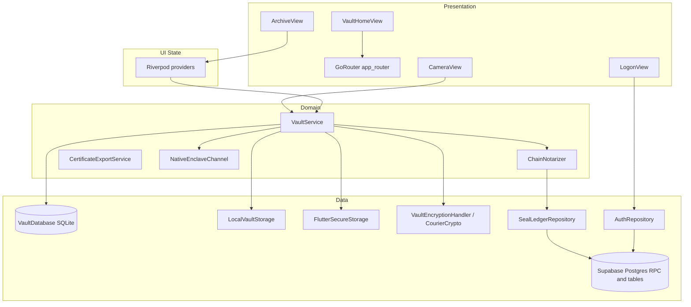

# FactLockCam Blueprints — 14 May 2026

**Purpose:** A detailed technical breakdown of the **present** FactLockCam system architecture as implemented in this repository—layers, data flows, integration surfaces, and operational constraints—suitable for engineering onboarding and design review.

**Wiki twin (navigation + schema):** `wiki/analyses/FactLockCam_Blueprints_14May2026.md` (linked from `wiki/index.md`).

**Canonical synthesis elsewhere:** Product verification baseline and hosted-Supabase repair narrative live in `wiki/concepts/FactLockCam_Product_Baseline_2026-05.md`; the prior dated architecture snapshot is `wiki/analyses/MASTER_CONTEXT13MAY2026.md` (2026-05-13); gap-to-target (ProofLock manifest) lives in `wiki/analyses/ProofLock_Refactor_Scope.md`.

---

## 1. Positioning and trust model

- **Product:** FactLockCam is a Flutter application for authenticated capture, **local-first** sealing, and **Supabase-backed** proof surfaces. It is framed as a **tamper-evident** media vault—authenticity heuristics and risk reduction—not a claim of absolute proof-of-truth, mathematical certainty, or guaranteed sensor-origin (see project rules and `wiki/concepts/FactLockCam_Product_Baseline_2026-05.md`).
- **Current remote “proof” path:** A **ProofLock-shaped** sequence: `check_proof_status` → `NativeEnclaveChannel.signHash` (still **simulated** on device) → `ChainNotarizer` (default `SimulatedChainNotarizer` → RPC `simulate_chain_notarize`) → local AES-GCM vault + SQLite → `proof_ledger` insert when remote steps succeed; otherwise `pending_sync` with backoff.
- **Target bar (out of scope for “present” detail but important context):** Hardware-backed signing, durable chain anchoring, C2PA, RPC-only courier surfaces, and outsider verification—as described in `wiki/analyses/ProofLock_Refactor_Scope.md` and `wiki/sources/ProofLock_Architectural_Manifest.md`.

---

## 2. Repository topology

| Area | Role |
|------|------|
| `factlockcam_app/` | Flutter app: UI, domain services, local persistence, Supabase clients |
| `supabase/` | Postgres schema, migrations, RLS, RPC definitions, local CLI config |
| `scripts/` | Operational wrappers (`factlockcam_supabase_pipeline.sh`, dart-define sync, resets) |
| `wiki/` | LLM-maintained architecture knowledge (`wiki/index.md` as navigation root) |
| `raw/` | Immutable source material for wiki ingestion |

---

## 3. Client stack (presentation and composition)

### 3.1 Framework and libraries

- **Flutter / Dart** with **`flutter_riverpod`** for UI-facing state (`ProviderScope` at `factlockcam_app/lib/main.dart`).
- **`go_router`** for navigation; auth-driven redirects in `factlockcam_app/lib/app/router/app_router.dart`.
- **`get_it`** as the composition root: `factlockcam_app/lib/core/di/injection.dart` registers singletons (explicit registration; injectable/codegen not used—see comment in `injection.dart`).
- **Bridging pattern:** Domain services are registered in GetIt and exposed to widgets via Riverpod `Provider`s (e.g. `vaultServiceProvider` in `vault_service.dart`).

### 3.2 Entry and configuration

- **`main.dart`:** `WidgetsFlutterBinding.ensureInitialized()`; if `AppConfig.hasSupabaseConfig`, calls `Supabase.initialize` with compile-time `String.fromEnvironment('SUPABASE_URL')` and `SUPABASE_ANON_KEY`; then `configureDependencies()`; then `runApp(ProviderScope(child: FactLockCamApp()))`.
- **`AppConfig`** (`core/config/app_config.dart`): optional `USE_POLYGON_NOTARIZER` and `REQUIRE_HARDWARE_ATTESTATION` (the latter is **defined but not wired** into capture/sync gating as of this blueprint).
- **Dart defines:** Filtered `factlockcam_app/dart_defines.json` is generated from `.env.local` via `scripts/write_flutter_dart_defines.py` / `scripts/sync_flutter_dart_defines.sh`; IDE launch can run the sync pre-debug (`.vscode/`). **Cold rebuild** is required after define changes—hot restart can leave stale compile-time values.

### 3.3 Routing surface

Defined in `app_router.dart`:

| Route | Behavior |
|------|----------|
| `/` | Redirects to logon |
| `/logon` | Email OTP flow |
| `/vault-home` | Hub (Archive / Picture / Video) |
| `/archive` | Tabbed photo/video archive |
| `/camera?mode=photo\|video` | Shared `CameraView` with `AcquisitionMode` |
| `/vault-dashboard` | **Legacy redirect** → `/vault-home` |

Unauthenticated users are redirected to `/logon`; authenticated users on `/logon` redirect to the hub.

---

## 4. Authentication and session

- **Mechanism:** Supabase **email OTP** (`signInWithOtp`, 6-digit `OtpType.email` verify). Implementation spans `data/supabase/auth_repository.dart`, `ui/controllers/auth_controller.dart`, `ui/views/logon_view.dart`.
- **Session coupling:** `authStateProvider` drives GoRouter redirects; without Supabase config the shell still runs with an in-app notice that Magic Number auth needs configuration.
- **Sign-out:** Burns **local wallet** (SQLite, vault files, secure key) **before** remote sign-out—see baseline in `wiki/concepts/FactLockCam_Product_Baseline_2026-05.md`.

---

## 5. Capture subsystem (dual mode)

### 5.1 Modes and navigation

- **`AcquisitionMode`** (`ui/views/camera/acquisition_mode.dart`): `photo` vs `video`, parsed from query string on `/camera`.
- **`CameraView`** (`ui/views/camera/camera_view.dart`):
  - Rear-camera preference; **`enableAudio`** when `mode.isVideo`.
  - **Photo:** `controller.takePicture()` on shutter action.
  - **Video:** `startVideoRecording` / `stopVideoRecording` with REC-state UX.
- **Permissions:** Camera + **microphone** for video (iOS `Info.plist`, Android `AndroidManifest.xml`—see product baseline provenance).

### 5.2 Forensic UI and performance rules

- Overlays use lightweight **`CustomPaint`** / painters (e.g. `ReticlePainter`, `TelemetryOverlay`, `CameraChromeFrame`, `ShutterButtonPainter` under `core/ui/painters/`).
- High-frequency overlay / shutter visuals are **`RepaintBoundary`**-wrapped per project capture-pipeline rules.
- **Teardown hardening:** `CameraView` uses a static **`_teardownCamera`** path so `stopVideoRecording` can complete before controller disposal (dispose cannot be async).

---

## 6. Vault domain: sealing pipeline (`VaultService`)

### 6.1 Responsibilities

`factlockcam_app/lib/domain/services/vault_service.dart` orchestrates:

- Isolate-based read + **SHA-256** fingerprinting.
- Optional online preflight and notarization via `SealLedgerRepository` + `ChainNotarizer`.
- **AES-GCM** encrypt (`VaultEncryptionHandler` / `CipherEngine`), thumbnail generation (images + **`video_thumbnail`** for video), filesystem layout via `LocalVaultStorage`.
- SQLite metadata via `VaultDatabase` (`ArchiveItem` model).
- **Courier-verified extraction:** `extractForCourier` + `CourierCrypto.decryptAndVerifyFingerprint` for owner-side viewing and future packaging.

### 6.2 `proofLockFile` — ordered runtime (conceptual)

This is the core ProofLock-shaped path used when sealing a capture file:

1. **MIME inference** from path (`_inferMimeType`).
2. **`Isolate.run`** (or equivalent isolate offload) to read bytes and compute **SHA-256** (`_readFileAndSha256InIsolate`).
3. If Supabase repository is configured and `userId` non-empty:
   - **`check_proof_status`** RPC with `p_file_hash`. Only **`new`** is treated as proceedable; other statuses throw **`ProofLockConflictException`**.
   - Transient/remotable failures may set **`pendingRemoteSync`** instead of failing hard (see `_isRecoverableRemoteFailure`).
4. **`NativeEnclaveChannel.signHash(fileHash)`** — **simulated** payloads in current builds; failures may flip `pendingRemoteSync`.
5. **`ChainNotarizer.notarize`** — default **`SimulatedChainNotarizer`** delegates to **`simulate_chain_notarize`** (`p_file_hash`, `p_device_signature`). **`PolygonChainNotarizer`** is a stub; keep `USE_POLYGON_NOTARIZER=false` until implemented.
6. **Local encrypt + thumbnail + paths** on disk.
7. **SQLite upsert.** If upsert fails after files were written, **`_persistSealedBytes`** performs **compensating deletion** of encrypted + thumbnail files to avoid orphan assets.
8. **`proof_ledger` insert** when remote path completed; else row marked **`pending_sync`** with backoff fields.
9. **`seal_ledger`** remains in use for **best-effort replica** work during **`retryPendingRemoteSync`** (see repository and baseline).
10. Temp capture cleanup on success paths.

### 6.3 Public entry points (conceptual)

- **`sealAndStoreCapture`** routes camera output into `proofLockFile` (and related helpers) as documented in wiki provenance lists.
- **`retryPendingRemoteSync`** walks pending rows with backoff, reconciling replica + proof path when connectivity/auth allows.

---

## 7. Remote integration layer (Supabase)

### 7.1 Client abstraction

- **`SupabaseClientHandle`** wraps optional client presence when defines are missing or init skipped (`data/supabase/supabase_client_handle.dart`).
- **`SealLedgerRepository`** (`data/supabase/seal_ledger_repository.dart`) centralizes:
  - **`check_proof_status`** → `p_file_hash`
  - **`simulate_chain_notarize`** → `p_file_hash`, `p_device_signature`
  - **`seal_ledger`** insert + idempotent handling of duplicate fingerprint (`23505` path)
  - **`proof_ledger`** insert with `asset_hash`, `device_signature`, `chain_tx_hash`
  - Wallet resolution via `profiles` / `wallet_id` for ledger writes

### 7.2 Database and RLS (high level)

Foundation + repair migrations under `supabase/migrations/` establish:

- **`profiles`** (user ↔ opaque **`wallet_id`**)
- **`seal_ledger`** (active-wallet replica)
- **`proof_ledger`** + **`simulated_chain_ledger`** (ProofLock-aligned surfaces post-repair)

Notable operational migrations referenced in wiki:

- **`20260509160000_repair_remote_prooflock_schema.sql`** — **destructive** repair aligning `proof_ledger` + RPCs to simulated-chain model; do not run casually on DBs with data to preserve.
- **`20260509200000_backfill_profiles_from_auth_users.sql`** — backfills missing `profiles` / `wallet_id`.
- **`20260510120000_tighten_ledger_select_rls.sql`** — replaces overly broad ledger `SELECT` with **wallet-scoped** authenticated reads.

RPCs are implemented as **`SECURITY DEFINER`** with PostgREST cache refresh patterns (`NOTIFY pgrst, 'reload schema'`) per project RPC standards.

---

## 8. Archive UX and Domain Interaction Contract

- **Archive list** reads **SQLite + thumbnail paths** only—no decryption for scrolling lists (`wiki/analyses/FactLockCam_Master_Blueprint.md`).
- **Tabs:** Photos vs Videos; `video/*` rows show play-badge overlay; decode failures can fall back to `videocam_outlined`.
- **Pending sync:** Per-row badges, banner, **Retry now**; background **`PendingSyncScheduler`** (~3 min) plus hub/archive lifecycle hooks call into dashboard/sync controllers (`syncPendingInBackground`).
- **Actions:** **`MediaActionType`**, **`AssetActionRegistry`**, **`AssetAction`**, **`UniversalAssetToolbar`** (`core/archive/...`, `features/archive/presentation/providers/asset_action_provider.dart`) map allowed actions by MIME/media type instead of ad-hoc buttons.
- **Full-size viewing:**
  - **`ArchivePhotoView`:** verified decrypt path with **cached extraction future** per fingerprint to avoid redundant decrypt on rebuilds.
  - **`ArchiveVideoView`:** `extractForCourier` → temp file → `video_player`.
- **Per-item delete:** removes local SQLite row + encrypted/thumbnail files; **does not** erase remote proof rows (policy TBD per risk register in wiki).

---

## 9. Auxiliary domain services

- **`CertificateExportService`** — text certificate draft; legal copy in `lib/core/legal/disclaimers.dart` (FRE 902 framing per project rules).
- **`NativeEnclaveChannel`** — method channel (`com.factlockcam.app/enclave`); **simulated** `signHash` on iOS/Android until Secure Enclave / Keystore work lands.

---

## 10. Local data architecture

| Concern | Mechanism |
|---------|-----------|
| Encrypted originals | `LocalVaultStorage` under app documents |
| Thumbnails | Separate files; video thumbs via `video_thumbnail` with MIME-aware temp extensions (`videoThumbnailTempExtensionForMime` in `vault_service.dart`) |
| Metadata | SQLite via `VaultDatabase` / `ArchiveItem` |
| Master key | `FlutterSecureStorage` (`factlockcam:vault_key`, legacy read for `snapseal:vault_key`) |
| Integrity at extract | `CourierCrypto` re-hash vs stored fingerprint |

---

## 11. Security, privacy, and operational risks (current)

Consolidated from `wiki/analyses/MASTER_CONTEXT13MAY2026.md` and `wiki/analyses/FactLockCam_Master_Blueprint.md`:

- **Simulated signing** is not ProofLock-grade hardware provenance; UI/product must not overclaim.
- **Polygon** durable anchoring is unimplemented; simulated chain remains default.
- **`pending_sync`** may linger without rich user diagnostics; backoff retries are partly silent.
- **RLS / grants:** Continue review of `anon` vs `authenticated`, RPC visibility (`check_proof_status`), and wallet-scoped ledger reads before production hardening.
- **Hosted schema drift:** Use `scripts/factlockcam_supabase_pipeline.sh` and explicit migration discipline; repair migrations can be destructive.
- **Test depth:** As of 2026-05-13 wiki note, **31** Flutter tests across **nine** files—good smoke/regression coverage for several paths, not yet a full crypto/sync failure matrix.

---

## 12. Developer operations (short)

- **`scripts/factlockcam_supabase_pipeline.sh`:** login, link, local start/reset, lint, migration push (dry-run/push), migration list, config push, dart-define generation, `app-run`.
- **CI:** `.github/workflows/supabase.yml` validates / deploys migrations against linked project secrets (`FACTLOCKCAM_SUPABASE_PROJECT_REF`, etc.).
- **Local reset:** `scripts/supabase_local_hard_reset.sh` for deterministic Docker stack reset (see older master context docs).

---

## 13. Layer diagram (logical)

---

## 14. Related references (read order)

1. `wiki/concepts/FactLockCam_Product_Baseline_2026-05.md` — verified workflow + Supabase compressed baseline  
2. `wiki/analyses/MASTER_CONTEXT13MAY2026.md` — dated full snapshot (2026-05-13)  
3. `wiki/analyses/FactLockCam_Master_Blueprint.md` — feature inventory + risks  
4. `wiki/analyses/ProofLock_Refactor_Scope.md` — gaps and phased work  
5. Key code anchors: `factlockcam_app/lib/main.dart`, `lib/app/router/app_router.dart`, `lib/core/di/injection.dart`, `lib/domain/services/vault_service.dart`, `lib/data/supabase/seal_ledger_repository.dart`, `supabase/migrations/`
