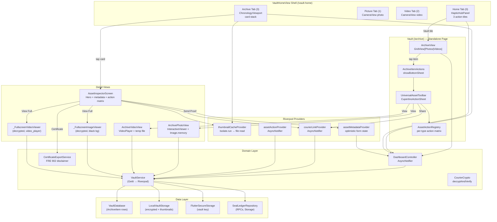

# FactLockCam Media Control Blueprints — 17 May 2026

**Purpose:** A high-resolution technical breakdown of the two primary media-browsing and asset-inspection surfaces in the FactLockCam Flutter application:
1. **Vault** — the standalone grid-based archive (`/archive`) entered via the "Vault" action tile on the Home tab.
2. **Archive** — the embedded chronology viewport (tab index 3 of the vault shell) entered via the "Archive" tab in the bottom `ProfessionalNavBar`.

**Wiki twin (schema reference):** See `wiki/index.md` → `wiki/analyses/MASTER_CONTEXT16MAY2026.md` for the full architecture snapshot; `wiki/analyses/FactLockCam_Master_Blueprint.md` for capability inventory; `wiki/concepts/FactLockCam_Product_Baseline_2026-05.md` for verified workflows.

**Companion document:** `FactLockCam_Blueprints14May2026.md` covers the wider system (capture, sealing pipeline, Supabase integration, ops).

---

## 1. Positioning and Terminology

| Term | Meaning in this document |
|------|--------------------------|
| **Vault** | The standalone `ArchiveView` (`/archive` route) — a `GridView`-based browser with Photos / Videos tabs. Entered by tapping the **Vault** action tile on the Home hub. |
| **Archive** | The embedded `ChronologyViewport` (index 3 of `VaultHomeView`'s `IndexedStack`) — a vertically-scrolling card-stack browser with Hero transitions. Entered by tapping the **Archive** tab in the bottom `ProfessionalNavBar`. |
| **Hub** | The `HapticHubPanel` (Home tab, index 0) — the landing screen with three action tiles (Vault, Picture, Video) over a video backdrop. |
| **Shell** | `VaultHomeView` (`/vault-home`) — the authenticated `IndexedStack` container hosting all four tabs. |

Both surfaces render the same underlying archive data (`List<ArchiveItem>` from `DashboardController`) but differ in navigation pattern, visual treatment, and action depth.

---

## 2. Container Architecture: `VaultHomeView` Shell

```17:74:/Users/paulensor/Projects/ProofLockCleanup/factlockcam_app/lib/ui/mobile/vault_home_view.dart
class VaultHomeView extends ConsumerStatefulWidget {
  // ...
  static const routePath = '/vault-home';
  // ...
}

class _VaultHomeViewState extends ConsumerState<VaultHomeView> {
  int _selectedIndex = 0;

  void _onCaptureComplete() {
    setState(() { _selectedIndex = 0; });
  }

  void _onCaptureRequested(int tabIndex) {
    setState(() { _selectedIndex = tabIndex; });
  }

  @override
  Widget build(BuildContext context) {
    return Scaffold(
      backgroundColor: AppColors.titaniumDeep,
      body: IndexedStack(
        index: _selectedIndex,
        children: [
          HapticHubPanel(onCaptureRequested: _onCaptureRequested),    // 0: Home
          CameraView(key: ..., mode: AcquisitionMode.photo, ...),      // 1: Picture
          CameraView(key: ..., mode: AcquisitionMode.video, ...),      // 2: Video
          ChronologyViewport(onCaptureRequested: _onCaptureRequested), // 3: Archive
        ],
      ),
      bottomNavigationBar: ProfessionalNavBar(
        selectedIndex: _selectedIndex,
        onDestinationSelected: (index) { setState(() { _selectedIndex = index; }); },
      ),
    );
  }
}
```

The shell uses `IndexedStack` so all four tabs remain alive in the widget tree. Tab switching mutates `_selectedIndex`. The `_onCaptureComplete` callback (passed to `CameraView`) switches back to Home (index 0) after sealing finishes.

### 2.1 Bottom Navigation: `ProfessionalNavBar`

```13:93:/Users/paulensor/Projects/ProofLockCleanup/factlockcam_app/lib/ui/mobile/vault/professional_nav_bar.dart
class ProfessionalNavBar extends StatelessWidget {
  // Five tabs: Home (0), Picture (1), Video (2), Archive (3), More (4)
  static const double height = 72;

  @override
  Widget build(BuildContext context) {
    // ...
    return DecoratedBox(
      decoration: BoxDecoration(
        color: AppColors.titaniumDeep,
        border: Border(top: BorderSide(color: AppColors.verifiedNeon.withValues(alpha: 0.35), width: 0.6)),
        // ...
      ),
      child: SizedBox(
        height: height,
        child: Row(children: [
          _TabItem(icon: Icons.shield_outlined,         label: 'Home',    isSelected: selectedIndex == 0, ...),
          _TabItem(icon: Icons.photo_camera_outlined,   label: 'Picture', isSelected: selectedIndex == 1, ...),
          _TabItem(icon: Icons.videocam_outlined,       label: 'Video',   isSelected: selectedIndex == 2, ...),
          _TabItem(icon: Icons.folder_open_outlined,    label: 'Archive', isSelected: selectedIndex == 3, ...),
          _TabItem(icon: Icons.more_horiz,              label: 'More',    isSelected: false, ...),  // Settings placeholder
        ]),
      ),
    );
  }
}
```

Each `_TabItem` renders a monospaced uppercase label (`AppTextStyles.monoSm`), an icon, and a 2px `verifiedNeon` top-border accent on the selected tab. Inactive tabs use `starkWhite` at 48% opacity. The **More** tab shows a "Settings panel coming soon" `SnackBar`.

### 2.2 Home Tab: `HapticHubPanel` (Entrance to Vault)

```19:165:/Users/paulensor/Projects/ProofLockCleanup/factlockcam_app/lib/ui/mobile/vault/haptic_hub_panel.dart
class HapticHubPanel extends ConsumerStatefulWidget {
  // The three action tiles:
  //   1. Vault   → context.push(ArchiveView.routePath)  → /archive (GridView)
  //   2. Picture → widget.onCaptureRequested?.call(1)   → IndexedStack tab 1 (CameraView photo)
  //   3. Video   → widget.onCaptureRequested?.call(2)   → IndexedStack tab 2 (CameraView video)
```

Each tile tap fires the `_handleHubTap` pipeline:

```41:45:/Users/paulensor/Projects/ProofLockCleanup/factlockcam_app/lib/ui/mobile/vault/haptic_hub_panel.dart
  void _handleHubTap(VoidCallback action) {
    unawaited(ref.read(hapticServiceProvider).lock());  // Heavy haptic
    unawaited(playBackdropFromStart());                   // Replay backdrop video from frame 0
    action();                                              // Navigate / switch tab
  }
```

The panel subscribes to `dashboardControllerProvider` to surface a pending-sync banner (identical pattern to ChronologyViewport). On first frame, it triggers `syncPendingInBackground()`.

---

## 3. Flow 1: Vault (`ArchiveView` via "Vault" Button)

### 3.1 Entry and Route

| Aspect | Detail |
|--------|--------|
| **Trigger** | User taps the **Vault** tile in `HapticHubPanel` (Home tab) |
| **Tile label** | "Vault" — "Browse photos and videos on this device" |
| **Icon** | `Icons.folder_open_outlined` |
| **Navigation** | `context.push(ArchiveView.routePath)` via GoRouter |
| **Route path** | `/archive` |
| **Widget** | `ArchiveView` (a `ConsumerStatefulWidget`) |

### 3.2 Widget Structure

```12:124:/Users/paulensor/Projects/ProofLockCleanup/factlockcam_app/lib/ui/mobile/archive_view.dart
class ArchiveView extends ConsumerStatefulWidget {
  static const routePath = '/archive';
  // ...
}

class _ArchiveViewState extends ConsumerState<ArchiveView> with SingleTickerProviderStateMixin {
  late final TabController _tabController;  // 2 tabs: Photos, Videos

  @override
  void initState() {
    super.initState();
    _tabController = TabController(length: 2, vsync: this);
    WidgetsBinding.instance.addPostFrameCallback((_) {
      ref.read(dashboardControllerProvider.notifier).syncPendingInBackground();
    });
  }
}
```

**Layout hierarchy:**

```
ArchiveView
└── Scaffold
    ├── AppBar
    │   ├── Leading: ← (Back) — pops to /vault-home if route can pop, else navigates directly
    │   └── Bottom: TabBar [Photos | Videos]
    └── Body: archive.when(
        ├── data → Column
        │   ├── [if pendingCount > 0] MaterialBanner("N items pending sync...") + "Retry now" button
        │   └── Expanded → TabBarView
        │       ├── _ArchiveGrid (photos, showVideoBadge: false)
        │       └── _ArchiveGrid (videos, showVideoBadge: true)
        ├── error → Center(Text)
        └── loading → Center(CircularProgressIndicator)
```

### 3.3 Data Source

Both tabs consume the same `List<ArchiveItem>` from `dashboardControllerProvider`:

```9:12:/Users/paulensor/Projects/ProofLockCleanup/factlockcam_app/lib/ui/controllers/dashboard_controller.dart
final dashboardControllerProvider =
    AsyncNotifierProvider<DashboardController, List<ArchiveItem>>(
      DashboardController.new,
    );
```

The list is partitioned client-side:
- **Photos**: items where `mimeType` does NOT start with `'video/'`
- **Videos**: items where `mimeType` starts with `'video/'`

```56:62:/Users/paulensor/Projects/ProofLockCleanup/factlockcam_app/lib/ui/controllers/dashboard_controller.dart
  Future<List<ArchiveItem>> build() async {
    return _loadResolvedArchive();
  }

  Future<List<ArchiveItem>> _loadResolvedArchive() async {
    return ref.read(vaultServiceProvider).listArchiveItems();
  }
```

`VaultService.listArchiveItems()` (`vault_service_io.dart:486`) reads from SQLite via `VaultDatabase`, runs each item through `_pathResolver.resolve()` (to repair stale file paths), regenerates missing video thumbnails if needed, and upserts corrected paths back to SQLite.

### 3.4 Grid Rendering: `_ArchiveGrid`

```140:221:/Users/paulensor/Projects/ProofLockCleanup/factlockcam_app/lib/ui/mobile/archive_view.dart
// _ArchiveGrid is a StatelessWidget using GridView.builder
// gridDelegate: SliverGridDelegateWithMaxCrossAxisExtent(maxCrossAxisExtent: 220)
//
// Each grid cell:
//   RepaintBoundary           ← performance isolation per rule vault-chronology-engine.mdc
//   └── Card (clipBehavior: antiAlias)
//       └── InkWell (onTap → onOpenItem)
//           └── GridTile
//               ├── footer: ColoredBox(black54) with title + shortened fingerprint
//               └── child: Stack
//                   ├── ArchiveThumbnail(thumbnailPath, showVideoBadge)
//                   ├── [if video] _VideoBadge (play_arrow circle)
//                   └── Positioned(top-right) "…" overflow button
```

Key visual conventions:
- **Title row**: displays `item.title` if non-empty (`fontWeight: w600`), else skipped; fingerprint always shown truncated to 12 chars; `"(pending)"` suffix if `item.pendingSync`.
- **Video badge**: a `Container` (56x56, `black54` circle) with `Icons.play_arrow` (white, 36px) centered over the thumbnail.
- **Overflow button**: a circular `IconButton` (`Icons.more_horiz`, white) in the top-right corner — same handler as the tap (`onOpenItem`).

### 3.5 Item Actions: `ArchiveItemActions.showBottomSheet`

Tapping a grid item (or its overflow button) opens a Cupertino action sheet:

```23:87:/Users/paulensor/Projects/ProofLockCleanup/factlockcam_app/lib/ui/mobile/archive_item_actions.dart
  static Future<void> showBottomSheet({
    required BuildContext context,
    required WidgetRef ref,
    required ArchiveItem item,
  }) async {
    await showCupertinoModalPopup<void>(
      context: context,
      builder: (sheetContext) {
        return ClipRRect(
          borderRadius: const BorderRadius.vertical(top: Radius.circular(24)),
          child: BackdropFilter(
            filter: ImageFilter.blur(sigmaX: 15.0, sigmaY: 15.0),
            child: UniversalAssetToolbar(
              assetHash: item.assetFingerprint,
              mediaType: item.mimeType ?? 'unknown',
              confirmAction: ...,     // delete → confirmation dialog
              onActionCompleted: ...,  // dispatches post-action navigation
              additionalActions: [
                CupertinoActionSheetAction(→ "Certificate draft"),
                CupertinoActionSheetAction(→ "Manage title and description"),
              ],
            ),
          ),
        );
      },
    );
  }
```

#### 3.5.1 `UniversalAssetToolbar` — action resolution

```10:139:/Users/paulensor/Projects/ProofLockCleanup/factlockcam_app/lib/core/archive/presentation/widgets/universal_asset_toolbar.dart
class UniversalAssetToolbar extends ConsumerWidget {
  @override
  Widget build(BuildContext context, WidgetRef ref) {
    final actionState = ref.watch(assetActionProvider);
    final isBusy = actionState.isLoading;
    final actions = AssetActionRegistry.getActionsForType(mediaType);

    return RepaintBoundary(
      child: CupertinoActionSheet(
        title: const Text('Asset Actions'),
        message: Text(_messageForMediaType(mediaType)),
        actions: [
          for (final action in actions)
            CupertinoActionSheetAction(onPressed: () => _handleAction(...), child: ...),
          ...additionalActions,
        ],
        cancelButton: CupertinoActionSheetAction(→ "Cancel"),
      ),
    );
  }
}
```

The toolbar delegates action availability to `AssetActionRegistry.getActionsForType()`.

#### 3.5.2 `AssetActionRegistry` — per-type action matrix

```5:84:/Users/paulensor/Projects/ProofLockCleanup/factlockcam_app/lib/core/archive/domain/services/asset_action_registry.dart
class AssetActionRegistry {
  // Picture / Video: [view, verify, share, delete]
  // Document:         [view, verify, export, share, delete]
  // Unknown:          [verify, delete]
  // Web platform:     verify is excluded (requires dart:io filesystem)

  static List<MediaActionType> getActionsForType(String mediaType) { ... }
}
```

The `MediaActionType` enum:

```1:1:/Users/paulensor/Projects/ProofLockCleanup/factlockcam_app/lib/core/archive/domain/models/media_action_type.dart
enum MediaActionType { view, verify, delete, share, export }
```

Action execution dispatches through `AssetAction` (`asset_action_provider.dart`), a Riverpod `AsyncNotifier` (code-generated via `@riverpod`):

```11:51:/Users/paulensor/Projects/ProofLockCleanup/factlockcam_app/lib/features/archive/presentation/providers/asset_action_provider.dart
@Riverpod(keepAlive: true)
class AssetAction extends _$AssetAction {
  Future<void> executeAction(MediaActionType action, String assetHash) async {
    switch (action) {
      case MediaActionType.view:      break;  // handled by onActionCompleted callback
      case MediaActionType.verify:    await proofLockService.extractForCourier(assetHash);  break;
      case MediaActionType.delete:    await vaultService.deleteArchiveItem(assetHash);      break;
      case MediaActionType.share:     break;  // TODO: wire courier export
      case MediaActionType.export:    break;  // TODO: wire certificate/PDF export
    }
  }
}
```

Note: `view` and `share` are **not** executed inside `AssetAction` — they are handled by `onActionCompleted` callbacks in `ArchiveItemActions`:

```45:64:/Users/paulensor/Projects/ProofLockCleanup/factlockcam_app/lib/ui/mobile/archive_item_actions.dart
              onActionCompleted: (action) async {
                switch (action) {
                  case MediaActionType.view:    _openVerifiedAsset(context, item);   break;
                  case MediaActionType.verify:  await _showVerifiedDialog(context);  break;
                  case MediaActionType.delete:  ref.invalidate(dashboardControllerProvider); break;
                  case MediaActionType.share:   await showSendProofDialog(context, ref, item); break;
                  case MediaActionType.export:  break;
                }
              },
```

#### 3.5.3 Detail Views (from "View" action)

`_openVerifiedAsset` routes to the appropriate viewer:

```89:98:/Users/paulensor/Projects/ProofLockCleanup/factlockcam_app/lib/ui/mobile/archive_item_actions.dart
  static void _openVerifiedAsset(BuildContext context, ArchiveItem item) {
    final isVideo = item.mimeType?.startsWith('video/') ?? false;
    Navigator.of(context).push(
      MaterialPageRoute<void>(
        builder: (_) => isVideo
            ? ArchiveVideoView(item: item)
            : ArchivePhotoView(item: item),
      ),
    );
  }
```

**`ArchivePhotoView`** (`archive_photo_view.dart`):
- Stores a `Future<SealedAsset>` initialized once per fingerprint in `initState()` (cached across rebuilds via `didUpdateWidget` check).
- Calls `VaultService.extractForCourier(assetFingerprint)` — decrypts the encrypted original, recomputes SHA-256, verifies against the stored fingerprint.
- Renders the decrypted `Uint8List` bytes in an `InteractiveViewer` (minScale: 1, maxScale: 5) with `Image.memory`.
- Full black background `Scaffold`.

**`ArchiveVideoView`** (`archive_video_view.dart`):
- Calls `VaultService.extractForCourier()` to get decrypted bytes, then `createArchiveVideoSource()` to write a temp file and initialize a `VideoPlayerController`.
- Renders the video in a `LayoutBuilder`-constrained `SizedBox` that respects aspect ratio.
- Play/pause via a filled `IconButton`.
- Dispose path: `source.dispose()` (async — deletes temp file + disposes controller).

#### 3.5.4 "Send Proof" (Share action)

```145:175:/Users/paulensor/Projects/ProofLockCleanup/factlockcam_app/lib/ui/mobile/archive_item_actions.dart
  static Future<void> showSendProofDialog(BuildContext context, WidgetRef ref, ArchiveItem item) async {
    final password = await _promptForRecipientPassword(context);  // CupertinoAlertDialog with password field
    // ...
    final url = await ref.read(courierLinkProvider.notifier).generateLink(item.assetFingerprint, password);
    await SharePlus.instance.share(ShareParams(text: url));
  }
```

The `CourierLink` provider (`courier_link_provider.dart`) delegates to `VaultService.createCourierPackage()`:

```293:358:/Users/paulensor/Projects/ProofLockCleanup/factlockcam_app/lib/domain/services/vault_service_io.dart
  Future<String> createCourierPackage({required String assetHash, required String verifierPassword}) async {
    // 1. Validate auth + Supabase config
    // 2. Resolve WEB_VAULT_BASE_URL (compile-time define > localhost debug fallback)
    // 3. Reject localhost in non-debug (unreachable by recipients)
    // 4. Read encrypted blob from local storage
    // 5. Load vault key, encode it
    // 6. Upload encrypted blob to Supabase Storage (courier-blobs bucket)
    // 7. Call get_or_create_courier_package RPC (creates courier_packages row)
    // 8. Return full URL: {WEB_VAULT_BASE_URL}/courier?pkg={packageId}
  }
```

#### 3.5.5 "Manage title and description" (metadata dialog)

```317:373:/Users/paulensor/Projects/ProofLockCleanup/factlockcam_app/lib/ui/mobile/archive_item_actions.dart
  static Future<void> _showMetadataDialog(...) async {
    // AlertDialog with two TextFields (Title, Description)
    // On save → dashboardControllerProvider.notifier.updateArchiveMetadata(...)
    // Optimistic: UI updates immediately via DashboardController state refresh
  }
```

#### 3.5.6 "Certificate draft"

```375:396:/Users/paulensor/Projects/ProofLockCleanup/factlockcam_app/lib/ui/mobile/archive_item_actions.dart
  static Future<void> _showCertificateDraft(...) async {
    final draft = ref.read(certificateExportServiceProvider).buildCertificateDraft(item);
    // AlertDialog with SelectableText(draft)
  }
```

Uses `CertificateExportService` (`domain/export/certificate_export_service.dart`), which includes FRE 902 legal disclaimers per rule `03_crypto_and_legal_bounds.mdc`.

#### 3.5.7 "Delete" action

```100:125:/Users/paulensor/Projects/ProofLockCleanup/factlockcam_app/lib/ui/mobile/archive_item_actions.dart
  static Future<bool> _confirmDelete(BuildContext context) async {
    // AlertDialog: "This removes the encrypted copy and thumbnail from this device only.
    // It does not remove proof rows on the server."
    return ok == true;
  }
```

Delete calls `VaultService.deleteArchiveItem()`:

```640:651:/Users/paulensor/Projects/ProofLockCleanup/factlockcam_app/lib/domain/services/vault_service_io.dart
  Future<void> deleteArchiveItem(String assetFingerprint) async {
    // 1. Look up item in SQLite
    // 2. Resolve paths
    // 3. Delete encrypted file + thumbnail file from local storage
    // 4. Delete SQLite row
    // (Remote proof_ledger rows are intentionally left untouched)
  }
```

---

## 4. Flow 2: Archive (`ChronologyViewport` via Bottom Nav)

### 4.1 Entry and Context

| Aspect | Detail |
|--------|--------|
| **Trigger** | User taps the **Archive** tab in `ProfessionalNavBar` (index 3) |
| **Tab label** | "ARCHIVE" (`Icons.folder_open_outlined`) |
| **Widget** | `ChronologyViewport` (embedded in `IndexedStack`) |
| **Route** | Stays within `/vault-home` (no navigation — tab switch) |

### 4.2 Widget Structure

```31:258:/Users/paulensor/Projects/ProofLockCleanup/factlockcam_app/lib/ui/mobile/vault/chronology_viewport.dart
class ChronologyViewport extends ConsumerStatefulWidget
    with HeavyMetalBackdropMixin<ChronologyViewport> {
  // ...
}
```

**Layout hierarchy:**

```
ChronologyViewport
└── Scaffold (backgroundColor: titaniumDeep)
    └── SafeArea → Column
        ├── HeavyMetalLogoBanner                    ← branded header
        ├── [if pending > 0] MaterialBanner + "RETRY NOW" button
        └── Expanded
            └── archive.when(
                ├── data → _buildContent →
                │   ├── [if empty] _EmptyState(Picture, Video, Vault quick-action tiles)
                │   └── [if items] ListView.builder
                │       └── SwipeActionLayer
                │           └── ChronologyCard (RepaintBoundary-wrapped)
                ├── error → Text (alertAmber, monoSm)
                └── loading → CircularProgressIndicator (verifiedNeon)
```

### 4.3 Scroll-Driven Card Animation

Each `ChronologyCard` computes its transform purely from `scrollOffset` and `viewportHeight` — **no AnimationController**:

```57:110:/Users/paulensor/Projects/ProofLockCleanup/factlockcam_app/lib/ui/mobile/vault/chronology_card.dart
    // Card center in viewport-relative coordinates:
    final double cardCenter = totalStep * widget.index - widget.scrollOffset + itemHeight / 2;
    final double viewportCenter = widget.viewportHeight / 2;
    final double distanceFromCenter = cardCenter - viewportCenter;

    // Normalised distance: 0 at centre, +/-1 at viewport edges (clamped to ±1.5)
    final double normalised = (distanceFromCenter / viewportCenter).clamp(-1.5, 1.5);

    // Scale: 1.0 at centre, 0.75 at edges (parabolic falloff)
    final double scale = 1.0 - 0.25 * (normalised * normalised).clamp(0, 1);

    // Opacity: 1.0 at centre, 0.25 at edges
    final double opacity = 1.0 - 0.75 * (normalised.abs()).clamp(0, 1);

    // Rotation: 0 at centre, ±2 degrees at edges
    final double rotationRad = math.pi / 90 * normalised.clamp(-1, 1);

    // Horizontal translation: 0 at centre, ±40px at edges
    final double translateX = 40.0 * normalised.clamp(-1, 1);
```

The card is rendered inside a `RepaintBoundary` (per rule `vault-chronology-engine.mdc`, item 1) with an `Opacity` + `Transform` (Matrix4 with translateX + rotateZ + scale).

**Haptic trigger on center crossing** (`ChronologyCard._triggerCenterHaptic`):
- Fires `HapticService.success()` when `|distanceFromCenter| < 8.0` and the previous build's distance was outside that band.
- This creates a light haptic "click" as each card passes through the screen's vertical center.

### 4.4 Thumbnail Decoding: `thumbnailCacheProvider`

```18:33:/Users/paulensor/Projects/ProofLockCleanup/factlockcam_app/lib/ui/mobile/vault/providers/thumbnail_cache_provider.dart
final thumbnailCacheProvider = FutureProvider.family<Uint8List, String>((ref, assetFingerprint) async {
  if (kIsWeb) return Uint8List(0);  // Web uses fallback icon

  final db = ref.read(vaultDatabaseProvider);
  final item = await db.findArchiveItem(assetFingerprint);
  if (item == null || !_thumbnailFileExists(item.thumbnailPath)) return Uint8List(0);

  return Isolate.run(() => File(item.thumbnailPath).readAsBytesSync());
});
```

Key design decisions:
- **Isolate offload**: File I/O runs off the main isolate, preventing frame drops during scroll (`Isolate.run`).
- **Family provider**: Cached by `assetFingerprint` — same card won't re-decode on rebuilds.
- **Web fallback**: Returns empty `Uint8List` on web; the card shows a placeholder icon instead.

### 4.5 Card Visual Structure

```100:258:/Users/paulensor/Projects/ProofLockCleanup/factlockcam_app/lib/ui/mobile/vault/chronology_card.dart
    // Container: 340px height, rounded 14px, titanium gradient (Highlight → Panel → #0A0A0A)
    // Border: verifiedNeon (0.55 alpha) or alertAmber (if pendingSync)
    // BoxShadow: subtle verifiedNeon glow + black offset shadow
    //
    // Stack:
    //   ┌─ Thumbnail (Positioned.fill)
    //   │   ┌─ Hero(tag: 'hero_thumb_{assetFingerprint}')
    //   │   │   └─ thumbnailAsync.when(
    //   │   │       data    → Image.memory(bytes, fit: BoxFit.cover)
    //   │   │       error   → _ThumbnailFallback(icon)
    //   │   │       loading → _ThumbnailFallback(icon)
    //   │   │   )
    //   │   └──
    //   ├─ Bottom metadata panel (Positioned, gradient scrim)
    //   │   ├─ Title (or shortened fingerprint, monoMd, starkWhite)
    //   │   ├─ Timestamp | MIME type (monoSm, 62% opacity)
    //   │   └─ File size (monoSm, 48% opacity)
    //   └─ Pending sync badge (top-right, alertAmber container, "SYNC" in black, w800)
```

### 4.6 `SwipeActionLayer` — Horizontal Swipe Gestures

```16:169:/Users/paulensor/Projects/ProofLockCleanup/factlockcam_app/lib/ui/mobile/vault/swipe_action_layer.dart
class SwipeActionLayer extends StatefulWidget {
  // Right-swipe: Kinetic Green background + "Share / Courier" icon
  // Left-swipe:  White background + "Verify Proof" icon
  // Threshold: 120px → fires HapticFeedback.heavyImpact() + triggers onShare/onVerify callback
  // Max reveal: 200px
  // Release below threshold → springs back to neutral
}
```

Swipe action callbacks in `ChronologyViewport`:

```236:257:/Users/paulensor/Projects/ProofLockCleanup/factlockcam_app/lib/ui/mobile/vault/chronology_viewport.dart
  void _onSwipeShare(ArchiveItem item) {
    unawaited(ref.read(hapticServiceProvider).heavyImpact());
    unawaited(ArchiveItemActions.showSendProofDialog(context, ref, item));
  }

  void _onSwipeVerify(ArchiveItem item) {
    unawaited(ref.read(hapticServiceProvider).heavyImpact());
    // Shows SnackBar: "Verify: {short fingerprint}"
  }
```

### 4.7 Tap → `AssetInspectorScreen`

Tapping a card navigates to the full Inspector:

```228:234:/Users/paulensor/Projects/ProofLockCleanup/factlockcam_app/lib/ui/mobile/vault/chronology_viewport.dart
  void _onTapCard(ArchiveItem item) {
    Navigator.of(context).push(
      MaterialPageRoute(builder: (_) => AssetInspectorScreen(item: item)),
    );
  }
```

#### 4.7.1 `AssetInspectorScreen` — Full Layout

```27:363:/Users/paulensor/Projects/ProofLockCleanup/factlockcam_app/lib/ui/mobile/vault/asset_inspector_screen.dart
class AssetInspectorScreen extends ConsumerStatefulWidget
    with HeavyMetalBackdropMixin<AssetInspectorScreen> {
```

**Layout hierarchy:**

```
AssetInspectorScreen
└── Scaffold (backgroundColor: titaniumDeep)
    └── SafeArea → Column
        ├── HeavyMetalLogoBanner
        │   ├── [if metaState.isDirty] Save button (kineticGreen)
        │   └── Close button (starkWhite, pops navigator)
        ├── [if saveError] Error banner (alertAmber background)
        └── Expanded → SingleChildScrollView
            ├── 1. _HeroImage (Hero tag: 'hero_thumb_{fingerprint}')
            │   └── ClipRRect(14px) → AspectRatio(4:3) → Hero → thumbnailAsync
            ├── 2. _MetadataField (TITLE)     ← TextFormField, monoMd
            ├── 3. _MetadataField (DESCRIPTION) ← TextFormField, maxLines: 3
            ├── 4. _InfoStrip (read-only)
            │   ├── HASH:   {20-char fingerprint prefix}
            │   ├── TYPE:   {mimeType}
            │   ├── SIZE:   {formatted bytes (B/KB/MB)}
            │   ├── CAPTURED: {YYYY-MM-DD HH:MM}
            │   └── [if pending] SYNC: PENDING (alertAmber)
            └── 5. _ActionMatrix
                ├── SEND PROOF        → _onSendProof()   → ArchiveItemActions.showSendProofDialog
                ├── VIEW FULL ASSET   → _onViewFull()    → extractForCourier → fullscreen viewer
                ├── VIEW CERTIFICATE  → _onViewCertificate() → CertificateExportService draft dialog
                └── BACK TO DASHBOARD → Navigator.pop()
```

#### 4.7.2 Metadata Editing (Optimistic)

The `assetMetadataProvider` (`asset_metadata_provider.dart`) manages per-asset editable state:

```44:128:/Users/paulensor/Projects/ProofLockCleanup/factlockcam_app/lib/ui/mobile/vault/providers/asset_metadata_provider.dart
final assetMetadataProvider = NotifierProvider.family<AssetMetadataNotifier, AssetMetadataState, String>(...);

class AssetMetadataNotifier extends Notifier<AssetMetadataState> {
  // initFromArchiveItem(item) — populates from on-disk ArchiveItem
  // setTitle / setDescription — optimistic: marks dirty immediately
  // save() — optimistically clears dirty, then calls DashboardController.updateArchiveMetadata()
  //           on error, restores dirty + sets saveError
}
```

The `DashboardController.updateArchiveMetadata()` performs an optimistic in-memory update of the archive list before persisting to SQLite:

```107:148:/Users/paulensor/Projects/ProofLockCleanup/factlockcam_app/lib/ui/controllers/dashboard_controller.dart
  Future<void> updateArchiveMetadata({...}) async {
    // 1. Read existing row from SQLite
    // 2. Normalize title/description (null vs empty vs trimmed)
    // 3. No-op if unchanged
    // 4. Persist via VaultService.updateArchiveMetadata (SQLite only, no proof_ledger mutation)
    // 5. Optimistically update in-memory state (map over current list)
  }
```

#### 4.7.3 "View Full Asset" — Deferred Decryption

```246:280:/Users/paulensor/Projects/ProofLockCleanup/factlockcam_app/lib/ui/mobile/vault/asset_inspector_screen.dart
  Future<void> _onViewFull() async {
    // 1. Show SnackBar: "Decrypting asset..."
    // 2. vault.extractForCourier(assetFingerprint)
    //    → AES-GCM decrypt + SHA-256 re-verify
    // 3. Route to _FullscreenImageViewer or _FullscreenVideoViewer
    //    Image: InteractiveViewer(Image.memory(bytes))
    //    Video: createArchiveVideoSource → VideoPlayerController → AspectRatio VideoPlayer
  }
```

This enforces the **Deferred Decryption** rule (item 2 in `vault-asset-inspector.mdc`): full-file decryption only triggers on explicit user action, not on initial load.

The `extractForCourier` method:

```603:627:/Users/paulensor/Projects/ProofLockCleanup/factlockcam_app/lib/domain/services/vault_service_io.dart
  Future<SealedAsset> extractForCourier(String assetFingerprint) async {
    // 1. Find item in SQLite
    // 2. Resolve paths (repair if needed)
    // 3. Load vault key bytes from secure storage
    // 4. Read encrypted original from disk
    // 5. CourierCrypto.decryptAndVerifyFingerprint:
    //    - AES-GCM decrypt
    //    - Recompute SHA-256 hash
    //    - Throw if hash ≠ expected fingerprint
    // 6. Return SealedAsset(assetFingerprint, clearBytes)
  }
```

### 4.8 Empty State

When no assets exist, `_EmptyState` renders:

```261:312:/Users/paulensor/Projects/ProofLockCleanup/factlockcam_app/lib/ui/mobile/vault/chronology_viewport.dart
  // "NO SEALED ASSETS" (monoMd, 42% white)
  // "Capture a photo or video to begin." (monoSm, 32% white)
  // Three _QuickActionTile widgets:
  //   Picture  → onCaptureRequested(1) [switches to CameraView photo]
  //   Video    → onCaptureRequested(2) [switches to CameraView video]
  //   Vault    → context.push(ArchiveView.routePath) [/archive]
```

The quick-action tiles use the same titanium gradient styling as the hub tiles but in a compact horizontal layout (icon + uppercase label, no subtitle, no chevron).

---

## 5. Shared Infrastructure

### 5.1 Data Flow Diagram

```
                          ┌──────────────────────┐
                          │   DashboardController │  (AsyncNotifier<List<ArchiveItem>>)
                          │   dashboardController │
                          │       Provider        │
                          └──────────┬───────────┘
                                     │ reads
                          ┌──────────▼───────────┐
                          │     VaultService      │  (GetIt singleton, exposed via Riverpod Provider)
                          │  vaultServiceProvider │
                          └──────────┬───────────┘
                                     │
              ┌──────────────────────┼──────────────────────┐
              │                      │                      │
     ┌────────▼───────┐    ┌────────▼───────┐    ┌────────▼───────┐
     │  VaultDatabase │    │LocalVaultStorage│    │FlutterSecureStor│
     │    (SQLite)    │    │  (file system)  │    │   (vault key)   │
     └────────────────┘    └────────────────┘    └────────────────┘

  ┌─ Providers consumed by UI ─────────────────────────────────────────┐
  │ thumbnailCacheProvider(assetFingerprint) → FutureProvider.family   │
  │   → Isolate.run → File.readAsBytesSync (thumbnail JPEG)            │
  │                                                                    │
  │ assetMetadataProvider(assetFingerprint) → NotifierProvider.family  │
  │   → AssetMetadataState(title, description, isDirty, saveError)     │
  │   → save() → DashboardController.updateArchiveMetadata()           │
  │                                                                    │
  │ assetActionProvider → AsyncNotifier (codegen)                      │
  │   → verify → extractForCourier                                     │
  │   → delete → vaultService.deleteArchiveItem                        │
  │                                                                    │
  │ courierLinkProvider → AsyncNotifier (codegen)                      │
  │   → generateLink → vaultService.createCourierPackage               │
  │                                                                    │
  │ certificateExportServiceProvider → Provider<CertificateExportService>│
  │   → buildCertificateDraft(item) → String (with FRE 902 disclaimer) │
  └────────────────────────────────────────────────────────────────────┘
```

### 5.2 ArchiveItem Data Model

```8:106:/Users/paulensor/Projects/ProofLockCleanup/factlockcam_app/lib/data/models/archive_item.dart
class ArchiveItem {
  final String assetFingerprint;    // SHA-256 hex string (64 chars)
  final String encryptedPath;       // Local path to AES-GCM encrypted file
  final String thumbnailPath;       // Local path to JPEG thumbnail
  final int byteLength;             // Original file size in bytes
  final DateTime createdAt;         // Capture/seal timestamp
  final bool pendingSync;           // true if remote proof/sync incomplete
  final String? mimeType;           // e.g. "image/jpeg", "video/quicktime"
  final String? title;              // User-editable title
  final String? description;        // User-editable description
  final int syncAttemptCount;       // Number of retry attempts
  final DateTime? lastSyncAttemptAt;
  final DateTime? nextRetryAt;      // Backoff-controlled next retry time
}
```

### 5.3 Pending Sync Coordination

```14:52:/Users/paulensor/Projects/ProofLockCleanup/factlockcam_app/lib/ui/controllers/dashboard_controller.dart
final PendingSyncCoordinator _pendingSyncCoordinator = PendingSyncCoordinator();

class PendingSyncCoordinator {
  Future<void>? _inFlight;

  Future<void> run(Future<void> Function() action) {
    // Serializes all sync attempts through a single mutex:
    // If a sync is already in-flight, callers wait on the existing future.
  }
}
```

Both `HapticHubPanel` and `ChronologyViewport` trigger `syncPendingInBackground()` on first frame. The `ArchiveView` also triggers it. All three serialize through `PendingSyncCoordinator.run()`.

### 5.4 Heavy Metal Design System (Visual Context)

| Token | Value | Usage in these flows |
|-------|-------|---------------------|
| `titaniumDeep` | `#121212` | Scaffold backgrounds |
| `titaniumPanel` | `#1C1C1C` | Card surfaces, gradient mid-stop, error banners |
| `titaniumHighlight` | `#3A3A3A` | Gradient top edge, specular highlights |
| `titaniumEdge` | `#2A2A2A` | Thin borders (info strip, form fields) |
| `starkWhite` | `#FFFFFF` | Primary text, action icons |
| `kineticGreen` | `#00D26A` | Save button, focus borders, active actions |
| `verifiedNeon` | `#39FF14` | Tab accent, card border, gradient border glow, action icons |
| `alertAmber` | `#FFB300` | Pending sync badge, error text, warning banners |

Typography:
- **`AppTextStyles.monoMd`** (`GoogleFonts.spaceMono`): Card titles, form field values, action labels.
- **`AppTextStyles.monoSm`** (`GoogleFonts.spaceMono`): Subtitles, timestamps, file sizes, info strip rows, pending banners, section headers ("ACTIONS", "CHOOSE AN ACTION").

---

## 6. Layer Diagram



---

## 7. Constraints and Rules Compliance

| Rule File | Constraint | Verified In |
|-----------|-----------|-------------|
| `01_flutter_state_architecture.mdc` | Riverpod + GetIt; no bloc/provider | `dashboardControllerProvider` (AsyncNotifier), `vaultServiceProvider` (GetIt bridge) |
| `vault-asset-inspector.mdc` §1 | Hero keyed by `assetFingerprint` | `ChronologyCard` → `AssetInspectorScreen`: tag `'hero_thumb_{fingerprint}'` |
| `vault-asset-inspector.mdc` §2 | Deferred decryption | Inspector loads thumbnail first; `extractForCourier` only on "View Full Asset" tap |
| `vault-asset-inspector.mdc` §3 | Optimistic metadata mutation, no proof_ledger changes | `assetMetadataProvider` → `DashboardController.updateArchiveMetadata` (SQLite only) |
| `vault-asset-inspector.mdc` §4 | Action matrix: Wrap or Column for buttons | `_ActionMatrix` uses a vertical `Column` of `_ActionTile` widgets |
| `vault-chronology-engine.mdc` §1 | RepaintBoundary per card | `ChronologyCard` wrapped in `RepaintBoundary`; `_ArchiveGrid` cells also wrapped |
| `vault-chronology-engine.mdc` §2 | Scroll-driven animation (no AnimationController) | `ChronologyCard`: `Transform` bound directly to `scrollOffset` |
| `vault-chronology-engine.mdc` §3 | Isolate decoding of thumbnails | `thumbnailCacheProvider`: `Isolate.run(() => File.readAsBytesSync())` |
| `vault-chronology-engine.mdc` §4 | Haptic lightImpact on center crossing | `ChronologyCard._triggerCenterHaptic`: `HapticService.success()` at |d|<8px |
| `vault-chronology-engine.mdc` §4 | Haptic heavyImpact on swipe threshold | `SwipeActionLayer._onHorizontalDragUpdate`: `HapticFeedback.heavyImpact()` at 120px |
| `04_forensic_ui_standards.mdc` | Monospaced font for hashes, telemetry | All hash/timestamp/size displays use `AppTextStyles.monoSm` / `monoMd` (`spaceMono`) |
| `04_forensic_ui_standards.mdc` | No thick borders over camera feed | (N/A — these views are post-capture, not camera overlays) |
| `courier-origination.mdc` §1 | State isolation: no Supabase in UI | All "Send Proof" flows through `CourierLink` AsyncNotifier → `VaultService` → `SealLedgerRepository` |
| `courier-origination.mdc` §2 | `WEB_VAULT_BASE_URL` binding | `_effectiveCourierWebVaultBase()` in `vault_service_io.dart:134` |
| `courier-origination.mdc` §3 | Non-blocking UX, loading indicator | `showSendProofDialog`: `CupertinoActivityIndicator` dialog during RPC |
| `03_crypto_and_legal_bounds.mdc` | FRE 902 disclaimer | `CertificateExportService.buildCertificateDraft()` includes legal copy from `core/legal/disclaimers.dart` |
| `prooflock-asset-ui.mdc` §1 | UniversalAssetToolbar on every asset | Both `ArchiveItemActions.showBottomSheet` and `ChronologyViewport` (via swipe) use it |
| `prooflock-asset-ui.mdc` §2 | Action delegation via AssetActionRegistry | `UniversalAssetToolbar` calls `AssetActionRegistry.getActionsForType(mediaType)` |
| `prooflock-asset-ui.mdc` §4 | RepaintBoundary on list items | Both `_ArchiveGrid` and `ChronologyCard` wrap items in `RepaintBoundary` |

---

## 8. Web Platform Considerations

Both flows have web-aware fallbacks:

- **`thumbnailCacheProvider`**: Returns empty `Uint8List` on `kIsWeb`, causing the fallback icon to render.
- **`AssetActionRegistry`**: Excludes `MediaActionType.verify` on `kIsWeb` because `extractForCourier` requires `dart:io` filesystem access.
- **`ArchiveVideoView`**: Uses platform-conditional `createArchiveVideoSource` (`archive_video_source.dart` vs `archive_video_source_web.dart`).
- **`_ArchiveGrid` / `ChronologyCard`**: Primarily mobile-optimized; web testing is limited.

---

## 9. Notable Gaps and TODOs

| Location | Gap | Severity |
|----------|-----|----------|
| `asset_action_provider.dart:24` | `view` action does not return a verified payload to the domain layer | Low |
| `asset_action_provider.dart:41` | `share` action is not wired inside AssetAction (handled by callback) | Medium |
| `asset_action_provider.dart:45` | `export` (certificate/PDF) not wired | Medium |
| `ChronologyViewport._onSwipeVerify` | Shows only a SnackBar — does not execute actual verification | Low |
| `ArchiveItemActions._showVerifiedDialog` | Displays a static message rather than presenting verified metadata | Low |
| Delete | Remote `proof_ledger` rows are intentionally not erased — product policy TBD | Medium |
| Pending sync UX | Banner + "Retry now" exists, but diagnostics are thin (no per-item status detail) | Medium |
| Web | Full decryption/verification unavailable on web (needs Web Crypto integration) | High |

---

## 10. Source File Index

| File | Role |
|------|------|
| `lib/ui/mobile/vault_home_view.dart` | Vault shell: IndexedStack + ProfessionalNavBar |
| `lib/ui/mobile/vault/professional_nav_bar.dart` | Bottom navigation bar (5 tabs) |
| `lib/ui/mobile/vault/haptic_hub_panel.dart` | Home tab: 3 action tiles (Vault, Picture, Video) + video backdrop |
| `lib/ui/mobile/vault/chronology_viewport.dart` | Archive tab: scrolling card stack + swipe actions + empty state |
| `lib/ui/mobile/vault/chronology_card.dart` | Individual card: RepaintBoundary, scroll-driven Transform, Hero, haptics |
| `lib/ui/mobile/vault/swipe_action_layer.dart` | Horizontal drag layer: Share (right) / Verify (left) |
| `lib/ui/mobile/vault/asset_inspector_screen.dart` | Full-screen detail: Hero, metadata form, info strip, action matrix, fullscreen viewers |
| `lib/ui/mobile/archive_view.dart` | Standalone Vault: GridView with Photos/Videos tabs |
| `lib/ui/mobile/archive_item_actions.dart` | Shared bottom sheet, send-proof dialog, metadata dialog, certificate draft, delete confirmation |
| `lib/ui/mobile/archive_photo_view.dart` | Full-size photo viewer (InteractiveViewer, cached extraction) |
| `lib/ui/mobile/archive_video_view.dart` | Full-size video player (temp file, VideoPlayerController) |
| `lib/ui/mobile/vault/providers/thumbnail_cache_provider.dart` | Isolate-based thumbnail decode, cached by fingerprint |
| `lib/ui/mobile/vault/providers/asset_metadata_provider.dart` | Optimistic metadata state for inspector form |
| `lib/core/archive/presentation/widgets/universal_asset_toolbar.dart` | Cupertino action sheet with registry-driven actions |
| `lib/core/archive/domain/services/asset_action_registry.dart` | Per-MIME-type action availability resolution |
| `lib/core/archive/domain/models/media_action_type.dart` | Action enum: view, verify, delete, share, export |
| `lib/features/archive/presentation/providers/asset_action_provider.dart` | AsyncNotifier: dispatches verify/delete to VaultService |
| `lib/ui/mobile/archive/providers/courier_link_provider.dart` | AsyncNotifier: courier link generation |
| `lib/ui/controllers/dashboard_controller.dart` | AsyncNotifier: archive list, sync coordination, metadata CRUD, wallet burn |
| `lib/domain/services/vault_service_io.dart` | Core domain: listArchiveItems, extractForCourier, deleteArchiveItem, createCourierPackage, updateArchiveMetadata |
| `lib/data/models/archive_item.dart` | SQLite-backed data model |
| `lib/data/models/sealed_asset.dart` | Decrypted asset holder (fingerprint + bytes) |
| `lib/core/di/service_providers.dart` | Riverpod-to-GetIt bridging providers |
| `lib/app/theme/app_colors.dart` | Heavy Metal color palette |
| `lib/app/theme/app_typography.dart` | Monospaced + Inter typography |
| `lib/core/ui/widgets/heavy_metal_backdrop.dart` | BackgroundVideoLayer, TitaniumOverlay, HeavyMetalLogoBanner |

---

## Provenance

- *Widget trees, navigation, and provider wiring*: Traced from source files listed in §10 (2026-05-17).
- *Domain behavior (sealing, crypto, courier)*: Verified against `VaultService` (`vault_service_io.dart`) and `CourierCrypto` (2026-05-17).
- *Rules compliance*: Cross-referenced against all active `.cursor/rules/*.mdc` files (2026-05-17).
- *Wiki context*: Anchored in `wiki/analyses/MASTER_CONTEXT16MAY2026.md`, `wiki/analyses/FactLockCam_Master_Blueprint.md`, `wiki/concepts/FactLockCam_Product_Baseline_2026-05.md`.
