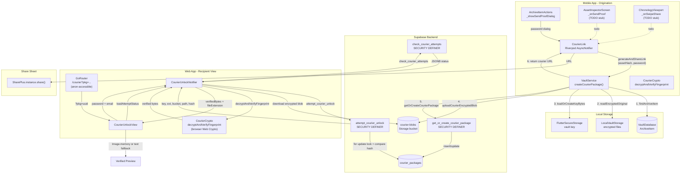

# FactLockCam Send Proof Blueprints — 17 May 2026

**Purpose:** A comprehensive deep audit of the **"Send Proof" / Courier** workflow as it exists in this repository — every layer from UI entry points through state management, domain orchestration, Supabase RPC contracts, database schema, storage security, recipient-side web unlock, configuration, error handling, and identified gaps.

**Canonical synthesis elsewhere:** For the full FactLockCam system architecture, see `FactLockCam_Blueprints14May2026.md` (engineering blueprint) and `wiki/analyses/MASTER_CONTEXT16MAY2026.md` (current comprehensive snapshot). For courier-specific architectural rules, see `.cursor/rules/courier-origination.mdc`.

---

## Table of Contents

1. [Summary and Positioning](#1-summary-and-positioning)
2. [UI Entry Points](#2-ui-entry-points)
3. [State Management Layer](#3-state-management-layer)
4. [Domain Orchestration — `VaultService.createCourierPackage()`](#4-domain-orchestration--vaultservicecreatecourierpackage)
5. [Data Layer — `SealLedgerRepository` Courier Methods](#5-data-layer--sealledgerrepository-courier-methods)
6. [Backend Schema and Migrations](#6-backend-schema-and-migrations)
7. [RPC Contracts](#7-rpc-contracts)
8. [Storage Security Model](#8-storage-security-model)
9. [Recipient-Side Web Unlock](#9-recipient-side-web-unlock)
10. [Configuration Surface](#10-configuration-surface)
11. [Error Handling Matrix](#11-error-handling-matrix)
12. [Identified Gaps and TODOs](#12-identified-gaps-and-todos)
13. [Layer Diagram](#13-layer-diagram)

---

## 1. Summary and Positioning

The **Send Proof** workflow is the mechanism by which a FactLockCam media owner gives an external recipient access to a sealed (encrypted) media asset. It has two halves:

| Half | Role | Platform | Auth |
|------|------|----------|------|
| **Origination** | Owner encrypts, uploads, and shares a link | Mobile (iOS/Android) — `VaultService.createCourierPackage()` | Authenticated Supabase session |
| **Unlock** | Recipient receives link, enters password, downloads and decrypts | Web (Flutter Web) — `CourierUnlockView` | **No auth required** (`anon`-accessible RPCs) |

**Product framing:** The system is a **tamper-evident** courier delivery mechanism. It is not a claim of absolute proof-of-truth or guaranteed sensor-origin. Recipients can verify that the media bytes match the SHA-256 fingerprint recorded by the owner's device at seal time. The vault key is shared in-band through the `courier_packages` database row (encoded), which means trust in the Supabase host is required for confidentiality.

### Key Properties

- **Password-gated:** The verifier password is SHA-256-hashed by the mobile client and stored as a hash in the RPC. The recipient must supply the matching plaintext password.
- **Auto-burn on exhaustion:** After 5 failed password guesses (configurable via `max_attempts`), the package is burned — the encrypted blob is deleted from storage and all further unlock attempts are rejected.
- **Idempotent re-sending:** If the owner sends a new link for the same asset, the RPC updates the existing `courier_packages` row rather than creating a duplicate.
- **Mobile-only origination:** The web `vault_service_web.dart` stubs `createCourierPackage()` as `UnsupportedError`. The Flutter web app can only _receive_ courier packages, not originate them.
- **Browser-decrypted:** Decryption happens in the browser via Web Crypto (`DefaultVaultEncryptionHandler`), not on a server.

---

## 2. UI Entry Points

There are **four** entry points in the mobile app that expose a "Send Proof" action. Two are wired through to the complete flow; two are TODO stubs.

### 2.1 Archive Item Actions Sheet (WIRED — Full Flow)

**File:** `factlockcam_app/lib/ui/mobile/archive_item_actions.dart`

The primary entry point. When a user opens the bottom sheet on an archive item and taps **"Send Proof"** (labelled as `MediaActionType.share` in `UniversalAssetToolbar`), the following path executes:

```dart
// archive_item_actions.dart line 143
static Future<void> _showSendProofDialog(
  BuildContext context,
  WidgetRef ref,
  ArchiveItem item,
) async {
  final password = await _promptForRecipientPassword(context);
  if (password == null) return;
  if (password.isEmpty) { /* show error: "Recipient password is required." */ return; }

  unawaited(_showLoadingDialog(context));  // Non-blocking loading

  try {
    await ref
        .read(courierLinkProvider.notifier)
        .generateAndShareLink(item.assetFingerprint, password);
  } catch (error) {
    Navigator.of(context, rootNavigator: true).pop(); // dismiss loading
    await _showErrorDialog(context, _friendlyCourierError(error));
    return;
  }

  Navigator.of(context, rootNavigator: true).pop(); // dismiss loading
}
```

**Flow:**
1. Prompt for recipient password (obscured `CupertinoTextField`)
2. Show non-dismissible loading spinner (`CupertinoActivityIndicator`)
3. Call `CourierLink.generateAndShareLink(assetHash, password)`
4. On success: `SharePlus` system share sheet opens with the courier URL
5. On error: dismiss loading, show friendly error dialog

### 2.2 Asset Inspector Screen (TODO Stub)

**File:** `factlockcam_app/lib/ui/mobile/vault/asset_inspector_screen.dart` (line 234)

```dart
void _onSendProof() {
  if (!mounted) return;
  ScaffoldMessenger.of(context).showSnackBar(
    SnackBar(
      content: Text('Send Proof: ${widget.item.assetFingerprint.substring(0, 12)}'),
      backgroundColor: AppColors.titaniumPanel,
    ),
  );
  // TODO: Wire courier creation flow — see courier_link_provider.dart
}
```

The SEND PROOF action tile in the full-screen Asset Inspector shows a SnackBar confirmation only. It is **not wired** to `CourierLink.generateAndShareLink`.

### 2.3 Chronology Viewport Right-Swipe (TODO Stub)

**File:** `factlockcam_app/lib/ui/mobile/vault/chronology_viewport.dart` (line 235)

```dart
void _onSwipeShare(ArchiveItem item) {
  unawaited(ref.read(hapticServiceProvider).heavyImpact());
  // TODO: Wire courier share flow — see courier_link_provider.dart
  if (!mounted) return;
  ScaffoldMessenger.of(context).showSnackBar(
    SnackBar(content: Text('Share: ${item.assetFingerprint.substring(0, 12)}')),
  );
}
```

The right-swipe gesture in the Chronology viewport fires haptic feedback and shows a SnackBar only. It is **not wired** to `CourierLink.generateAndShareLink`.

### 2.4 SwipeActionLayer (Gesture Layer Only)

**File:** `factlockcam_app/lib/ui/mobile/vault/swipe_action_layer.dart`

The `SwipeActionLayer` wraps each `ChronologyCard` in a horizontal swipe gesture. Right-swiping reveals a Kinetic Green background with "Share / Courier" label. When the drag crosses the 120-px threshold, `HapticFeedback.heavyImpact()` fires and `onShare` is called. The `chronology_viewport.dart` passes its todo stub as the callback.

```dart
// swipe_action_layer.dart line 49
void _onHorizontalDragEnd(DragEndDetails details) {
  if (_dragOffset.abs() >= _actionThreshold) {
    if (_dragOffset > 0 && widget.onShare != null) {
      widget.onShare!();
    }
    // ...
  }
  setState(() { _dragOffset = 0; _heavyImpactFired = false; });
}
```

---

## 3. State Management Layer

**File:** `factlockcam_app/lib/ui/mobile/archive/providers/courier_link_provider.dart`

The `CourierLink` Riverpod `AsyncNotifier` (keepAlive) is the sole state management entry point for send proof workflows:

```dart
@Riverpod(keepAlive: true)
class CourierLink extends _$CourierLink {
  @override
  FutureOr<void> build() {}

  Future<void> generateAndShareLink(String assetHash, String password) async {
    state = const AsyncLoading<void>();
    try {
      final url = await ref
          .read(vaultServiceProvider)
          .createCourierPackage(
            assetHash: assetHash,
            verifierPassword: password,
          );
      await SharePlus.instance.share(ShareParams(text: url));
      state = const AsyncData<void>(null);
    } catch (error, stackTrace) {
      state = AsyncError<void>(error, stackTrace);
      Error.throwWithStackTrace(error, stackTrace);
    }
  }
}
```

**Lifecycle:**
1. `build()` returns `AsyncData(null)` — idle state
2. `generateAndShareLink()` sets `AsyncLoading` — the UI shows a spinner
3. On success: `AsyncData(null)`, system share sheet opens
4. On error: `AsyncError`, error is thrown back to the caller (caught in `archive_item_actions.dart`)

**Generated provider** (`courier_link_provider.g.dart`):

```dart
final courierLinkProvider = AsyncNotifierProvider<CourierLink, void>(
  CourierLink.new,
);
```

**Key observation:** The generated provider exposes `void` as the data type since the notifier has no meaningful state beyond loading/error. The URL is consumed by `SharePlus` within the notifier rather than being exposed to the widget tree.

---

## 4. Domain Orchestration — `VaultService.createCourierPackage()`

**File:** `factlockcam_app/lib/domain/services/vault_service_io.dart` (line 289)

This is the core orchestration method. It is **mobile-only** — the web stub (`vault_service_web.dart`) throws `UnsupportedError`.

### Ordered Runtime

```dart
Future<String> createCourierPackage({
  required String assetHash,
  required String verifierPassword,
}) async {
```

#### Step 1: Auth Check

```dart
final userId = _authRepository.currentUserId;
if (userId == null || userId.isEmpty) {
  throw StateError('No authenticated user for courier package creation.');
}
```

#### Step 2: Supabase Config Check

```dart
if (!_sealLedgerRepository.isConfigured) {
  throw StateError(
    'Supabase is not configured. Run with --dart-define SUPABASE_URL=... '
    'and --dart-define SUPABASE_ANON_KEY=...',
  );
}
```

#### Step 3: WEB_VAULT_BASE_URL Resolution

```dart
final courierVaultBase = _effectiveCourierWebVaultBase();
```

Calls `_effectiveCourierWebVaultBase()` which implements the define precedence (see [Section 10](#10-configuration-surface)).

#### Step 4: Non-Debug localhost Guard

```dart
final vaultBaseParsed = Uri.tryParse(courierVaultBase);
if (!kDebugMode &&
    vaultBaseParsed != null &&
    _courierWebVaultHostLooksMachineLocal(vaultBaseParsed)) {
  throw StateError(
    'WEB_VAULT_BASE_URL points at localhost ($courierVaultBase). Recipients '
    'on another device cannot reach it...',
  );
}
```

In **release/profile** builds, localhost references are rejected. Debug builds allow localhost.

#### Step 5: SQLite Lookup

```dart
final item = await _database.findArchiveItem(assetHash);
if (item == null) {
  throw StateError('No sealed asset exists for $assetHash.');
}
```

#### Step 6: Path Resolution and DB Update

```dart
final resolved = await _storage.resolveArchivePaths(item);
if (resolved.thumbnailPath != item.thumbnailPath ||
    resolved.encryptedPath != item.encryptedPath) {
  await _database.upsertArchiveItem(resolved);
}
```

If the archive paths have drifted (e.g. files were moved), the database is updated.

#### Step 7: Read Encrypted Original from Local Disk

```dart
final encryptedBytes = await _storage.readEncryptedOriginal(
  resolved.encryptedPath,
);
```

#### Step 8: Load and Encode Archive Key

```dart
final keyBytes = await _loadOrCreateKeyBytes();
final encodedVaultKey = _vaultEncryption.encodeKey(keyBytes);
```

The vault key is read from `FlutterSecureStorage` (`factlockcam:vault_key`) and encoded to a transportable string for the RPC.

#### Step 9: Determine File Extension

```dart
final fileExtension = _fileExtensionForMimeType(resolved.mimeType);
```

Maps MIME types to file extensions (`.jpg`, `.png`, `.mov`, `.mp4`, etc.).

#### Step 10: Compute Storage Path

```dart
final storagePath = _normalizedCourierBlobPath(
  '$userId/$assetHash$fileExtension.seal',
);
```

Path format: `{auth.uid()}/{asset_fingerprint}{ext}.seal`

The helper `_normalizedCourierBlobPath` strips leading slashes so the path is compatible with Storage RLS `split_part(ltrim(name, '/'), '/', 1)`.

#### Step 11: Upload Encrypted Blob to Supabase Storage

```dart
await _sealLedgerRepository.uploadCourierEncryptedBlob(
  storagePath: storagePath,
  encryptedBytes: encryptedBytes,
);
```

Uploads the AES-GCM ciphertext to `courier-blobs` bucket under the computed path.

#### Step 12: Create/Refresh Package via RPC

```dart
final packageId = await _sealLedgerRepository.getOrCreateCourierPackage(
  assetHash: assetHash,
  verifierPassword: verifierPassword,
  encodedVaultKey: encodedVaultKey,
  fileExtension: fileExtension,
  storagePath: storagePath,
);
```

The RPC is idempotent: if a package exists for this `owner_id` + `asset_hash`, it updates the existing row. Otherwise, it inserts a new one.

#### Step 13: Construct Courier URL

```dart
final base = courierVaultBase.endsWith('/')
    ? courierVaultBase.substring(0, courierVaultBase.length - 1)
    : courierVaultBase;
return '$base/courier?pkg=${Uri.encodeQueryComponent(packageId)}';
```

The returned URL is passed to `SharePlus.instance.share()` by the `CourierLink` notifier.

### Method Signature Summary

| Parameter | Source | Description |
|-----------|--------|-------------|
| `assetHash` | Caller (from `ArchiveItem.assetFingerprint`) | SHA-256 hex fingerprint identifying the sealed asset |
| `verifierPassword` | User via password dialog | Plaintext password recipient will use; hashed by RPC (`extensions.digest(p_verifier_password, 'sha256')`) |

---

## 5. Data Layer — `SealLedgerRepository` Courier Methods

**File:** `factlockcam_app/lib/data/supabase/seal_ledger_repository.dart`

### 5.1 `uploadCourierEncryptedBlob`

```dart
Future<void> uploadCourierEncryptedBlob({
  required String storagePath,
  required Uint8List encryptedBytes,
}) async {
  final client = _requiredClient();
  await client.storage.from('courier-blobs').uploadBinary(
        storagePath,
        encryptedBytes,
        fileOptions: const FileOptions(
          contentType: 'application/octet-stream',
          upsert: true,
        ),
      );
}
```

- Bucket: `courier-blobs` (private, 50MB limit)
- Content-Type: `application/octet-stream`
- `upsert: true` — allows re-uploading for the same path (idempotent blob storage)
- Path must satisfy Storage RLS: `split_part(ltrim(name, '/'), '/', 1) = auth.uid()::text`

### 5.2 `getOrCreateCourierPackage`

```dart
Future<String> getOrCreateCourierPackage({
  required String assetHash,
  required String verifierPassword,
  required String encodedVaultKey,
  required String fileExtension,
  required String storagePath,
}) async {
  final client = _requiredClient();
  final userId = client.auth.currentUser?.id;
  if (userId == null) {
    throw StateError('No authenticated user for courier package creation.');
  }

  final response = await client.rpc(
    'get_or_create_courier_package',
    params: <String, dynamic>{
      'p_asset_hash': assetHash,
      'p_verifier_password': verifierPassword,
      'p_encoded_vault_key': encodedVaultKey,
      'p_file_extension': fileExtension,
      'p_storage_path': storagePath,
    },
  );
  if (response is! String || response.isEmpty) {
    throw StateError('get_or_create_courier_package returned no package id.');
  }
  return response;
}
```

- All five parameters are sent as `String` types to PostgREST
- Response is expected to be a UUID string (the `package_id`)
- Empty/non-string response throws `StateError`

### 5.3 Courier-Related Method Gap

The repository does **not** expose methods for the recipient-side RPCs (`check_courier_attempts`, `attempt_courier_unlock`). Those are called directly from `CourierUnlockNotifier` using `Supabase.instance.client` rather than through `SealLedgerRepository`. This means the recipient web UI has a tight coupling to `Supabase.instance.client` rather than going through the repository abstraction.

---

## 6. Backend Schema and Migrations

Seven migrations spanning 2026-05-14 through 2026-05-17 implement the courier backend.

### 6.1 Schema Foundation (`20260514220000_web_courier_schema.sql`)

**Table: `courier_packages`**

```sql
create table if not exists public.courier_packages (
  package_id uuid primary key default gen_random_uuid(),
  owner_id uuid not null references public.profiles (id) on delete cascade,
  asset_hash text not null,
  storage_bucket text not null default 'courier-blobs',
  storage_path text not null unique,
  file_extension text not null,
  vault_key text not null,
  verifier_secret_hash text not null,
  requestor_email text,
  failed_attempts integer not null default 0 check (failed_attempts >= 0),
  max_attempts integer not null default 5 check (max_attempts > 0),
  last_failed_at timestamptz,
  unlocked_at timestamptz,
  burned_at timestamptz,
  expires_at timestamptz,
  created_at timestamptz not null default now(),
  updated_at timestamptz not null default now()
);
```

| Column | Type | Purpose |
|--------|------|---------|
| `package_id` | UUID PK | Unique identifier, serialized in courier URL query param |
| `owner_id` | UUID FK → `profiles.id` | Wallet owner who created the package |
| `asset_hash` | text | SHA-256 fingerprint of the sealed media |
| `storage_bucket` | text | Always `'courier-blobs'` |
| `storage_path` | text UNIQUE | `{uid}/{hash}{ext}.seal` format |
| `file_extension` | text | e.g. `.jpg`, `.mp4` |
| `vault_key` | text | Encoded AES-GCM archive key (in-band sharing — see trust note) |
| `verifier_secret_hash` | text | SHA-256(`verifierPassword`) |
| `requestor_email` | text? | Email of the person attempting unlock |
| `failed_attempts` | int (≥0) | Count of wrong guesses |
| `max_attempts` | int (>0) | Default 5 |
| `last_failed_at` | timestamptz? | Timestamp of last failed attempt |
| `unlocked_at` | timestamptz? | Set when password is correct |
| `burned_at` | timestamptz? | Set when max attempts exceeded (auto-burn) |
| `expires_at` | timestamptz? | Future expiry (nullable — no sender UI sets this) |
| `created_at` | timestamptz | Insert timestamp |
| `updated_at` | timestamptz | Auto-updated via trigger `courier_packages_set_updated_at` |

**RLS Policies:**

| Policy | Operation | Target | Check |
|--------|-----------|--------|-------|
| Users select own courier packages | SELECT | authenticated | `owner_id = auth.uid()` |
| Users insert own courier packages | INSERT | authenticated | `owner_id = auth.uid()` |
| Users update own courier packages | UPDATE | authenticated | `owner_id = auth.uid()` |
| Users delete own courier packages | DELETE | authenticated | `owner_id = auth.uid()` |

**Important:** Direct `SELECT` on `courier_packages` by `authenticated` users is scoped to their own rows via RLS. There is **no** broad `SELECT` grant for `anon` — all anon access is through the `SECURITY DEFINER` RPCs. This matches the architectural rule forbidding direct `SELECT` on black-box tables.

### 6.2 RPCs (Schema Migration — Same File)

See [Section 7 — RPC Contracts](#7-rpc-contracts) for full details.

Two RPCs are defined alongside the schema:
- `check_courier_attempts(uuid)` — returns JSONB status, accessible to anon
- `attempt_courier_unlock(uuid, text, text)` — SETOF table result, accessible to anon

### 6.3 Performance Indexes (`20260515000000_web_courier_indices.sql`)

```sql
create index if not exists idx_courier_packages_id
  on public.courier_packages (package_id);
create index if not exists idx_courier_packages_hash
  on public.courier_packages (asset_hash);
create index if not exists idx_courier_packages_owner
  on public.courier_packages (owner_id) where owner_id is not null;
create index if not exists idx_courier_packages_active_storage
  on public.courier_packages (storage_bucket, storage_path)
  where burned_at is null;
```

Also grants `EXECUTE` on `check_courier_attempts(uuid)` to anon (redundant with the schema migration grant, but idempotent).

### 6.4 Courier Origination RPC (`20260515032134_get_or_create_courier_package.sql`)

Defines `get_or_create_courier_package(text, text, text, text, text)` as SECURITY DEFINER. See [Section 7.1](#71-get_or_create_courier_package).

### 6.5 Storage Bucket Idempotent Creation (`20260516000000_ensure_courier_blobs_storage_bucket.sql`)

```sql
insert into storage.buckets (id, name, public)
values ('courier-blobs', 'courier-blobs', false)
on conflict (id) do update set public = false;
```

### 6.6 Storage Object RLS Repair (`20260517000000_repair_courier_storage_object_rls.sql`)

Definitive Idempotent migration that:

1. Creates the `courier-blobs` bucket with explicit `file_size_limit: 52428800` (50MB) and `allowed_mime_types`
2. Drops and recreates all five Storage RLS policies using `split_part(ltrim(name, '/'), '/', 1)` (more robust than `storage.foldername(name)` used in the schema migration)
3. Fixes the recipient policy to use `ltrim(storage.objects.name, '/')` to match the normalized path

See [Section 8 — Storage Security Model](#8-storage-security-model) for policy details.

**Important sequencing note:** The repair migration (`20260517000000`) is the **latest** and **intended** version. The earlier schema migration's storage policies (`20260514220000`) are superseded. Deployments must include both unless the policy names would conflict (the repair explicitly drops before recreating).

---

## 7. RPC Contracts

Three RPCs form the entire Supabase courier surface. Two are SECURITY DEFINER (can read `courier_packages` despite RLS); one is a lightweight status check.

### 7.1 `get_or_create_courier_package`

```sql
create or replace function public.get_or_create_courier_package(
  p_asset_hash text,
  p_verifier_password text,
  p_encoded_vault_key text,
  p_file_extension text,
  p_storage_path text
)
returns uuid
language plpgsql
security definer
set search_path = public, extensions
```

**Security:** `SECURITY DEFINER` — runs as the owner (typically `supabase_admin`), bypassing RLS to read/write `courier_packages` on behalf of any authenticated user. The function performs manual auth checks.

**Inputs:**

| Parameter | Type | Validation | Notes |
|-----------|------|------------|-------|
| `p_asset_hash` | text | REJECT if null/blank after trim | Duplicate detection key per owner |
| `p_verifier_password` | text | REJECT if null/empty | SHA-256 hashed immediately via `extensions.digest` |
| `p_encoded_vault_key` | text | REJECT if null/blank after trim | Shared in-band |
| `p_file_extension` | text | Not validated (stored lowercased) | Lowered via `lower(trim(...))` |
| `p_storage_path` | text | REJECT if null/blank; REJECT if first segment != `auth.uid()::text` | RLS-compatible path check |

**Auth checks:**

```sql
v_owner_id uuid := auth.uid();
if v_owner_id is null then
  raise exception 'Authenticated user required';
end if;
```

**Idempotency behavior:**

```sql
-- Refresh existing package for same owner+asset
select cp.package_id into v_package_id
  from public.courier_packages cp
  where cp.owner_id = v_owner_id
    and cp.asset_hash = trim(p_asset_hash)
  order by cp.created_at desc
  limit 1;

if v_package_id is not null then
  update public.courier_packages cp
    set verifier_secret_hash = v_verifier_secret_hash,
        storage_path = trim(p_storage_path),
        file_extension = lower(trim(p_file_extension)),
        vault_key = trim(p_encoded_vault_key),
        failed_attempts = 0,
        last_failed_at = null,
        requestor_email = null,
        unlocked_at = null,
        burned_at = null,
        expires_at = null,
        updated_at = now()
    where cp.package_id = v_package_id;
  return v_package_id;
end if;
```

On re-send: **resets** `failed_attempts`, clears `unlocked_at`/`burned_at`/`expires_at`/`requestor_email`, updates `vault_key` and `storage_path`.

**Insert path:**

```sql
insert into public.courier_packages (
  owner_id, asset_hash, storage_bucket, storage_path,
  file_extension, vault_key, verifier_secret_hash
) values (
  v_owner_id, trim(p_asset_hash), 'courier-blobs',
  trim(p_storage_path), lower(trim(p_file_extension)),
  trim(p_encoded_vault_key), v_verifier_secret_hash
)
returning package_id into v_package_id;
```

**Grants:**

```sql
revoke all on function public.get_or_create_courier_package(text, text, text, text, text) from public;
grant execute on function public.get_or_create_courier_package(text, text, text, text, text)
  to authenticated, service_role;
```

Only `authenticated` and `service_role` can call this RPC.

### 7.2 `check_courier_attempts`

```sql
create or replace function public.check_courier_attempts(p_package_id uuid)
returns jsonb
language plpgsql
security definer
set search_path = public, extensions
```

**Security:** `SECURITY DEFINER` — required because `anon` (no RLS bypass) needs to read an arbitrary `courier_packages` row without knowing `owner_id`.

**Response JSONB:**

```json
{
  "status": "available" | "locked" | "burned" | "expired" | "not_found",
  "locked": true | false,
  "attempts_remaining": <number>,
  "max_attempts": <number>
}
```

**Status computation:**

| Condition | Status | Locked |
|-----------|--------|--------|
| Package not found | `"not_found"` | `true` |
| `burned_at is not null` | `"burned"` | `true` |
| `expires_at ≤ now()` | `"expired"` | `true` |
| `failed_attempts ≥ max_attempts` | `"locked"` | `true` |
| Otherwise | `"available"` | `false` |

**Grants:**

```sql
grant execute on function public.check_courier_attempts(uuid)
  to anon, authenticated, service_role;
```

The `anon` grant is what makes the courier unlock page accessible without authentication.

### 7.3 `attempt_courier_unlock`

```sql
create or replace function public.attempt_courier_unlock(
  p_package_id uuid,
  p_verifier_guess text,
  p_requestor_email text
)
returns table (
  key text,
  file_extension text,
  storage_bucket text,
  storage_path text,
  asset_hash text
)
language plpgsql
security definer
set search_path = public, extensions
```

**Security:** `SECURITY DEFINER` — same rationale as `check_courier_attempts` (anon needs to read the package row and, on success, the vault key).

**Inputs:**

| Parameter | Type | Notes |
|-----------|------|-------|
| `p_package_id` | uuid | From the courier URL query param |
| `p_verifier_guess` | text | Recipient's password guess (SHA-256 compared inside function) |
| `p_requestor_email` | text | Stored for audit; may be empty/null |

**Flow:**

1. **Read package with row lock** (`for update`):
   ```sql
   select * into v_package from public.courier_packages
     where package_id = p_package_id
     for update;
   ```
   If not found: `raise exception 'Courier package not found'`

2. **Lock state check**:
   ```sql
   if v_package.burned_at is not null
       or (v_package.expires_at is not null and v_package.expires_at <= now())
       or v_package.failed_attempts >= v_package.max_attempts then
     raise exception 'Courier package is locked';
   end if;
   ```

3. **Password verification**:
   ```sql
   v_guess_hash := encode(extensions.digest(coalesce(p_verifier_guess, ''), 'sha256'), 'hex');
   if v_guess_hash <> v_package.verifier_secret_hash then
     -- Increment failed_attempts
     -- If failed_attempts >= max_attempts:
     --   SET burned_at = now()
     --   DELETE storage blob
     raise exception 'Invalid verifier challenge';
   end if;
   ```

4. **Success path**:
   ```sql
   update public.courier_packages cp
     set unlocked_at = now(),
         requestor_email = nullif(p_requestor_email, '')
     where cp.package_id = p_package_id
     returning * into v_package;

   return query select v_package.vault_key, v_package.file_extension,
                       v_package.storage_bucket, v_package.storage_path,
                       v_package.asset_hash;
   ```

**Return contract:** On success, a single row with five columns:

| Column | Dart Type | Purpose |
|--------|-----------|---------|
| `key` | String (encoded) | AES-GCM archive key for decryption |
| `file_extension` | String | e.g. `.jpg` |
| `storage_bucket` | String | Always `'courier-blobs'` |
| `storage_path` | String | Path to download encrypted blob |
| `asset_hash` | String | SHA-256 fingerprint for verification |

**Grants:**

```sql
grant execute on function public.attempt_courier_unlock(uuid, text, text)
  to anon, authenticated, service_role;
```

---

## 8. Storage Security Model

### 8.1 Bucket Properties

| Property | Value |
|----------|-------|
| Bucket ID | `courier-blobs` |
| Public | `false` (private) |
| File size limit | 50 MB (`52428800`) |
| Allowed MIME types | `application/octet-stream`, `image/jpeg`, `video/mp4`, `application/pdf` |

### 8.2 Owner Policies (for `authenticated` role)

All four owner policies use the same path-scoping check:

```sql
split_part(ltrim(name, '/'), '/', 1) = auth.uid()::text
```

This extracts the first path segment (the user's UUID directory) and matches it against the authenticated user's ID. Paths look like `{uuid}/{hash}{ext}.seal` — the first segment is always the owner's `auth.uid()`.

| Policy | Operation | Effect |
|--------|-----------|--------|
| `Courier owners upload encrypted blobs` | INSERT | `with check` — owner scoped |
| `Courier owners read own encrypted blobs` | SELECT | `using` — owner scoped |
| `Courier owners update own encrypted blobs` | UPDATE | `using` + `with check` — owner scoped |
| `Courier owners delete own encrypted blobs` | DELETE | `using` — owner scoped |

### 8.3 Recipient Policy (for `anon` role)

```sql
create policy "Recipients read active encrypted courier blobs"
  on storage.objects
  for select
  to anon
  using (
    bucket_id = 'courier-blobs'
    and exists (
      select 1
      from public.courier_packages cp
      where cp.storage_bucket = storage.objects.bucket_id
        and cp.storage_path = ltrim(storage.objects.name, '/')
        and cp.burned_at is null
        and (cp.expires_at is null or cp.expires_at > now())
    )
  );
```

This is a **gated** anon read: an unauthenticated user can only download a blob if a matching `courier_packages` row exists that is NOT burned and NOT expired. The gate is the `courier_packages` RLS bypass (the RPC already authenticated the user via SECURITY DEFINER).

### 8.4 Blob Cleanup on Burn

When `attempt_courier_unlock` determines that `failed_attempts >= max_attempts`, it not only sets `burned_at` but also **deletes the storage blob**:

```sql
if v_package.failed_attempts >= v_package.max_attempts then
  update public.courier_packages cp
    set burned_at = now()
    where cp.package_id = p_package_id;

  delete from storage.objects so
  where so.bucket_id = v_package.storage_bucket
    and so.name = v_package.storage_path;
end if;
```

This means a burned package is **permanently unrecoverable** — both the metadata and the blob are gone.

---

## 9. Recipient-Side Web Unlock

### 9.1 Routing

**File:** `factlockcam_app/lib/app/router/app_router.dart` (line 50)

```dart
GoRoute(
  path: CourierUnlockView.routePath,  // '/courier'
  builder: (context, state) =>
      CourierUnlockView(packageId: state.uri.queryParameters['pkg']),
),
```

The route is **not protected** by the auth redirect guard:

```dart
final isCourierRoute = state.matchedLocation == CourierUnlockView.routePath;
if (!isAuthenticated && !isOnLogon && !isCourierRoute) {
  return LogonView.routePath;
}
```

Any visitor — authenticated or not — can access `/courier?pkg=...`.

### 9.2 View Structure

**File:** `factlockcam_app/lib/ui/web/courier_unlock_view.dart`

A single-page Flutter web view with:

1. **Header:** `'FactLockCam Courier'` in `VerifiedNeon` (`#39FF14`) monospace
2. **Subtitle:** `'Unlock and verify an encrypted courier package locally in this browser.'`
3. **Status Panel:** Shows `packageId`, status from `check_courier_attempts`, and any error/status messages
4. **Email field:** Recipient email (optional, stored for audit)
5. **Password field:** One-time password (obscured), with `onSubmitted` trigger
6. **Unlock button:** Disabled during loading or when locked; shows spinner during loading
7. **Verified Preview:** Appears after successful decryption

### 9.3 Notifier State Machine

**File:** `factlockcam_app/lib/ui/web/courier_unlock_notifier.dart`

```dart
class CourierUnlockState {
  const CourierUnlockState({
    this.attemptStatus,
    this.verifiedBytes,
    this.fileExtension,
    this.message,
    this.isLoading = false,
  });

  final Map<String, dynamic>? attemptStatus;
  final Uint8List? verifiedBytes;
  final String? fileExtension;
  final String? message;
  final bool isLoading;

  bool get isLocked => attemptStatus?['locked'] == true;
}
```

**State transitions:**

```
build()
  └─ idle (loading=false, no attemptStatus)

loadAttemptStatus(packageId)
  ├─ Supabase not configured → message, idle
  ├─ packageId null/empty → message, idle
  └─ RPC success → attemptStatus populated
  └─ RPC error → message with error.toString()

unlock(packageId, challenge, email)
  ├─ RPC error → message, re-fetch attemptStatus
  └─ RPC success → download blob → decrypt → verifiedBytes + fileExtension
```

### 9.4 Crypto Path

The unlock notifier uses a `DefaultVaultEncryptionHandler()` (Web Crypto on web, native crypto on mobile) for browser-side decryption:

```dart
final response = await Supabase.instance.client.rpc(
  'attempt_courier_unlock',
  params: {
    'p_package_id': packageId,
    'p_verifier_guess': challenge,
    'p_requestor_email': email.trim(),
  },
);
final row = _firstRpcRow(response);
final bucket = row['storage_bucket'] as String;
final path = row['storage_path'] as String;
final encryptedBytes = await Supabase.instance.client.storage
    .from(bucket)
    .download(path);
final verifiedBytes = await CourierCrypto.decryptAndVerifyFingerprint(
  vault: _vault,
  encryptedPayload: encryptedBytes,
  keyBytes: _vault.decodeKey(row['key'] as String),
  expectedFingerprint: row['asset_hash'] as String,
);
```

**`CourierCrypto.decryptAndVerifyFingerprint`** (`factlockcam_app/lib/core/crypto/courier_crypto.dart`):

```dart
static Future<Uint8List> decryptAndVerifyFingerprint({
  required VaultEncryptionHandler vault,
  required Uint8List encryptedPayload,
  required Uint8List keyBytes,
  required String expectedFingerprint,
}) async {
  final clearBytes = await vault.decrypt(
    encryptedPayload: encryptedPayload,
    keyBytes: keyBytes,
  );
  final verifiedFingerprint = await vault.generateHash(clearBytes);
  if (verifiedFingerprint != expectedFingerprint) {
    throw StateError('Sealed media failed SHA-256 verification.');
  }
  return clearBytes;
}
```

**Failure modes:**
- AES-GCM authentication failure (wrong key or corrupt ciphertext) — thrown by `vault.decrypt()`
- Digest mismatch (plaintext hash != `expectedFingerprint`) — `StateError` indicating tampering or wrong asset binding

### 9.5 Preview Rendering

```dart
class _VerifiedPreview extends StatelessWidget {
  @override
  Widget build(BuildContext context) {
    final ext = (fileExtension ?? '').replaceFirst('.', '');
    final isImage = {'jpg', 'jpeg', 'png', 'gif', 'webp'}.contains(ext);
    return isImage
        ? Image.memory(bytes, fit: BoxFit.contain)
        : Text('Verified .$ext asset (${bytes.length} bytes). Preview support '
            'for this type is not enabled yet.');
  }
}
```

**Current limitation:** Only image types (jpg/jpeg/png/gif/webp) render an inline preview. Video, document, and other types show a text placeholder.

---

## 10. Configuration Surface

### 10.1 `WEB_VAULT_BASE_URL` Compile-Time Define

**File:** `factlockcam_app/lib/domain/services/vault_service_io.dart` (line 112)

```dart
static const String _webVaultCompilerDefine = String.fromEnvironment(
  'WEB_VAULT_BASE_URL',
);
```

- Has **no Dart default** (empty string when not passed)
- Only refreshed on **cold build** — hot restart keeps stale values

### 10.2 Precedence

**File:** `vault_service_io.dart` (line 130)

```dart
String _effectiveCourierWebVaultBase() {
  final trimmed = _webVaultCompilerDefine.trim();
  if (trimmed.isNotEmpty) {
    // 1. Explicit dart-define wins (tunnel, staging, prod)
    return AppConfig.normalizeSupabaseProjectUrl(trimmed);
  }
  if (kDebugMode) {
    // 2. Debug-only localhost fallback
    return 'http://localhost:3000';
  }
  // 3. Release/profile without define = StateError
  throw StateError(
    'WEB_VAULT_BASE_URL is unset. For profile/release QA, pass '
    '`--dart-define=WEB_VAULT_BASE_URL=https://...`',
  );
}
```

| Scenario | Define Passed? | Build Mode | Result |
|----------|---------------|------------|--------|
| Production deployment | Yes | Release | Define value |
| QA tunnel (Ngrok) | Yes | Debug/Profile | Define value (HTTPS tunnel) |
| Local dev Flutter Web | No | Debug | `http://localhost:3000` |
| Local dev release build | No | Release | **StateError** |

### 10.3 Non-Debug localhost Guard

```dart
if (!kDebugMode &&
    vaultBaseParsed != null &&
    _courierWebVaultHostLooksMachineLocal(vaultBaseParsed)) {
  throw StateError('WEB_VAULT_BASE_URL points at localhost...');
}
```

In release/profile builds, a localhost `WEB_VAULT_BASE_URL` is rejected. Debug builds allow it.

### 10.4 QA Tunnel Tooling

**Script:** `scripts/start_qa_env.sh` — orchestrates:
- Flutter Web on port 3000
- Ngrok HTTPS tunnel → dynamic URL
- iOS simulator build with `--dart-define=WEB_VAULT_BASE_URL=<ngrok-url>`

**Dart defines pipeline:** `scripts/write_flutter_dart_defines.py` filters `.env.local` → `dart_defines.json`, consumed by VS Code launch tasks and `flutter run --dart-define-from-file`.

### 10.5 Courier URL Format

```
{base}/courier?pkg={uuid}
```

Where `base` is `_effectiveCourierWebVaultBase()` with trailing slash removed, and `{uuid}` is the `package_id` URI-encoded.

---

## 11. Error Handling Matrix

### 11.1 Friendly Error Messages

**File:** `factlockcam_app/lib/ui/mobile/archive_item_actions.dart` (line 246)

| Trigger | Friendly Message |
|---------|-----------------|
| Supabase not configured | `'Supabase is not configured for this build.'` |
| No authenticated user | `'Sign in before generating a courier link.'` |
| `WEB_VAULT_BASE_URL` unset | Instructions to use VS Code launch or pass dart-define |
| `ERR_CONNECTION_REFUSED` / Connection refused | Instructions about Ngrok tunnel and localhost |
| `Bucket not found` | Instructions to deploy migrations for `courier-blobs` bucket |
| RLS violation on upload | Instructions to deploy Storage RLS migrations |

These are surfaced via `_showErrorDialog` — a `CupertinoAlertDialog` titled "Could not send proof".

### 11.2 `StateError` Throw Points

| Method | Condition | Message |
|--------|-----------|---------|
| `createCourierPackage` | `userId == null \|\| userId.isEmpty` | `'No authenticated user for courier package creation.'` |
| `createCourierPackage` | `!_sealLedgerRepository.isConfigured` | `'Supabase is not configured...'` |
| `createCourierPackage` | Non-debug localhost | `'WEB_VAULT_BASE_URL points at localhost...'` |
| `createCourierPackage` | `_effectiveCourierWebVaultBase()` unset in profile/release | `'WEB_VAULT_BASE_URL is unset...'` |
| `createCourierPackage` | Asset not found in SQLite | `'No sealed asset exists for {hash}.'` |
| `getOrCreateCourierPackage` | `userId == null` | `'No authenticated user for courier package creation.'` |
| `getOrCreateCourierPackage` | RPC returns non-string | `'get_or_create_courier_package returned no package id.'` |
| `uploadCourierEncryptedBlob` | `client == null` (via `_requiredClient()`) | `'Supabase is not configured...'` |
| `CourierCrypto.decryptAndVerifyFingerprint` | Hash mismatch | `'Sealed media failed SHA-256 verification.'` |

### 11.3 UI Loading State

The send proof flow shows a `CupertinoAlertDialog` with `CupertinoActivityIndicator` during the network/encryption phase. The dialog is non-dismissible (`barrierDismissible: false`). It is dismissed programmatically on both success (after `SharePlus` returns) and error (before showing error dialog).

### 11.4 RPC Error Propagation

`PostgrestException` errors from the `get_or_create_courier_package` RPC bubble up through:
1. `SealLedgerRepository.getOrCreateCourierPackage` → `StateError` or raw `PostgrestException`
2. `VaultService.createCourierPackage` → rethrows
3. `CourierLink.generateAndShareLink` → caught, set as `AsyncError`, rethrown
4. `ArchiveItemActions._showSendProofDialog` → caught, friendly message shown

---

## 12. Identified Gaps and TODOs

### 12.1 Unwired UI Entry Points

| Location | Line | Gap |
|----------|------|-----|
| `asset_inspector_screen.dart` | 244 | `// TODO: Wire courier creation flow — see courier_link_provider.dart` — shows SnackBar only |
| `chronology_viewport.dart` | 238 | `// TODO: Wire courier share flow — see courier_link_provider.dart` — shows SnackBar only |
| `asset_action_provider.dart` | 41 | `// TODO: Wire to a sealed-share/courier export service when that ProofLock package boundary exists` — share action is a no-op |

### 12.2 Missing Sender Features

| Gap | Impact |
|-----|--------|
| **No expiry UI** — Sender cannot set a time-bomb on the link | Packages live indefinitely unless manually burned or auto-burned by failed attempts |
| **No package management** — No UI to list sent packages, revoke, or check status | Sender has no visibility into whether a package was unlocked or has failed attempts |
| **No email notification** — Sender must communicate the link and password out-of-band | Reduces UX cohesion; the RPC stores `requestor_email` but no app triggers this |
| **Web courier origination** — `vault_service_web.dart` stubs `createCourierPackage()` | The Flutter web app cannot originate courier packages without filesystem access |

### 12.3 Missing Receiver Features

| Gap | Impact |
|-----|--------|
| **No Polygonscan verification** — No integration to look up the proof on-chain | Recipient cannot independently verify that the asset was notarized on a durable chain (though the existing `CourierCrypto` verification confirms integrity against the owner's fingerprint) |
| **Limited preview support** — Only image types show inline; video/audio/document show text placeholder | Recipient must download the file to view non-image media types |
| **No `.plock` packaging** — No standard proof-package format | No portable proof file that can be saved and shared beyond the web view |

### 12.4 Architectural Gaps

| Gap | Location | Notes |
|-----|----------|-------|
| `Supabase.instance.client` direct coupling in unlock notifier | `courier_unlock_notifier.dart` lines 81, 111, 122 | Should route through `SealLedgerRepository` for consistency |
| No `courier_packages` repository class | Missing | Recipient-side operations bypass the repository layer |
| `SharePlus` is called inside Riverpod notifier | `courier_link_provider.dart` line 25 | Side effect in state layer — could be moved to a UI callback |
| `encryptedPath` not re-resolved before read | `vault_service_io.dart:327-329` | Uses `resolved.encryptedPath` which was just verified, but on re-send the path might be stale vs disk |

---

## 13. Layer Diagram



---

## Provenance Tracking

- *UI Entry Points, State Management, Domain Orchestration*: Derived from `factlockcam_app/lib/ui/mobile/archive_item_actions.dart`, `factlockcam_app/lib/ui/mobile/archive/providers/courier_link_provider.dart`, `factlockcam_app/lib/domain/services/vault_service_io.dart` (17 May 2026 audit).
- *Asset inspector and chronology stubs*: Derived from `factlockcam_app/lib/ui/mobile/vault/asset_inspector_screen.dart`, `factlockcam_app/lib/ui/mobile/vault/chronology_viewport.dart`, `factlockcam_app/lib/ui/mobile/vault/swipe_action_layer.dart` (17 May 2026 audit).
- *Data Layer*: Derived from `factlockcam_app/lib/data/supabase/seal_ledger_repository.dart` (17 May 2026 audit).
- *Supabase Schema, RPCs, Storage*: Derived from `supabase/migrations/20260514220000_web_courier_schema.sql`, `supabase/migrations/20260515032134_get_or_create_courier_package.sql`, `supabase/migrations/20260515000000_web_courier_indices.sql`, `supabase/migrations/20260516000000_ensure_courier_blobs_storage_bucket.sql`, `supabase/migrations/20260517000000_repair_courier_storage_object_rls.sql` (17 May 2026 audit).
- *Recipient Web Unlock*: Derived from `factlockcam_app/lib/ui/web/courier_unlock_view.dart`, `factlockcam_app/lib/ui/web/courier_unlock_notifier.dart`, `factlockcam_app/lib/core/crypto/courier_crypto.dart`, `factlockcam_app/lib/app/router/app_router.dart` (17 May 2026 audit).
- *Configuration Surface*: Derived from `factlockcam_app/lib/domain/services/vault_service_io.dart`, `scripts/start_qa_env.sh`, `scripts/write_flutter_dart_defines.py`, `.cursor/rules/courier-origination.mdc`, `.cursor/rules/ephemeral-environments.mdc` (17 May 2026 audit).
- *Architectural Rules*: Derived from `.cursor/rules/courier-origination.mdc`, `.cursor/rules/web-architecture.mdc`, `.cursor/rules/supabase_rpc_standards.mdc`, `.cursor/rules/02_supabase_rls_security.mdc` (17 May 2026).
- *Prior Context*: Cross-checked with `wiki/analyses/MASTER_CONTEXT16MAY2026.md`, `wiki/analyses/FactLockCam_Master_Blueprint.md`, `wiki/analyses/FactLockCam_Blueprints_14May2026.md` (17 May 2026).
