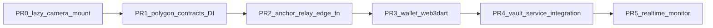

# Postmortem: Polygon Integration Try 1

**Date of incident:** 2026-05-19  
**Audit date:** 2026-05-20  
**Branch:** `cursor/wiki-supabase-local-reset-audit`  
**Baseline commit (rollback target):** `19269d2` — *Hub refactor: four-tile launcher, camera/archive shell nav, account delete, full-burn migration*  
**Current HEAD after reconciliation:** `bc9a379`  
**Preserved WIP:** `git stash@{0}` — *pre-rollback: debug session + polygon WIP 2026-05-19*  
**Forensic snapshot (audit branch):** `audit/polygon-try1-bisect` @ `c87ac99`

---

## Executive Summary

On 2026-05-19 the team attempted to land a **Polygon Live Retrofit framework** (replacing the Supabase `simulate_chain_notarize` simulator path) in a single uncommitted batch alongside **UI shell refactors** and **crash-debug instrumentation**. After a full day of debugging, the tree was rolled back to the morning push (`19269d2`). The WIP was preserved in `stash@{0}` — nothing was permanently lost.

**Primary lesson:** The failure was **not caused by Polygon DI scaffolding alone**. Automated bisect (2026-05-20) shows Polygon-only changes pass all 33 unit/widget tests and compile cleanly. The incident combined (1) a **process failure** — mixed concerns with no incremental device bisect, (2) **UI shell changes** that broke navigation widget contracts and were being debugged as crash suspects, and (3) a **device-specific runtime issue** — user-confirmed blank/black screen on physical iPhone, while simulator and build/install succeed. A parallel **Flutter VM Service attach failure** on iOS 26 (`Connection closed before full header was received`) was misread as "app won't start," wasting hours on bootstrap instrumentation that introduced its own defects (zone mismatch, `dart:io` in shared `main.dart`).

For Try 2: land Polygon as **small, flag-gated PRs**, use **`app-install` + manual launch** for device QA — never bundle UI refactors with chain integration. **PR0 (lazy camera mount) landed 2026-05-20** — see [Resolution](#resolution-2026-05-20) below.

---

## Timeline

| Time (2026) | Event |
|-------------|-------|
| **May 18 21:00** | Commit `19269d2` — hub-first shell lands (`VaultHomeView` + five-panel `IndexedStack`, account burn, four-tile launcher). |
| **May 19 (AM)** | Morning push is `19269d2`; team begins Polygon retrofit work on top. |
| **May 19 (day)** | Uncommitted batch: Polygon DI abstractions, `anchor-relay` Edge Function stub, UI nav-bar/camera/account refactors, Podfile Swift-concurrency patch, `[CRASH_DIAG]` / `runZonedGuarded` instrumentation. User reports app "won't start" via `flutter run` on physical iPhone (iOS 26.4). |
| **May 19 ~15:52** | Full rollback to `19269d2`; WIP stashed as `stash@{0}`. Session analysis captured in stashed `DEEPSEEK_FAILURE.md`. |
| **May 19 17:15** | Commit `bc9a379` — wiki reconciliation, [[iOS_Device_Development_Workflow]] documents VM attach vs build/install. |
| **May 20 (PM)** | Post-audit **integrity restored**: reinstalled baseline from main repo; **PR0 lazy camera mount** in `VaultHomeView`; physical iPhone QA passes. |

---

## Symptom Matrix

| Symptom | Observed? | Notes |
|---------|-----------|-------|
| Terminal: `Error connecting to the service protocol` | **Yes** | iOS 26 + Flutter 3.38; occurs after install, often ~13–14s after launch. Documented in [[iOS_Device_Development_Workflow]]. |
| Physical device: blank/black screen or crash | **Yes (user-confirmed)** | Distinct from attach-only failure; rollback to `19269d2` restored working app per May 19 QA notes. |
| Dart startup logs complete (`initializeBackend`, `configureDependencies`, `runApp`) | **Yes (during debug session)** | See `DEEPSEEK_FAILURE.md` Runs 1–4; suggests process reached `runApp()` even when UI did not appear. |
| Widget/unit tests on WIP | **32/33 pass** | `widget_test.dart` fails: expects `CupertinoIcons.back`, camera bisect renders `Icons.arrow_back` in Material `AppBar`. |
| iOS device build + install (baseline HEAD) | **Pass** | Audit 2026-05-20: `flutter build ios --debug` + `flutter install` on iPhoneTanto (wireless). |
| iOS device build + install (full WIP) | **Pass** | Same audit; WIP compiles and installs despite runtime failure. |
| iOS Simulator `flutter run` (baseline) | **Pass** | Supabase init + VM Service connected on iPhone 17 sim. |
| iOS Simulator `flutter run` (UI-only subset) | **Pass** | B2 bisect: same successful attach on simulator. |

**Interpretation:** Compile-time and simulator-runtime health are good across baseline and WIP subsets. The user-visible failure is **physical-device-specific**, likely involving native camera/hardware contention or layout timing — not Dart analysis errors or missing Polygon files.

---

## Change Inventory (stash@{0})

| Category | Files | Purpose |
|----------|-------|---------|
| **Polygon framework** | `wallet_service.dart`, `vault_blockchain_handler.dart`, `notarization_monitor_service.dart`, `chain_notarizer.dart`, `injection.dart`, `supabase/functions/anchor-relay/index.ts` | Feature-flagged DI (`USE_POLYGON_NOTARIZER=false` default); stubs throw `UnimplementedError` when flag enabled. |
| **UI / shell** | `vault_panel_navigation_bar.dart`, `camera_view.dart`, `account_settings_panel.dart`, `widget_test.dart` | Nav bar custom `Container`; camera **bisect** removed `CupertinoPageScaffold`; account panel dropped `CupertinoPageScaffold`. |
| **Debug pollution** | `main.dart` (+ session edits to `factlockcam_app.dart`, `supabase_client.dart`, `injection.dart`) | `[CRASH_DIAG]` stderr, `dart:io` import, error handlers; `runZonedGuarded` zone mismatch in one iteration. |
| **Infrastructure** | `ios/Podfile`, `Podfile.lock`, `Info.plist`, `PrivacyInfo.xcprivacy`, `pubspec.yaml`, `factlockcam_supabase_pipeline.sh` | iOS 13 deployment target, `SWIFT_STRICT_CONCURRENCY=minimal`; pipeline `app-install` / `app-attach` helpers. |
| **Process docs** | `DEEPSEEK_FAILURE.md`, `.cursor/rules/bootstrap-integrity.mdc`, `.cursor/rules/polygon-live-retrofit.mdc` | Session postmortem; cursor rules (latter is premature — references non-existent APIs). |

**Not changed in WIP (critical gap):** `VaultService.proofLockFile` still calls `_chainNotarizer.notarizeFileHash` directly — no integration with `VaultBlockchainHandler` or `NotarizationMonitorService`.

---

## Root Cause Analysis

### Ranked hypotheses (updated with 2026-05-20 bisect evidence)

| Rank | Hypothesis | Bisect / test result | Verdict |
|------|-----------|----------------------|---------|
| **1** | **Mixed batch + no device bisect** | 21 files changed atomically; rollback discarded all Polygon work with UI experiments | **Confirmed (process)** |
| **2** | **UI shell regression on physical device** | B2 (UI only): widget_test fails; sim `flutter run` passes; device blank screen user-confirmed on full WIP | **Likely contributor** — camera bisect + dual-camera `IndexedStack` interaction |
| **3** | **Dual `CameraView` init in `IndexedStack`** | Pre-existing at `19269d2`; both photo/video cameras mount at hub load; native contention on real hardware | **Likely device-specific** — sim lacks real camera stack |
| **4** | **Debug instrumentation side effects** | B4 (main.dart only): 33/33 tests pass; zone mismatch was self-inflicted in one debug iteration | **Compounding, not root** |
| **5** | **Podfile / Swift concurrency** | B3 (Podfile only): 33/33 tests pass | **Unlikely root cause** |
| **6** | **Polygon DI alone** | B1 (Polygon DI only): **33/33 tests pass** | **Rejected as startup cause** |
| **7** | **Pure VM attach tooling issue** | Parallel to blank screen; explains terminal error, not user-confirmed black UI | **Parallel issue** |

### Bisect matrix (automated, 2026-05-20)

| Variant | `flutter test` | iOS sim build | iOS device build |
|---------|----------------|---------------|------------------|
| Baseline (`bc9a379`) | 33/33 pass | Pass | Pass + install |
| **B1 Polygon DI only** | **33/33 pass** | — | — |
| B2 UI only | 32/33 (widget_test) | Pass | — |
| B3 Podfile only | 33/33 pass | — | — |
| B4 main instrumentation only | 33/33 pass | — | — |
| B5 UI + main (no Polygon) | 32/33 (widget_test) | — | — |
| Full WIP (`c87ac99`) | 32/33 (widget_test) | Pass | Pass + install |

### Pre-existing architectural risk

[`VaultHomeView`](factlockcam_app/lib/ui/mobile/vault_home_view.dart) embeds **two** [`CameraView`](factlockcam_app/lib/ui/mobile/camera/camera_view.dart) widgets in an [`IndexedStack`](factlockcam_app/lib/ui/mobile/vault_home_view.dart). `IndexedStack` keeps all children mounted — both cameras call `availableCameras()` and construct `CameraController` in `initState` even when the hub panel (index 0) is visible. This is a known iOS physical-device risk. It predates Polygon work but **must be fixed before Try 2 device QA**.

---

## What Went Wrong (Process)

1. **Single atomic batch** — Polygon contracts, DI wiring, UI refactors, Podfile experiments, and crash instrumentation landed together with no commit boundaries.
2. **Misdiagnosis loop** — VM Service attach errors were treated as app crashes; hours spent instrumenting `main.dart` instead of verifying device screen state first.
3. **Self-inflicted defects** — Incorrect `runZonedGuarded` placement caused zone mismatch; `dart:io` added to shared entrypoint (breaks web); `PlatformDispatcher.onError` returning `true` swallows errors.
4. **Premature cursor rules** — `polygon-live-retrofit.mdc` mandates deleting `recordImmediateProof` and routing through APIs that do not exist yet (`alwaysApply: true`).
5. **Test drift** — UI bisect changed camera back button from Cupertino to Material without aligning test expectations; widget tests caught this but device QA did not gate the merge.
6. **Incomplete integration** — Framework abstractions were added to DI but not to `VaultService`; Try 1 could never have enabled Polygon end-to-end even if the app had launched.

---

## What Was Salvageable

| Artifact | Location in stash | Try 2 action |
|----------|-------------------|--------------|
| `WalletService` / `VaultBlockchainHandler` / `NotarizationMonitorService` interfaces | `factlockcam_app/lib/domain/blockchain/`, `lib/domain/services/` | Restore in PR1 (contracts + DI, flag off) |
| Updated `PolygonChainNotarizer` delegation shape | `chain_notarizer.dart` | Restore with PR1 |
| `anchor-relay` Edge Function stub + contract | `supabase/functions/anchor-relay/index.ts` | Restore in PR2 with Deno contract test |
| Pipeline `app-install` / `app-attach` | `scripts/factlockcam_supabase_pipeline.sh` | Commit standalone (no Polygon coupling) |
| `bootstrap-integrity.mdc` | `.cursor/rules/` | Commit after fixing frontmatter |
| `DEEPSEEK_FAILURE.md` | repo root (stashed) | Archive as historical debug log; do not treat conclusions as authoritative |

---

## What to Discard

- All `[CRASH_DIAG]` / `[STARTUP]` / `runZonedGuarded` instrumentation in `main.dart` and related files
- `dart:io` import in shared `main.dart`
- Camera bisect (`BISECT: Always use Scaffold`) — revert to `CupertinoPageScaffold` hub path or redesign deliberately
- Premature `polygon-live-retrofit.mdc` until `VaultService` integration exists
- Bundling nav-bar hit-target refactor with chain work

---

## Try 2 Strategy

### PR sequencing

| PR | Scope | Gate |
|----|-------|------|
| **PR0** | Lazy-mount cameras in `VaultHomeView` | **Done (2026-05-20)** — `_cameraPanel()` |
| **PR1** | Domain interfaces + DI registrations from stash; `USE_POLYGON_NOTARIZER=false` | `flutter test` 33/33; no VaultService change |
| **PR2** | `anchor-relay` Edge Function + Deno contract test | Edge Function returns `{ txHash }` for valid POST |
| **PR3** | `web3dart` wallet in `PolygonWalletService` | Unit test with test key; still flag off |
| **PR4** | Wire `VaultService.proofLockFile` through handler; async pending semantics | Integration test with mocked relay |
| **PR5** | `PolygonNotarizationMonitorService` Realtime subscription | E2E on testnet with flag on in QA only |

### Operating principles

1. **One concern per PR** — never mix Polygon with UI shell refactors.
2. **Device QA protocol** — `flutter build ios --debug` → `flutter install` → manual home-screen launch → then optional `flutter attach`.
3. **Feature flag discipline** — keep `USE_POLYGON_NOTARIZER=false` until PR4 completes end-to-end.
4. **No bootstrap pollution** — enforce clean `main()` per `bootstrap-integrity.mdc`.
5. **Schema track** — separate migration to decouple `proof_ledger.chain_tx_hash` FK from `simulated_chain_ledger` before mainnet hashes (see [[ProofLock_Refactor_Scope]]).

---

## Audit Evidence (2026-05-20)

| Check | Result |
|-------|--------|
| Baseline `flutter analyze` | 7 info-level issues only |
| Baseline `flutter test` | 33/33 pass |
| Baseline iOS device build + install | Success (iPhoneTanto wireless) |
| Full WIP iOS device build + install | Success |
| Full WIP `flutter test` | 32/33 — `widget_test` back-button finder mismatch |
| Simulator baseline `flutter run` | Supabase init + VM Service OK |
| Simulator B2 UI-only `flutter run` | Supabase init + VM Service OK |

---

## Resolution (2026-05-20)

After the postmortem audit, the app appeared broken on device because the audit **installed the broken WIP build** from the forensic worktree (`ProofLockCleanup-audit` @ `c87ac99`) onto iPhoneTanto — not because the main-repo source regressed (docs-only commit `636648d`).

**Restoration steps:**

1. `flutter clean` + rebuild from **`ProofLockCleanup`** main tree (not the audit worktree).
2. **`flutter install`** from main repo to replace the WIP binary on device.
3. **PR0 fix** — `VaultHomeView._cameraPanel()` mounts `CameraView` only when its panel index is active (`SizedBox.shrink()` otherwise). Prevents dual hidden cameras from initializing on hub load — root cause of physical-device blank screens identified in this postmortem.

**Verification (2026-05-20):**

| Check | Result |
|-------|--------|
| `flutter test` (main repo + PR0) | **33/33 pass** (10 test files) |
| iOS device build + install + manual QA | **Pass** (iPhoneTanto, iOS 26.4) |
| Hub → Picture → back → Archive flow | **Pass** (user-confirmed) |

**Try 2 entry point:** PR0 complete → start at **PR1** (Polygon contracts + DI, flag off). Stash `stash@{0}` unchanged.

**Audit discipline (added):** Never `flutter install` from a forensic worktree onto a QA device without relabeling the build; always reinstall from the canonical repo after audit sessions.

---

## Open Questions

1. ~~**Exact native crash signature on device for full WIP**~~ — **Resolved:** WIP binary on device + eager dual-camera init; not a main-repo source defect.
2. ~~**Optimal lazy-camera pattern**~~ — **Resolved:** mount-on-active-panel via `_cameraPanel()` (destroy-on-hide when returning to hub).
3. **Commit PR0 to main** — code fix in `vault_home_view.dart` pending commit on `cursor/wiki-supabase-local-reset-audit`.

---

## Related Documents

- Wiki: [[Polygon_Try1_Postmortem]]
- Stash forensic snapshot: branch `audit/polygon-try1-bisect` @ `c87ac99`
- Session debug log: `git show 33d0fd4:DEEPSEEK_FAILURE.md`
- Device workflow: [[iOS_Device_Development_Workflow]]
- Refactor scope: [[ProofLock_Refactor_Scope]]
- Simulated chain schema: `supabase/migrations/20260503120000_prooflock_simulated_chain.sql`
