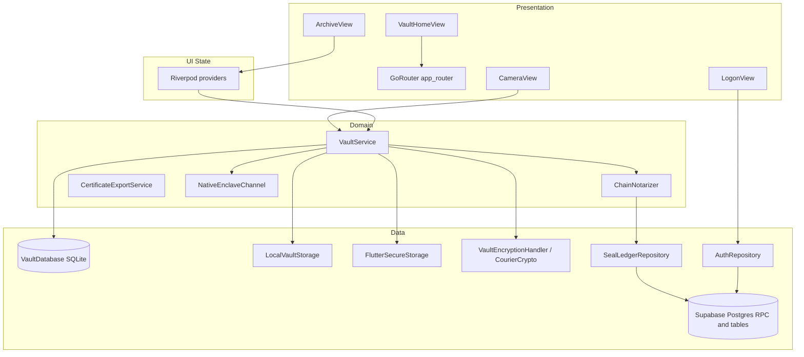

# FactLockCam Blueprints (14 May 2026)

## Core Synthesis

This page is an **engineering-oriented** blueprint of the **current** FactLockCam system: repository layout, Flutter composition (Riverpod, GoRouter, GetIt routing to domain services), dual-mode capture, the **`VaultService.proofLockFile`** ordering and failure modes, Supabase **`SealLedgerRepository`** RPCs and table roles, archive UX and the Domain Interaction Contract, local persistence, and operational scripts. It complements the narrative snapshot [[MASTER_CONTEXT16MAY2026]] (2026-05-16) with **layered detail** suitable for onboarding and design review.

**Canonical status and repair narrative** remain in [[FactLockCam_Product_Baseline_2026-05]]; **capability inventory and risks** in [[FactLockCam_Master_Blueprint]]; **ProofLock gap analysis** in [[ProofLock_Refactor_Scope]]. An unfrontmattered copy of this breakdown also lives at repository root as `FactLockCam_Blueprints14May2026.md` for quick file search outside the wiki.

### Positioning and trust model

- **Product:** FactLockCam is a Flutter application for authenticated capture, **local-first** sealing, and **Supabase-backed** proof surfaces. It is framed as a **tamper-evident** media vault—authenticity heuristics and risk reduction—not a claim of absolute proof-of-truth, mathematical certainty, or guaranteed sensor-origin (see project rules and [[FactLockCam_Product_Baseline_2026-05]]).
- **Current remote “proof” path:** **ProofLock-shaped:** `check_proof_status` → `NativeEnclaveChannel.signHash` (still **simulated** on device) → `ChainNotarizer` (default `SimulatedChainNotarizer` → RPC `simulate_chain_notarize`) → local AES-GCM vault + SQLite → `proof_ledger` insert when remote steps succeed; otherwise `pending_sync` with backoff.
- **Target bar:** Hardware-backed signing, durable chain anchoring, C2PA, RPC-only courier surfaces, outsider verification—[[ProofLock_Refactor_Scope]] and [[ProofLock_Architectural_Manifest]].

### Repository topology

| Area | Role |
|------|------|
| `factlockcam_app/` | Flutter app: UI, domain services, local persistence, Supabase clients |
| `supabase/` | Postgres schema, migrations, RLS, RPC definitions, local CLI config |
| `scripts/` | Operational wrappers (`factlockcam_supabase_pipeline.sh`, dart-define sync, resets) |
| `wiki/` | LLM-maintained architecture knowledge ([[index]] as navigation root) |
| `raw/` | Immutable source material for wiki ingestion |

### Client stack (presentation and composition)

**Framework and libraries**

- **Flutter / Dart** with **`flutter_riverpod`** for UI-facing state (`ProviderScope` at `factlockcam_app/lib/main.dart`).
- **`go_router`** for navigation; auth-driven redirects in `factlockcam_app/lib/app/router/app_router.dart`.
- **`get_it`** as the composition root: `factlockcam_app/lib/core/di/injection.dart` registers singletons (explicit registration; `injectable` codegen not used—see comment in `injection.dart`).
- **Bridging pattern:** Domain services are registered in GetIt and exposed to widgets via Riverpod `Provider`s (e.g. `vaultServiceProvider` in `vault_service.dart`).

**Entry and configuration**

- **`main.dart`:** `WidgetsFlutterBinding.ensureInitialized()`; if `AppConfig.hasSupabaseConfig`, `Supabase.initialize` with compile-time `SUPABASE_URL` / `SUPABASE_ANON_KEY`; then `configureDependencies()`; then `runApp(ProviderScope(child: FactLockCamApp()))`.
- **`AppConfig`** (`core/config/app_config.dart`): optional `USE_POLYGON_NOTARIZER` and `REQUIRE_HARDWARE_ATTESTATION` (latter **defined but not wired** into capture/sync gating as of this blueprint).
- **Dart defines:** Filtered `factlockcam_app/dart_defines.json` from `.env.local` via `scripts/write_flutter_dart_defines.py` / `scripts/sync_flutter_dart_defines.sh`; IDE pre-launch can sync. **Cold rebuild** after define changes—hot restart can leave stale compile-time values.

**Routing surface** (`app_router.dart`)

| Route | Behavior |
|------|----------|
| `/` | Redirects to logon |
| `/logon` | Email OTP flow |
| `/vault-home` | Hub-first `VaultHomeView`: `IndexedStack` index 0 = four-tile `HapticHubPanel`; 1–2 = **lazy-mounted** photo/video `CameraView`; 3 = `UnifiedArchiveViewport`; 4 = `AccountSettingsPanel`. Panel back → hub; post-capture → hub index 0 |
| `/archive` | Tabbed photo/video archive |
| `/vault-dashboard` | **Legacy redirect** → `/vault-home` |

Unauthenticated users → `/logon`; authenticated users on `/logon` → hub. Camera is no longer a standalone `/camera?mode=` route — it is embedded inside `VaultHomeView` via `IndexedStack`.

### Authentication and session

- **Mechanism:** Supabase **email OTP** (`signInWithOtp`, 6-digit `OtpType.email` verify)—`data/supabase/auth_repository.dart`, `ui/controllers/auth_controller.dart`, `ui/views/logon_view.dart`.
- **Session coupling:** `authStateProvider` drives GoRouter redirects; without Supabase config the shell runs with an in-app notice.
- **Sign-out:** Burns **local wallet** (SQLite, vault files, secure key) **before** remote sign-out—[[FactLockCam_Product_Baseline_2026-05]].

### Capture subsystem (dual mode)

- **`AcquisitionMode`** (`ui/views/camera/acquisition_mode.dart`): `photo` vs `video` from query string.
- **`CameraView`** (`ui/views/camera/camera_view.dart`): rear-camera preference; **`enableAudio`** when `mode.isVideo`; photo `takePicture()`; video `startVideoRecording` / `stopVideoRecording` with REC UX.
- **Forensic UI:** `CustomPaint` / painters under `core/ui/painters/`; **`RepaintBoundary`** on high-frequency overlays; **`_teardownCamera`** so `stopVideoRecording` completes before controller disposal.

### Vault domain: `VaultService` and `proofLockFile`

**Responsibilities** (`factlockcam_app/lib/domain/services/vault_service.dart`): isolate read + SHA-256; optional preflight/notarization via `SealLedgerRepository` + `ChainNotarizer`; AES-GCM (`VaultEncryptionHandler` / `CipherEngine`); thumbnails (images + `video_thumbnail`); `LocalVaultStorage`; SQLite via `VaultDatabase`; **`extractForCourier`** + `CourierCrypto.decryptAndVerifyFingerprint`.

**Ordered runtime (conceptual)**

1. MIME inference (`_inferMimeType`).
2. **`Isolate.run`** read + SHA-256 (`_readFileAndSha256InIsolate`).
3. If Supabase configured: **`check_proof_status`** (`p_file_hash`); only **`new`** proceedable → else **`ProofLockConflictException`**; recoverable failures may set **`pendingRemoteSync`**.
4. **`NativeEnclaveChannel.signHash`** — **simulated**; failures may flip `pendingRemoteSync`.
5. **`ChainNotarizer.notarize`** — default **`SimulatedChainNotarizer`** → **`simulate_chain_notarize`**; **`PolygonChainNotarizer`** stub—keep `USE_POLYGON_NOTARIZER=false` until implemented.
6. Local encrypt + thumbnail + paths.
7. SQLite upsert; on failure after writes, **`_persistSealedBytes`** compensating delete of encrypted + thumbnail files.
8. **`proof_ledger` insert** on happy remote path; else **`pending_sync`** + backoff.
9. **`seal_ledger`** best-effort during **`retryPendingRemoteSync`**.
10. Temp capture cleanup on success paths.

**Public entry points:** `sealAndStoreCapture` → `proofLockFile`; `retryPendingRemoteSync` for pending rows.

### Remote integration (Supabase)

- **`SupabaseClientHandle`** — optional client when defines missing (`data/supabase/supabase_client_handle.dart`).
- **`SealLedgerRepository`:** `check_proof_status`, `simulate_chain_notarize`, `seal_ledger` insert (idempotent `23505` handling), `proof_ledger` insert, `profiles` / `wallet_id` resolution.

**Migrations (high level):** `profiles`, `seal_ledger`, `proof_ledger`, `simulated_chain_ledger`. Notable: `20260509160000_repair_remote_prooflock_schema.sql` (**destructive**); `20260509200000_backfill_profiles_from_auth_users.sql`; `20260510120000_tighten_ledger_select_rls.sql` (wallet-scoped ledger `SELECT`). RPCs: `SECURITY DEFINER`; PostgREST `NOTIFY pgrst, 'reload schema'` per project RPC standards.

### Archive UX and Domain Interaction Contract

- List from **SQLite + thumbnails** only—no decrypt for scrolling ([[FactLockCam_Master_Blueprint]]).
- Tabs: Photos / Videos; video play-badge; `videocam_outlined` fallback.
- **Pending sync:** badges, banner, **Retry now**; `PendingSyncScheduler` (~3 min); `syncPendingInBackground`.
- **Actions:** `MediaActionType`, `AssetActionRegistry`, `AssetAction`, `UniversalAssetToolbar`.
- **Viewing:** `ArchivePhotoView` (cached extraction future); `ArchiveVideoView` via `extractForCourier` + `video_player`.
- **Per-item delete:** local only—no remote proof erasure (policy TBD).

### Auxiliary services

- **`CertificateExportService`** — text certificate draft; legal copy `lib/core/legal/disclaimers.dart` (FRE 902 framing).
- **`NativeEnclaveChannel`** — `com.factlockcam.app/enclave`; simulated `signHash` until Secure Enclave / Keystore.

### Local data architecture

| Concern | Mechanism |
|---------|-----------|
| Encrypted originals | `LocalVaultStorage` |
| Thumbnails | Separate files; video via `video_thumbnail` + MIME-aware temp extensions (`videoThumbnailTempExtensionForMime`) |
| Metadata | SQLite / `ArchiveItem` |
| Master key | `FlutterSecureStorage` (`factlockcam:vault_key`, legacy `snapseal:vault_key`) |
| Extract integrity | `CourierCrypto` re-hash vs fingerprint |

### Risks and ops (snapshot)

Consolidated from [[MASTER_CONTEXT16MAY2026]] and [[FactLockCam_Master_Blueprint]]: simulated signing; Polygon unimplemented; `pending_sync` diagnostics thin; RLS/grants and RPC privacy review ongoing; hosted schema drift; **36** Flutter tests (2026-05-16 audit)—not a full crypto/sync matrix.

**Ops:** `scripts/factlockcam_supabase_pipeline.sh`; CI `.github/workflows/supabase.yml`; `scripts/supabase_local_hard_reset.sh`.

### Layer diagram (logical)

### Suggested read order

1. [[FactLockCam_Product_Baseline_2026-05]]
2. [[MASTER_CONTEXT16MAY2026]]
3. [[FactLockCam_Master_Blueprint]]
4. [[ProofLock_Refactor_Scope]]
5. Code: `factlockcam_app/lib/main.dart`, `app/router/app_router.dart`, `core/di/injection.dart`, `domain/services/vault_service.dart`, `data/supabase/seal_ledger_repository.dart`, `supabase/migrations/`

## Provenance Tracking

* *Content*: Compiled from repository root `FactLockCam_Blueprints14May2026.md` (created 2026-05-14) cross-checked with [[FactLockCam_Product_Baseline_2026-05]], [[MASTER_CONTEXT16MAY2026]], [[FactLockCam_Master_Blueprint]], and implementation paths under `factlockcam_app/lib/`.
* *Purpose*: Wiki-durable navigation entry for layered architecture detail; root file retained for non-wiki workflows.

## Related Notes

* [[FactLockCam_Product_Baseline_2026-05]]
* [[MASTER_CONTEXT16MAY2026]]
* [[FactLockCam_Master_Blueprint]]
* [[ProofLock_Refactor_Scope]]
* [[Project_Audit_2026-05-11]]
* [[ProofLock_Architectural_Manifest]]
* [[index]]
* [[overview]]
