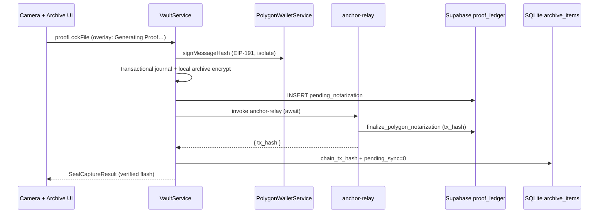

# Polygon Saga (Live)

## Core Synthesis

**Try 2 is complete and QA-verified** on physical iPhone against hosted project `jqvnwtslmoxjwzusmtxs`.

- **Eighth QA 2026-05-22:** **Live Polygon mainnet** — real on-chain `notarize()` tx, Polygonscan-confirmed, sync clears; sim-hash fallback removed ([[Polygon_Mainnet_Wiring_2026-05]]).
- **Third QA 2026-05-21:** capture + Polygon ledger insert re-verified after Sprint 2 local persist ([[Archive_Transactional_Journal]]) and SQLite open race fix.
- **Second QA 2026-05-20:** post-capture proof progress regression and certificate tx-hash omission fixed.

When `USE_POLYGON_NOTARIZER=true` (default after `scripts/sync_flutter_dart_defines.sh`), capture runs:

1. Isolate SHA-256 hash
2. Device sign + **EIP-191 EVM sign** (`PolygonWalletService`)
3. Local AES-GCM archive + SQLite (`pending_sync=true`)
4. `proof_ledger` INSERT with `notarization_status=pending_notarization`
5. **Await** `anchor-relay` Edge Function (camera overlay shows **"Generating Proof…"** until return)
6. Relay calls `finalize_polygon_notarization`; client persists **`chain_tx_hash`** locally (SQLite v5) and clears `pending_sync`
7. Verified flash + haptic on success

Simulated chain remains available when `USE_POLYGON_NOTARIZER=false`.

**Live mainnet (eighth QA):** When `ALCHEMY_API_URL` and `RELAYER_PRIVATE_KEY` are set on `anchor-relay`, the relay broadcasts `notarize(bytes32)` on Polygon mainnet and returns a real `transactionHash`. Missing secrets → **HTTP 500** (no `polygon-sim:` fallback). Client rejects legacy sim-encoded hashes. See [[Polygon_Mainnet_Wiring_2026-05]].

## Architecture (Try 2 — post-regression fix)

## Key surfaces

| Layer | Artifact | Role |
|-------|----------|------|
| Domain | `WalletService` / `PolygonWalletService` | EVM key in `FlutterSecureStorage`; `profiles.evm_address` sync |
| Domain | `VaultBlockchainHandler` / `PolygonBlockchainHandler` | `invoke('anchor-relay')` → returns `transactionHash` |
| Domain | `PolygonChainNotarizer` | EIP-191 owner sign + delegate to `PolygonBlockchainHandler` |
| Domain | `NotarizationMonitorService` | Realtime `UPDATE` + **RPC receipt polling** when `POLYGON_RPC_URL` set |
| Domain | `NotarizationMonitorService` | Realtime `UPDATE` + **initial remote seed** on `watchAsset` |
| Domain | `ProofSyncNotifier` | Clears local pending + invalidates dashboard on relay success |
| Data | `ArchiveItem.chainTxHash` | SQLite column (DB v5); written on relay success |
| Data | `SealLedgerRepository.fetchProofChainTxHash` | Remote fallback for certificates on legacy rows |
| Export | `CertificateExportService.buildCertificateDraft` | Async; includes **Ledger Transaction Hash** line |
| UI | `camera_view.dart` `_SealingOverlay` | Polygon copy: **Generating Proof…** |
| UI | `chronology_card.dart` / omni grid | **Generating Proof…** badge via `proofNotarizationStateProvider` |
| Edge | `supabase/functions/anchor-relay/index.ts` | JWT + EIP-191 verify → live Polygon broadcast → finalize row |
| DB | `20260520120000_polygon_saga_proof_ledger.sql` | `notarization_status`, nullable `chain_tx_hash`, finalize RPCs |
| DB | `20260523000000_polygon_tx_indexing.sql` | Indexes for monitor polling by `chain_tx_hash` / `notarization_status` |
| Config | `POLYGON_RPC_URL` | Optional dart-define for client-side receipt polling |
| Flag | `USE_POLYGON_NOTARIZER` | Compile-time via `dart_defines.json` (sync script defaults **true**) |

## QA notes

| Issue | Fix |
|-------|-----|
| Post-capture proof progress disappeared | Fire-and-forget relay returned before UI could show state; **await relay** during `proofLockFile` |
| Archive badge skipped "Generating Proof…" | Relay finished before dashboard refresh; monitor now **seeds** initial status; chronology shows badge while `pendingNotarization` |
| Certificate missing tx hash | `CertificateExportService` adds ledger hash; local SQLite + remote fetch |
| Legacy rows without local hash | Certificate falls back to `fetchProofChainTxHash` from `proof_ledger` |
| Pending sync stuck after capture (2026-05-22) | Seventh QA: client swallowed relay 500; brief sim fallback. **Eighth QA:** sim removed, errors propagate — [[Polygon_Mainnet_Wiring_2026-05]] |
| Flutter Web compile failure | Unconditional `sqlite3` import in `journal_repository.dart`; fixed with stub/io conditional export |

**Deploy checklist:** `supabase db push` + `supabase functions deploy anchor-relay --no-verify-jwt` + `supabase secrets set ALCHEMY_API_URL=... RELAYER_PRIVATE_KEY=...` (both required for live mainnet).

**Device rebuild (required):** `flutter run -d <deviceName> --dart-define-from-file=dart_defines.json` on physical iPhone — use device name from `flutter devices`, not `-d ios` ([[iOS_Device_Development_Workflow]]).

## Provenance Tracking

* *Implementation*: `vault_service_io.dart`, `vault_blockchain_handler.dart`, `notarization_monitor_service.dart`, `certificate_export_service.dart`, `vault_database_io.dart` (v5), `seal_ledger_repository.dart` (2026-05-20 regression fix).
* *Try 1 context*: [[Polygon_Try1_Postmortem]], [`POSTMORTEM_POLYGON_TRY1.md`](../../POSTMORTEM_POLYGON_TRY1.md).

## Related Notes

* [[Polygon_Mainnet_Wiring_2026-05]]
* [[Polygon_Try1_Postmortem]]
* [[FactLockCam_Product_Baseline_2026-05]]
* [[ProofLock_Refactor_Scope]]
* [[FactLockCam_Master_Blueprint]]
* [[glossary]]
