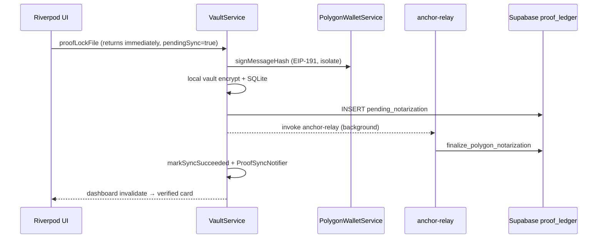

# Polygon Saga (Live)

## Core Synthesis

**Try 2 is complete and QA-verified (2026-05-21)** on physical iPhone against hosted project `jqvnwtslmoxjwzusmtxs`. Capture uses an **async saga** when `USE_POLYGON_NOTARIZER=true` (default after `scripts/sync_flutter_dart_defines.sh`): hash in isolate → EIP-191 EVM sign → local encrypt + SQLite → `proof_ledger` row with `notarization_status=pending_notarization` → fire-and-forget **`anchor-relay`** Edge Function → RPC `finalize_polygon_notarization` → local `pending_sync` cleared in ~**1–2 seconds** via `ProofSyncNotifier` (Realtime is a fallback, not the sole path).

Simulated chain remains available when `USE_POLYGON_NOTARIZER=false`.

## Architecture (Try 2)

## Key surfaces

| Layer | Artifact | Role |
|-------|----------|------|
| Domain | `WalletService` / `PolygonWalletService` | EVM key in `FlutterSecureStorage`; `profiles.evm_address` sync |
| Domain | `VaultBlockchainHandler` / `PolygonBlockchainHandler` | `supabase.functions.invoke('anchor-relay')` |
| Domain | `NotarizationMonitorService` | Realtime `UPDATE` on `proof_ledger` (backup) |
| Domain | `ProofSyncNotifier` | Clears local pending + invalidates dashboard on relay success |
| Edge | `supabase/functions/anchor-relay/index.ts` | JWT + EIP-191 verify → finalize row (sim tx hash until live RPC secrets) |
| DB | `20260520120000_polygon_saga_proof_ledger.sql` | `notarization_status`, nullable `chain_tx_hash`, `evm_address`, finalize RPCs |
| DB | `20260521000000_proof_ledger_replica_identity.sql` | `REPLICA IDENTITY FULL` for Realtime payloads |
| Flag | `USE_POLYGON_NOTARIZER` | Compile-time via `dart_defines.json` (sync script defaults **true**) |
| Rule | `.cursor/rules/polygon-saga-architecture.mdc` | PR sequencing + UI/crypto boundaries |

## QA notes (2026-05-21)

- **Bug fixed:** Relay returned HTTP 200 and remote row was `notarized`, but UI stayed pending indefinitely because `_dispatchPolygonRelay` never called `markSyncSucceeded`. Fix: `_finalizeLocalPolygonSync` + `ProofSyncNotifier` → ~2s card flip (matches ProofLock app ledger latency).
- **Deploy checklist:** `supabase db push` (both saga migrations) + `supabase functions deploy anchor-relay`.
- **Live Polygon broadcast:** Edge function uses deterministic **simulated** `tx_hash` until `POLYGON_RPC_URL` + gas-station secrets and contract wiring land.

## Provenance Tracking

* *Implementation*: `factlockcam_app/lib/domain/blockchain/`, `vault_service_io.dart`, `supabase/functions/anchor-relay/`, migrations `20260520120000_*`, `20260521000000_*` (2026-05-20–21).
* *Try 1 context*: [[Polygon_Try1_Postmortem]], [`POSTMORTEM_POLYGON_TRY1.md`](../../POSTMORTEM_POLYGON_TRY1.md).
* *Manifest source*: Event-driven saga blueprint (May 2026 architectural manifest).

## Related Notes

* [[Polygon_Try1_Postmortem]]
* [[FactLockCam_Product_Baseline_2026-05]]
* [[ProofLock_Refactor_Scope]]
* [[FactLockCam_Master_Blueprint]]
* [[glossary]]
