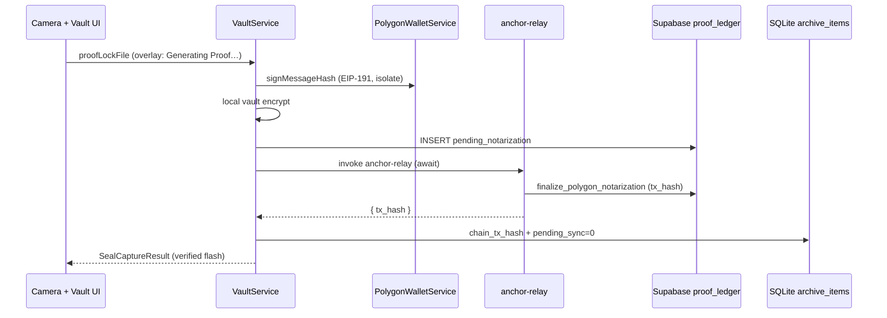

# Polygon Saga (Live)

## Core Synthesis

**Try 2 is complete and QA-verified** on physical iPhone against hosted project `jqvnwtslmoxjwzusmtxs`. **Second QA pass 2026-05-20:** user-confirmed after fixing post-capture proof progress regression and certificate tx-hash omission.

When `USE_POLYGON_NOTARIZER=true` (default after `scripts/sync_flutter_dart_defines.sh`), capture runs:

1. Isolate SHA-256 hash
2. Device sign + **EIP-191 EVM sign** (`PolygonWalletService`)
3. Local AES-GCM vault + SQLite (`pending_sync=true`)
4. `proof_ledger` INSERT with `notarization_status=pending_notarization`
5. **Await** `anchor-relay` Edge Function (camera overlay shows **"Generating Proof…"** until return)
6. Relay calls `finalize_polygon_notarization`; client persists **`chain_tx_hash`** locally (SQLite v5) and clears `pending_sync`
7. Verified flash + haptic on success

Simulated chain remains available when `USE_POLYGON_NOTARIZER=false`.

**Simulated on-chain hash:** `anchor-relay` still returns deterministic `polygon-sim:<asset_hash>` until live Polygon RPC + contract secrets are wired. The hash is **real ledger data** and appears on certificates even before mainnet broadcast.

## Architecture (Try 2 — post-regression fix)

## Key surfaces

| Layer | Artifact | Role |
|-------|----------|------|
| Domain | `WalletService` / `PolygonWalletService` | EVM key in `FlutterSecureStorage`; `profiles.evm_address` sync |
| Domain | `VaultBlockchainHandler` / `PolygonBlockchainHandler` | `invoke('anchor-relay')` → returns `tx_hash` |
| Domain | `NotarizationMonitorService` | Realtime `UPDATE` + **initial remote seed** on `watchAsset` |
| Domain | `ProofSyncNotifier` | Clears local pending + invalidates dashboard on relay success |
| Data | `ArchiveItem.chainTxHash` | SQLite column (DB v5); written on relay success |
| Data | `SealLedgerRepository.fetchProofChainTxHash` | Remote fallback for certificates on legacy rows |
| Export | `CertificateExportService.buildCertificateDraft` | Async; includes **Ledger Transaction Hash** line |
| UI | `camera_view.dart` `_SealingOverlay` | Polygon copy: **Generating Proof…** |
| UI | `chronology_card.dart` / omni grid | **Generating Proof…** badge via `proofNotarizationStateProvider` |
| Edge | `supabase/functions/anchor-relay/index.ts` | JWT + EIP-191 verify → finalize row |
| DB | `20260520120000_polygon_saga_proof_ledger.sql` | `notarization_status`, nullable `chain_tx_hash`, finalize RPCs |
| Flag | `USE_POLYGON_NOTARIZER` | Compile-time via `dart_defines.json` (sync script defaults **true**) |

## QA notes

| Issue | Fix |
|-------|-----|
| Post-capture proof progress disappeared | Fire-and-forget relay returned before UI could show state; **await relay** during `proofLockFile` |
| Vault badge skipped "Generating Proof…" | Relay finished before dashboard refresh; monitor now **seeds** initial status; chronology shows badge while `pendingNotarization` |
| Certificate missing tx hash | `CertificateExportService` adds ledger hash; local SQLite + remote fetch |
| Legacy rows without local hash | Certificate falls back to `fetchProofChainTxHash` from `proof_ledger` |

**Deploy checklist:** `supabase db push` (saga migrations) + `supabase functions deploy anchor-relay`.

**Device rebuild (required):** signed debug build with `--dart-define-from-file=dart_defines.json` — never `--no-codesign` for physical install ([[iOS_Device_Development_Workflow]]).

## Provenance Tracking

* *Implementation*: `vault_service_io.dart`, `vault_blockchain_handler.dart`, `notarization_monitor_service.dart`, `certificate_export_service.dart`, `vault_database_io.dart` (v5), `seal_ledger_repository.dart` (2026-05-20 regression fix).
* *Try 1 context*: [[Polygon_Try1_Postmortem]], [`POSTMORTEM_POLYGON_TRY1.md`](../../POSTMORTEM_POLYGON_TRY1.md).

## Related Notes

* [[Polygon_Try1_Postmortem]]
* [[FactLockCam_Product_Baseline_2026-05]]
* [[ProofLock_Refactor_Scope]]
* [[FactLockCam_Master_Blueprint]]
* [[glossary]]
