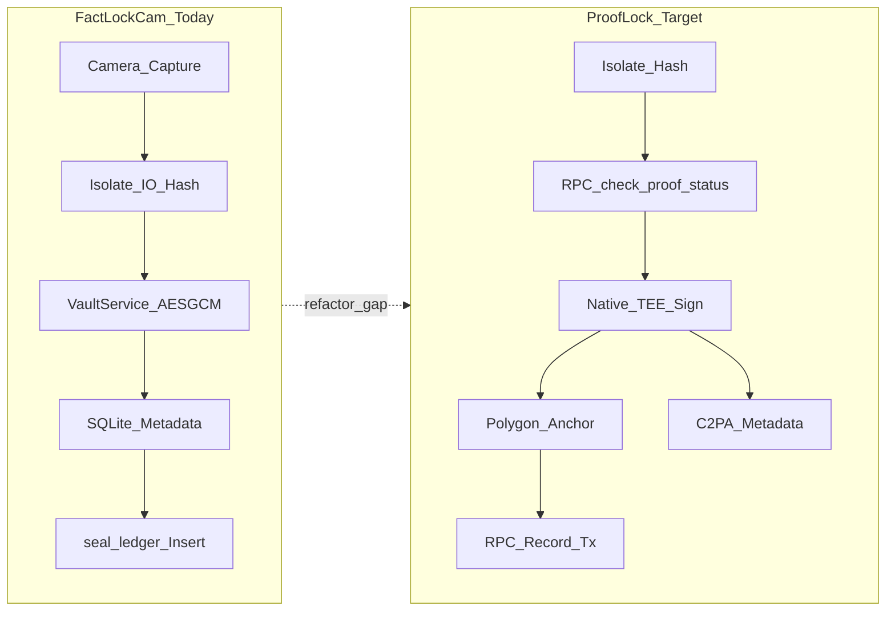

# ProofLock Refactor Scope

## Core Synthesis

The **ProofLock manifest** ([[ProofLock_Architectural_Manifest]]) describes a **target architecture** that remains **ahead** of the current **FactLockCam** codebase ([[FactLockCam_Master_Blueprint]]) on several tracks, though **device signing MVP** landed in fifteenth QA ([[App_Store_Hardening_2026-05]]). Today’s app delivers a credible **local-first wallet** with a **ProofLock-shaped online path**: capture → isolate read/hash → **`check_proof_status`** preflight (conflict → `ProofLockConflictException`) → **`NativeEnclaveChannel` `signHash`** (Secure Enclave / Keystore on iOS/Android) → Polygon saga or **`SimulatedChainNotarizer` / `simulate_chain_notarize`** → **AES-GCM** vault encryption → SQLite + thumbnails → **`proof_ledger` insert** when remote steps succeed, with **`pending_sync` + backoff retries** (`PendingSyncScheduler`, hub/archive **`syncPendingInBackground`**) when they do not. Best-effort **`seal_ledger`** sync remains in **`retryPendingRemoteSync`**. Owner-side archive interactions use a media-type-driven Domain Interaction Contract. Remaining manifest gaps: **server-side device-signature verify**, **C2PA**, and **`courier_packages` / RPC-only courier** depth.

Refactor effort is therefore **large and multi-track**, not a single feature. A practical sequencing is: (1) **docs and contracts** frozen in wiki + ADR-style notes, (2) **Supabase evolution** (new tables/RPC, RLS, indexes) without breaking existing wallets, (3) **archive pipeline hardening** (atomicity, pending-sync worker), (4) **native enclave channel MVP** (sign hash or bind attestation), (5) **Polygon write path** + persistence of `polygon_tx_hash`, (6) **C2PA** as a parallel track, (7) **verification / public read** UX and tests.

### Manifest requirement → current surface

| Manifest element | Current repo | Gap |
| :--- | :--- | :--- |
| Isolate SHA-256 + UI perf | `VaultService` uses `Isolate.run` for temp file read/delete; hashing via `CipherEngine` | Align naming/docs with manifest; optional dedicated hash worker file |
| Pre-flight `check_proof_status` | **`SealLedgerRepository.checkProofStatus`** + **`VaultService.proofLockFile`** / retry path | Hardening, UX for non-`new` status, policy review |
| Hardware enclave signing | **`EnclaveSigner.swift`** + **`DeviceEnclaveSigner.kt`**; P-256 ECDSA over SHA-256 hex; **`REQUIRE_HARDWARE_ATTESTATION`** wired in Dart | Server-side P-256 pubkey verify in `anchor-relay` (follow-up) |
| Polygon notarization | **Live async saga** when `USE_POLYGON_NOTARIZER=true`: `PolygonWalletService` + `anchor-relay` + `notarization_status`; sim `chain_tx_hash` until mainnet RPC wired ([[Polygon_Saga_Live]]) | Wire real Polygon contract broadcast + persist on-chain hash |
| `proof_ledger` vs `seal_ledger` | **`proof_ledger`** + **`seal_ledger`** + **`profiles`** (retry path still touches `seal_ledger`) | Consolidate naming/semantics if product wants a single ledger story |
| Courier black-box (`courier_packages`, no SELECT) | `extractForCourier` is local-only; no Supabase courier table | Schema + SECURITY DEFINER RPCs + policy review |
| C2PA FFI | Not present | FFI build, licensing, binary size, CI matrix |
| “Seal complete = SQLite + Supabase” (capture rule) | Local vault + SQLite always; **`proof_ledger`** only when remote path completes (`pending_sync` + retries otherwise) | Decide external marketing language vs offline-first semantics; expand user-visible diagnostics |

**Security note:** The manifest’s example “XOR + SHA256” vault encryption is **not** implemented in FactLockCam (AES-GCM is). Any future doc or porting from the manifest must **not** treat XOR as current truth.

## Phased effort (indicative)

**Polygon Try 2 (2026-05-21):** PR0–PR5 **complete**; physical iPhone QA passes. **Live Polygon mainnet** verified eighth QA 2026-05-22 — see [[Polygon_Saga_Live]], [[Polygon_Mainnet_Wiring_2026-05]]. **Hardware device signing MVP** verified fifteenth QA 2026-05-30 — [[App_Store_Hardening_2026-05]].

Rough calendar estimates for a **small team**; actuals depend on chain UX, attestation depth, and App Store review.

| Phase | Scope | Order-of-magnitude |
| :--- | :--- | :--- |
| 1 | Wiki + API contracts + migration naming (`proof_ledger`, RPC signatures) | 0.5–1 day |
| 2 | Supabase: indexes, RLS, `check_proof_status`, courier RPC sketch | 2–4 days + security review |
| 3 | Archive: transactional local writes; deepen `pending_sync` reconciliation UX/diagnostics | 2–4 days (partially satisfied 2026-05) |
| 4 | Native TEE signing MVP (iOS + Android) | 1–2 weeks MVP; more for hardening |
| 5 | Polygon submission + persist hash + failure modes | 1–2 weeks |
| 6 | C2PA / FFI | 1–2+ weeks |
| 7 | Tests (auth, vault, RPC, chain mocks), release checklist | 1+ week |

**Overall:** expect **several weeks to a few months** of focused work to reach manifest parity, not days.

## Provenance Tracking

* *Manifest claims and target flow*: Derived from `raw/prooflock_architectural_manifest.md` via [[ProofLock_Architectural_Manifest]] (2026-05-03)
* *Current implementation mapping*: Derived from `factlockcam_app/lib/domain/services/vault_service.dart`, `factlockcam_app/lib/data/supabase/seal_ledger_repository.dart`, `factlockcam_app/lib/ui/controllers/pending_sync_scheduler.dart`, `factlockcam_app/lib/core/ghost_key/native_enclave_channel.dart`, `factlockcam_app/lib/domain/blockchain/chain_notarizer.dart`, `factlockcam_app/lib/main.dart`, `factlockcam_app/lib/ui/controllers/auth_controller.dart`, `factlockcam_app/lib/core/archive/domain/services/asset_action_registry.dart`, and `supabase/migrations/20260428013509_snapseal_foundation.sql` (2026-05-03; refreshed 2026-05-11, [[Project_Audit_2026-05-11]]; archive action contract noted 2026-05-12)

## Related Notes

* [[App_Store_Hardening_2026-05]]
* [[ProofLock_Architectural_Manifest]]
* [[FactLockCam_Master_Blueprint]]
* [[Polygon_Saga_Live]]
* [[Polygon_Try1_Postmortem]]
* [[Project_Audit_2026-05-11]]
* [[overview]]
* [[glossary]]
