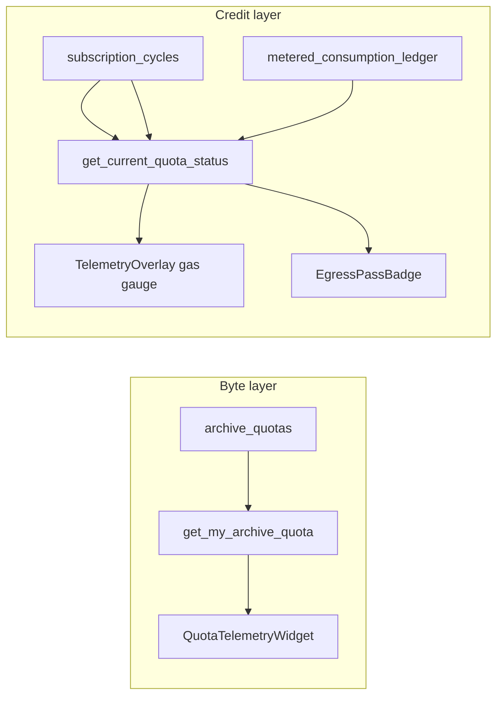

# Archive Quota Telemetry (2026-06)

## Core Synthesis

FactLockCam meters cloud Archive capacity on **two independent layers** while keeping zero-knowledge encryption intact:

| Layer | What it meters | Backend | Flutter state | Primary UI |
|-------|----------------|---------|---------------|------------|
| **Bytes** | Storage + monthly egress bytes | `archive_quotas` + `archive_tiers` | `archiveQuotaNotifierProvider` | `QuotaTelemetryWidget` (dual progress bars) |
| **Credits** | Monthly pro proofs + consumable verification credits | `subscription_cycles` + `metered_consumption_ledger` | `quotaStateProvider` | Camera gas gauge + Egress Pass badge + verify/export modal |

Both layers coexist; neither replaces the other. Byte caps protect Supabase storage/egress margins; credit counters gate high-cost remote operations and heavy local decryption exports.

### Layer 1 — Bytes (`archive_quotas` + `archive_tiers`)

- Migration: `supabase/migrations/20260602120000_archive_quotas_and_tiers.sql`
- **`archive_tiers`**: reference catalog (`free`, `picture`, `video`) with byte limits and display names.
- **`archive_quotas`**: 1:1 with `profiles`; tracks `storage_used_bytes`, `egress_used_bytes`, `tier_id`, monthly `egress_period_start`.
- **Strict RLS**: authenticated users may **SELECT** own row only; mutations via `SECURITY DEFINER` RPCs (`get_my_archive_quota`, `increment_archive_storage`, `increment_archive_egress`, `set_archive_tier`).
- **Dual egress model**: byte-weighted account cap (primary) + existing per-package `max_downloads` on `courier_packages` (secondary viral-multiplier guard).
- **Egress hook**: `attempt_courier_unlock` calls `increment_archive_egress(owner_id, file_size_bytes)` after successful unlock.

#### Tier limits (MASTER_CONTEXT economics)

| Tier | Storage | Egress / month | Price |
|------|---------|----------------|-------|
| Free | 50 MB | 3 GB | $0 |
| Picture | 5 GB | 25 GB | $1/mo |
| Video | 50 GB | 200 GB | $10/mo |

### Layer 2 — Credits (`subscription_cycles` + `metered_consumption_ledger`)

- Migration: `supabase/migrations/20260602140000_subscription_cycles_metering.sql` — **pushed hosted 2026-06-02** (remote **23/23** migrations synced).
- **`subscription_cycles`**: calendar-month window per user; `base_allocation` default **50** pro proofs; `egress_credits_balance` default **12** on new cycles.
- **`metered_consumption_ledger`**: append-only debits; `action_type` ∈ `{pro_proof, verification_credit}`.
- **Unique index**: `(user_id, cycle_start)` — partial index on `now()` rejected by PostgreSQL (42P17); active-cycle logic lives in `private.ensure_active_subscription_cycle`.
- **RPCs**:
  - `get_current_quota_status()` → `{ pro_proofs_remaining, pro_proofs_base, egress_credits_balance, cycle_end }`
  - `record_metered_consumption(p_action_type)` → same shape after atomic debit
- **Strict RLS**: SELECT own rows only; all writes via SECURITY DEFINER RPCs.

#### Credit action semantics

| Action type | Debited when | Pre-flight UI |
|-------------|--------------|---------------|
| `pro_proof` | Successful seal (Polygon or simulated) after local persist | None (passive gas gauge only) |
| `verification_credit` | Successful `extractForCourier` on verify/export/download paths | Verification Credit modal |

### Flutter feature module

Path: `factlockcam_app/lib/features/archive_quota/`

| Layer | Byte layer | Credit layer |
|-------|------------|--------------|
| Domain | `ArchiveQuotaService`, `ArchiveQuotaSnapshot` | `MeteringQuotaService`, `QuotaState`, `MeteredActionType` |
| Data | `ArchiveQuotaRepository` | `MeteringQuotaRepository` |
| Presentation | `QuotaTelemetryWidget`, `archive_quota_paywall.dart` | `quotaStateProvider`, `quotaLifecycleProvider`, `EgressPassBadge`, `metering_credit_interceptor.dart` |
| Billing | `MockSubscriptionBillingGateway.upgradeTier()` | StoreKit egress credit packs (deferred) |

#### UI anchors (actual paths)

| Surface | Widget / hook | Behavior |
|---------|---------------|----------|
| Camera HUD | `TelemetryOverlay` (`ui/mobile/camera/`) | Passive `PROOFS: remaining/base` via `AppTextStyles.monoSm`; no RPC on camera open |
| Archive header | `EgressPassBadge` in `UnifiedArchiveViewport` | Pill: `Egress Pass · N credits` |
| Asset actions | `UniversalAssetToolbar` + `metering_credit_interceptor.dart` | Verify/export pre-flight modal; optimistic debit + RPC reconcile |
| Seal success | `camera_view.dart` → `recordProProofConsumption` | Optimistic `pro_proof` debit after haptic lock |
| App resume | `quotaLifecycleProvider` in `factlockcam_app.dart` | Poll `get_current_quota_status` on `AppLifecycleState.resumed` |

#### Error handling (QA)

- RPC refresh failures (e.g. pre-migration `PGRST202`) log to console in debug only — **no** `FlutterError.presentError` red overlay on quota poll miss.
- Gas gauge and badge hide when `quotaStateProvider` is null (unauthenticated, test quarantine, or RPC unavailable).

### Cursor rules

- `.cursor/rules/SKILL_Archive_Quota_Telemetry.mdc` — byte-layer scaffold + paywall patterns
- `.cursor/rules/factlockcam-metering-ui.mdc` — credit UI constraints (zero-latency capture, Archive nomenclature, optimistic updates)

### Open follow-ups

- Wire `increment_archive_storage` from `VaultSyncCoordinator` post-upload.
- Wire capture/Send Proof to `ensureArchiveQuotaForSeal` / `ensureArchiveQuotaForSendProof` (byte layer).
- Replace mock billing with production IAP.
- StoreKit egress credit pack purchases (increment `egress_credits_balance`).

## Provenance Tracking

* *Byte schema + Flutter scaffold*: Implemented 2026-06-02 per `.cursor/rules/SKILL_Archive_Quota_Telemetry.mdc`.
* *Credit layer + device QA*: Implemented and user-confirmed 2026-06-02; migration push fixed partial-index predicate; `flutter test` **72/72**.
* *Tier economics*: Derived from `MASTER_CONTEXT13MAY2026.md` subscription tier section.

## Related Notes

* [[FactLockCam_Product_Baseline_2026-05]]
* [[Send_Proof_Courier_2026-05]]
* [[Cloud_Vault_Wiring_2026-05]]
* [[overview]]
* [[log]]
